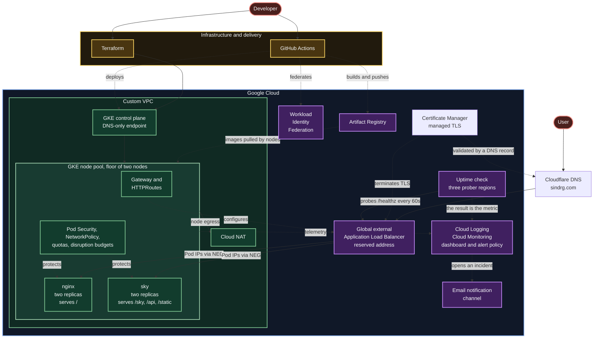

# Secure GKE Workload Platform

A secure, publicly reachable Kubernetes platform on Google Cloud, built and documented one phase at a time, for those who want to see how a private cluster, keyless delivery, workload guardrails and managed TLS fit together in practice.

## Live

[sindrg.com](https://sindrg.com)

## Architecture

## Status

- Focus: secure platform and workload delivery on GKE
- Complete: private GKE foundation built with modular Terraform.
- Complete: NGINX Deployment, ClusterIP Service, probes, resources, scaling, self-healing, restart, and rollback validation.
- Complete: credential-free pull request validation, required on `main`.
- Complete: workload guardrails, with Pod Security Admission, a namespace resource budget, and default-deny NetworkPolicies.
- Complete: a project-owned non-root image published to Artifact Registry and deployed by digest.
- Complete: keyless delivery through Workload Identity Federation, with a namespaced pipeline Role and a gated rollout.
- Complete: a public Gateway on a custom domain, with managed TLS and an HTTP to HTTPS redirect, while the workload Service stays internal.
- Complete: a node floor of two, a disruption budget on each workload, and a nightly maintenance window, so an evicted Pod has somewhere to land.
- In progress: observability. The telemetry scope, the uptime check, the alert, and the dashboard are built and taking data.
- Complete: failure drills. The alert was fired deliberately and recovered, and a bad version was stopped at the rollout gate without reaching users.
- Milestone 1: complete apart from the last step. The workload is guarded, the image is project owned and deployed by digest, delivery is keyless, and the workload is public through Gateway API.
- Next: the deploy timings and the cost snapshot, which are what close Milestone 1.

## Platform capabilities

| Domain | What exists | Decisions | Evidence |
| --- | --- | --- | --- |
| Networking | Custom VPC, private nodes, Cloud NAT, DNS-only control plane, Dataplane V2 | [Networking](decisions.md#networking) | [Phase 1](worklog/phase-01-infrastructure.md) |
| Cluster | Zonal GKE Standard, autoscaling node pool, Shielded Nodes, Regular release channel | [Cluster](decisions.md#cluster) | [Phase 1](worklog/phase-01-infrastructure.md) |
| Identity | Workload Identity Federation, dedicated node service account | [Identity and access](decisions.md#identity-and-access) | [Phase 1](worklog/phase-01-infrastructure.md) |
| Workload | `demo` namespace, NGINX Deployment, health probes, resource limits, ClusterIP Service | [Infrastructure and configuration](decisions.md#infrastructure-and-configuration) | [Phase 2](worklog/phase-02-nginx-workload.md) |
| Delivery | Credential-free pull request validation, required checks on `main` | [Delivery](decisions.md#delivery) | [Phase 3](worklog/phase-03-ci.md) |
| Policy | Pod Security baseline enforced, restricted audited, dedicated ServiceAccount, namespace budget, default-deny NetworkPolicies | [Workload security](decisions.md#workload-security) | [Phase 4](worklog/phase-04-workload-guardrails.md) |
| Images | Private Artifact Registry repository, immutable tags, retention policy, node read access | [Images and supply chain](decisions.md#images-and-supply-chain) | [Phase 5](worklog/phase-05-custom-image.md) |
| Deployment | Keyless GitHub Actions delivery, repository-scoped federation, namespaced pipeline RBAC, gated rollout | [Delivery](decisions.md#delivery) | [Phase 6](worklog/phase-06-keyless-delivery.md) |
| Ingress | GKE Gateway on a reserved global address, container-native load balancing, Certificate Manager TLS, HTTP to HTTPS redirect | [Ingress and TLS](decisions.md#ingress-and-tls) | [Phase 7](worklog/phase-07-gateway-tls.md) |
| Observability | Cluster telemetry declared, uptime check on `/healthz`, one alert policy, dashboard as code; drills done in Phase 10, cost snapshot outstanding | [Observability](decisions.md#observability) | [Phase 8](worklog/phase-08-observability.md) |
| Resilience | Node floor of two, disruption budgets on both workloads, nightly maintenance window | [Cluster](decisions.md#cluster) | [Phase 9](worklog/phase-09-resilience.md) |
| Failure drills | Deliberate outage with a recorded detection time, and a failed rollout contained by `maxUnavailable: 0` | [Observability](decisions.md#observability) | [Phase 10](worklog/phase-10-failure-drills.md) |

## Documentation

- [Implementation plan](plan.md)
- [Architecture decisions](decisions.md)
- [Phase 1 infrastructure worklog](worklog/phase-01-infrastructure.md)
- [Phase 2 workload worklog](worklog/phase-02-nginx-workload.md)
- [Phase 3 CI worklog](worklog/phase-03-ci.md)
- [Phase 4 guardrails worklog](worklog/phase-04-workload-guardrails.md)
- [Phase 5 custom image worklog](worklog/phase-05-custom-image.md)
- [Phase 6 keyless delivery worklog](worklog/phase-06-keyless-delivery.md)
- [Phase 7 gateway and TLS worklog](worklog/phase-07-gateway-tls.md)
- [Phase 8 observability worklog](worklog/phase-08-observability.md)
- [Phase 9 surviving a node worklog](worklog/phase-09-resilience.md)
- [Phase 10 failure drills worklog](worklog/phase-10-failure-drills.md)
- [Troubleshooting log](troubleshooting.md)
- [Kubernetes concepts reference](reference/kubernetes-concepts.md)
- [kubectl command reference](reference/kubectl-commands.md)
- [IAM and Workload Identity Federation reference](reference/iam-and-federation.md)
