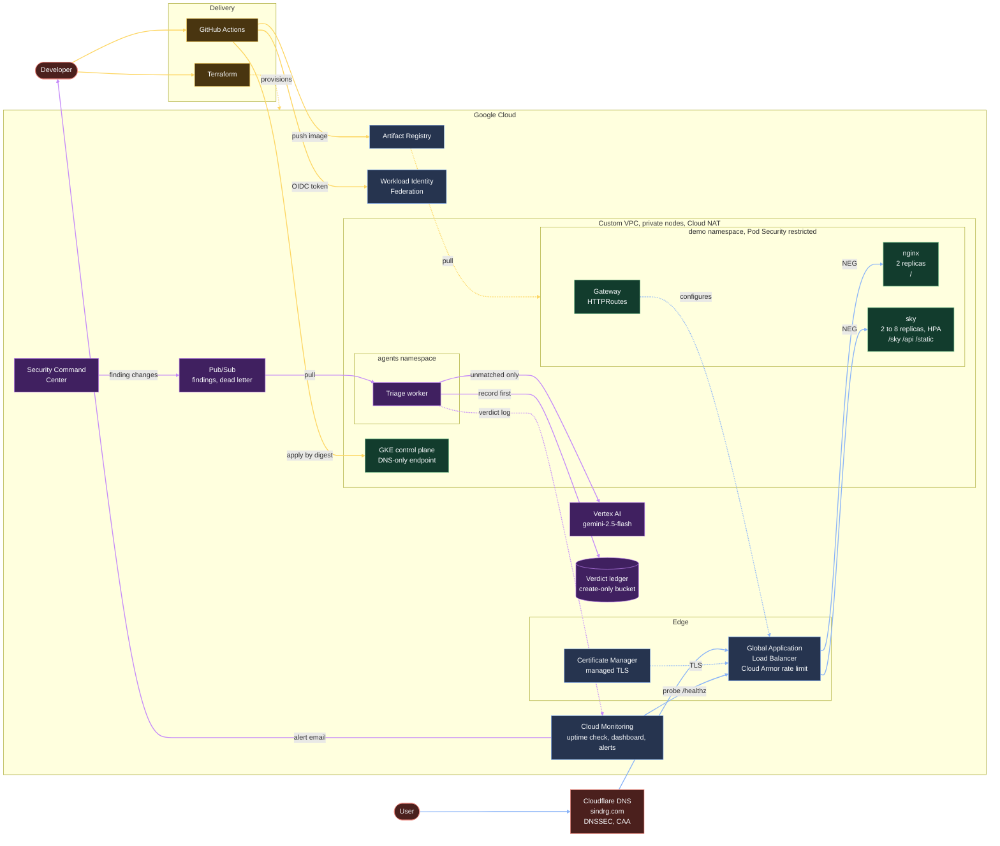

# Secure Kubernetes Platform on GKE

A private GKE cluster, two workloads, and an AI agent that triages the security findings. Terraform builds it and GitHub Actions deploys to it with no stored key.

> [!NOTE]
> **Closed on 2026-09-22. Shut down on 2026-09-25.** The infrastructure and the `sindrg.com` DNS records are deleted. The code is kept as it ran. See [the shutdown worklog](worklog/shutdown.md).

## Architecture

| Colour | Path |
| --- | --- |
| Blue | Serving: a request reaches a Pod through the load balancer, straight to Pod IPs |
| Amber | Delivery: GitHub Actions federates, pushes an image, and applies it by digest |
| Purple | Triage: a finding is settled by rules or by model, recorded, then alerted on |

[The triage worker reference](reference/triage-worker.md) has the finding path in detail.

## What it does

| Area | What exists | Why | Evidence |
| --- | --- | --- | --- |
| Foundation | Custom VPC, private nodes, Cloud NAT, DNS-only control plane, Dataplane V2, zonal GKE Standard | [Networking](decisions.md#networking), [Cluster](decisions.md#cluster) | [Phase 1](worklog/phase-01-infrastructure.md) |
| Workloads | `nginx` and `sky` in `demo`, with probes, limits and ClusterIP Services | [Configuration](decisions.md#infrastructure-and-configuration) | [Phase 2](worklog/phase-02-nginx-workload.md) |
| CI | Credential-free pull request checks, required on `main` | [Delivery](decisions.md#delivery) | [Phase 3](worklog/phase-03-ci.md) |
| Guardrails | Pod Security `restricted`, namespace quota, default-deny NetworkPolicies | [Workload security](decisions.md#workload-security) | [Phase 4](worklog/phase-04-workload-guardrails.md) |
| Images | Private registry, immutable tags, non-root images pulled by digest | [Supply chain](decisions.md#images-and-supply-chain) | [Phase 5](worklog/phase-05-custom-image.md) |
| Delivery | Keyless deploys scoped to `main`, namespaced pipeline RBAC, gated rollout | [Delivery](decisions.md#delivery) | [Phase 6](worklog/phase-06-keyless-delivery.md) |
| Upstream pins | A scheduled workflow proposes each pin bump, and the merge is the review | [Pin automation](decisions.md#upstream-pin-automation) | [Notes](worklog/notes/upstream-pin-automation.md) |
| Ingress | GKE Gateway, managed TLS, HTTP to HTTPS redirect, path routing | [Ingress and TLS](decisions.md#ingress-and-tls) | [Phase 7](worklog/phase-07-gateway-tls.md) |
| Observability | Uptime check, dashboard as code, alerts for availability, findings and dead letters | [Observability](decisions.md#observability) | [Phase 8](worklog/phase-08-observability.md) |
| Resilience | Node floor of two, disruption budgets, maintenance window, two failure drills | [Cluster](decisions.md#cluster) | [Phase 9](worklog/phase-09-resilience.md), [Phase 10](worklog/phase-10-failure-drills.md) |
| Hardening | Default network removed, vulnerability scanning, Log Analytics | [Workload security](decisions.md#workload-security) | [Phase 11](worklog/phase-11-hardening.md) |
| Load | k6 harness, clean rollouts, HPA on `sky`, nodes across three zones | [Load and scaling](decisions.md#load-and-scaling) | [12a](worklog/phase-12a-load-baseline.md), [12b](worklog/phase-12b-rollout-baseline.md), [12c](worklog/phase-12c-rollouts-connections.md), [12d](worklog/phase-12d-autoscaling.md) |
| Security baseline | [Threat model](reference/threat-model.md) with 12 findings: 11 closed, 1 accepted | [Workload security](decisions.md#workload-security) | [Phase 13](worklog/phase-13-security-baseline.md), [Phase 14](worklog/phase-14-close-the-baseline.md) |
| Finding triage | Findings over Pub/Sub, settled by reviewed mapping then by model, in an append-only ledger | [Agents](decisions.md#agents) | [Phase 15](worklog/phase-15-scc-triage.md) |
| Patching | Dependabot moves each base image, and a scanner counts what remains | [Residual vulnerabilities](decisions.md#residual-image-vulnerabilities) | [Phase 15b](plan.md#phase-15b-patch-the-images-this-repository-builds) |

The worker code lives in [ai-k8s](https://github.com/sindredg/ai-k8s). Phases 16 to 19 are optional and were not built. [The plan](plan.md#status) says what would justify each.

## Measured

| Area | Metric | Result |
| --- | --- | --- |
| Delivery | Merge to Ready workload | 59 s |
| Delivery | Deploy duration, median of 12 runs | 70.5 s |
| Observability | Alert detection floor | About 3 min |
| Cost | Running cost | kr461.81 a week, covered by credits |
| Load | `sky` saturation, 2 replicas | 40 rps, p95 230 ms |
| Load | `sky` saturation, 8 replicas | 125 rps, p95 394 ms, no failures |
| Load | HPA decision to a Pod on a new node | 97 s |
| Rollouts | Failed requests at 20 rps, before `preStop` | 1.14% |
| Rollouts | Connection failures after `preStop` | 0 of 3 rollouts, from 72 |
| Rollouts | Closed-connection 503s after keep-alive | 0 of 7,150, from 6 |
| Triage | Finding change to message on the subscription | About 2 s |
| Triage | Crash to recorded verdict on redelivery | 285 ms |
| Triage | Right on all 5 runs, rules plus model | 16 of 18 dev, 7 of 7 holdout |
| Triage | Right on all 5 runs, rules alone | 14 of 18 dev, 5 of 7 holdout |
| Triage | False contradictions from the model | 0 of 125 runs, from 15 |
| Triage | Model call p95 latency and cost | About 2 s, about 0.003 USD |
| Images | CRITICAL and HIGH vulnerabilities | `frontend` 0, from 17. `sky` 6 with no fix, from 22 |

The command behind each number is in [the worklogs](worklog/README.md).

## Known limitations

| Limitation | Reason |
| --- | --- |
| Terraform state is local | One operator, no automated apply. See the [decision gate](plan.md#later-decision-gates) |
| Bootstrap order not rehearsed on an empty project | Reconstructed from the worklogs in [operations](reference/operations.md#bootstrap-order) |
| Zonal control plane | Cost. The node pool spans three zones |
| `agents` egress admits any host on 443 | NetworkPolicy cannot match hostnames. See [boundary 3](reference/threat-model.md#boundary-3-pod-to-cluster) |
| Six HIGH vulnerabilities in `sky` | No fixed package. [Accepted](decisions.md#residual-image-vulnerabilities) |
| Evaluation is 25 cases, and one person wrote the holdout | A check against tuning, not an independent sample. See [slice 13](worklog/phase-15-scc-triage.md#limitations) |
| Event Threat Detection needs Security Command Center Premium | Ran on a trial. Standard drops threat findings |

## Documentation

| Document | Holds |
| --- | --- |
| [plan.md](plan.md) | What was built, phase by phase, and what stayed optional |
| [decisions.md](decisions.md) | Why each choice was made, its cost, and what was rejected |
| [worklog/](worklog/README.md) | The commands and output behind every claim |
| [troubleshooting.md](troubleshooting.md) | Failures worth not repeating |
| [loadtest/](loadtest/README.md) | The k6 harness |
| [Operations](reference/operations.md) | Where values live, bootstrap order, recovery |
| [Networking](reference/networking.md) | How a request reaches a Pod, and what blocks everything else |
| [IAM and federation](reference/iam-and-federation.md) | Who can do what, and how GitHub gets a token |
| [Threat model](reference/threat-model.md) | Trust boundaries and their findings |
| [Triage worker](reference/triage-worker.md) | How a finding becomes a verdict |
| [Kubernetes concepts](reference/kubernetes-concepts.md) | How Kubernetes works, using the objects this cluster runs |
| [kubectl](reference/kubectl-commands.md) | Commands to operate and inspect the platform |
