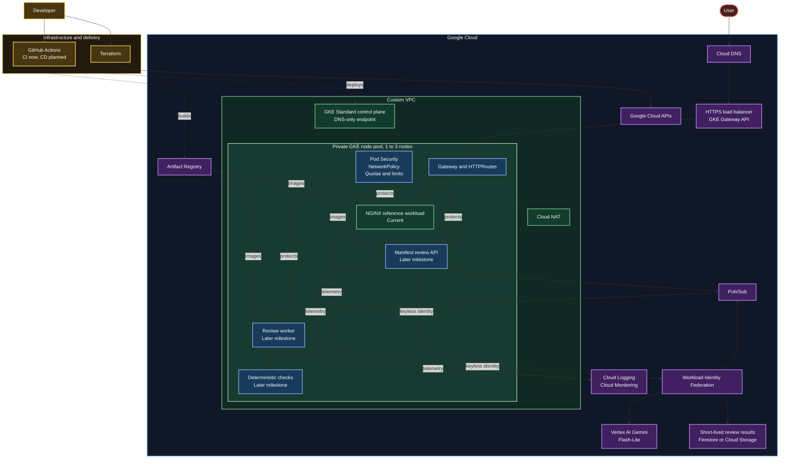

# Secure GKE Workload Platform

## Status

- Focus: secure workload delivery on GKE, with the AI reviewer as a later reference workload.
- Complete: private GKE foundation built with modular Terraform.
- Complete: NGINX Deployment, ClusterIP Service, probes, resources, scaling, self-healing, restart, and rollback validation.
- Complete: credential-free pull request validation, required on `main`.
- Next: guard the existing workload with Pod Security Admission, NetworkPolicy, and resource limits.
- Milestone 1: guard the existing NGINX workload, publish a custom image, add keyless delivery, expose it through Gateway API, and prove it with monitoring and failure tests.
- Milestone 2: add an AI-assisted manifest reviewer with deterministic validation before and after every model suggestion.

## Platform capabilities

| Domain | What exists | Decisions | Evidence |
| --- | --- | --- | --- |
| Networking | Custom VPC, private nodes, Cloud NAT, DNS-only control plane, Dataplane V2 | [Networking](decisions.md#networking) | [Phase 1](worklog/phase-01-infrastructure.md) |
| Cluster | Zonal GKE Standard, autoscaling node pool, Shielded Nodes, Regular release channel | [Cluster](decisions.md#cluster) | [Phase 1](worklog/phase-01-infrastructure.md) |
| Identity | Workload Identity Federation, dedicated node service account | [Identity and access](decisions.md#identity-and-access) | [Phase 1](worklog/phase-01-infrastructure.md) |
| Workload | `demo` namespace, NGINX Deployment, health probes, resource limits, ClusterIP Service | [Infrastructure and configuration](decisions.md#infrastructure-and-configuration) | [Phase 2](worklog/phase-02-nginx-workload.md) |
| Delivery | Credential-free pull request validation, required checks on `main` | [Delivery](decisions.md#delivery) | [Phase 3](worklog/phase-03-ci.md) |
| Policy | Not built yet | [Deferred](decisions.md#deferred-decision-records) | Phase 4 |
| Observability | Not built yet | [Deferred](decisions.md#deferred-decision-records) | Phase 8 |

## Documentation

- [Implementation plan](plan.md)
- [Architecture decisions](decisions.md)
- [Phase 1 infrastructure worklog](worklog/phase-01-infrastructure.md)
- [Phase 2 workload worklog](worklog/phase-02-nginx-workload.md)
- [Phase 3 CI worklog](worklog/phase-03-ci.md)
- [kubectl command reference](reference/kubectl-commands.md)
