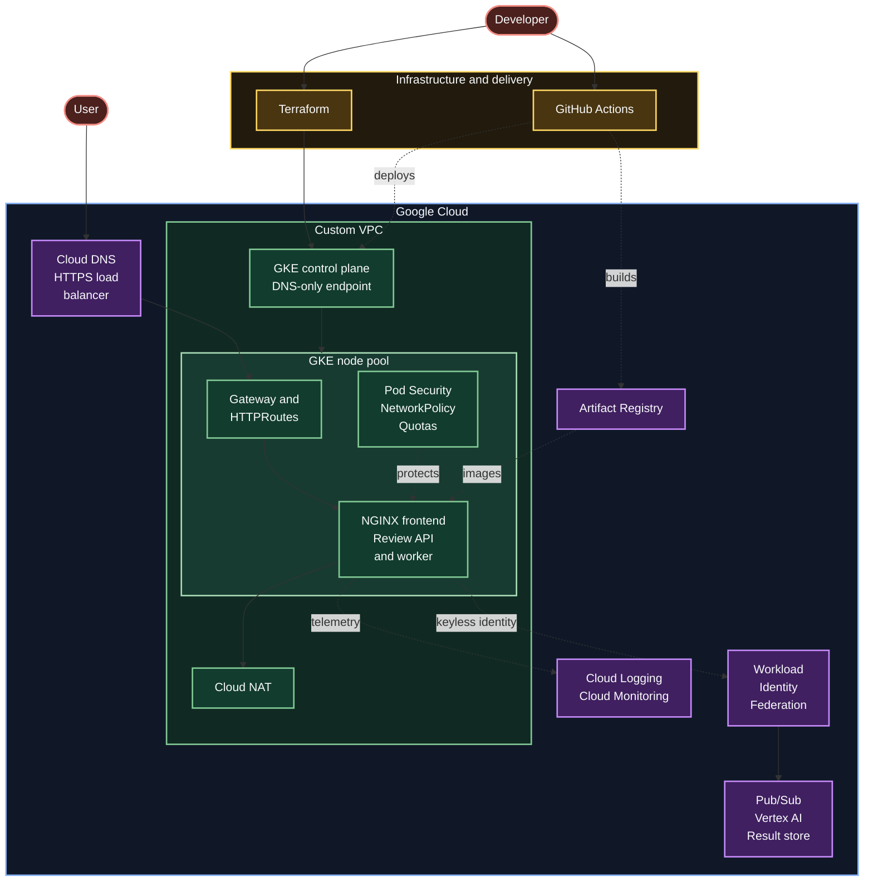

# Secure GKE Workload Platform

## Status

- Focus: secure platform and workload delivery on GKE
- Complete: private GKE foundation built with modular Terraform.
- Complete: NGINX Deployment, ClusterIP Service, probes, resources, scaling, self-healing, restart, and rollback validation.
- Complete: credential-free pull request validation, required on `main`.
- Complete: workload guardrails, with Pod Security Admission, a namespace resource budget, and default-deny NetworkPolicies.
- Complete: a project-owned non-root image published to Artifact Registry and deployed by digest. The private repository exists; nothing has been built yet.
- In-progres: public facing gateway, custom .com domain (complete) and secure tls 1.3 connectivity (troubleshooting in-progress)
- Milestone 1: guard the existing NGINX workload, publish a custom image, add keyless delivery, expose it through Gateway API, and prove it with monitoring and failure tests.

## Platform capabilities

| Domain | What exists | Decisions | Evidence |
| --- | --- | --- | --- |
| Networking | Custom VPC, private nodes, Cloud NAT, DNS-only control plane, Dataplane V2 | [Networking](decisions.md#networking) | [Phase 1](worklog/phase-01-infrastructure.md) |
| Cluster | Zonal GKE Standard, autoscaling node pool, Shielded Nodes, Regular release channel | [Cluster](decisions.md#cluster) | [Phase 1](worklog/phase-01-infrastructure.md) |
| Identity | Workload Identity Federation, dedicated node service account | [Identity and access](decisions.md#identity-and-access) | [Phase 1](worklog/phase-01-infrastructure.md) |
| Workload | `demo` namespace, NGINX Deployment, health probes, resource limits, ClusterIP Service | [Infrastructure and configuration](decisions.md#infrastructure-and-configuration) | [Phase 2](worklog/phase-02-nginx-workload.md) |
| Delivery | Credential-free pull request validation, required checks on `main` | [Delivery](decisions.md#delivery) | [Phase 3](worklog/phase-03-ci.md) |
| Policy | Pod Security baseline enforced, restricted audited, dedicated ServiceAccount, namespace budget, default-deny NetworkPolicies | [Workload security](decisions.md#workload-security) | [Phase 4](worklog/phase-04-workload-guardrails.md) |
| Images | Private Artifact Registry repository, immutable tags, retention policy, node read access | [Images and supply chain](decisions.md#images-and-supply-chain) | [Phase 5](worklog/phase-05-custom-image.md) |
| Deployment | Keyless GitHub Actions delivery, repository-scoped federation, namespaced pipeline RBAC, gated rollout | [Delivery](decisions.md#delivery) | [Phase 6](worklog/phase-06-keyless-delivery.md) |
| Ingress | GKE Gateway on a reserved global address, container-native load balancing, Certificate Manager TLS in progress | [Delivery](decisions.md#delivery) | [Phase 7](worklog/phase-07-gateway-tls.md) |
| Observability | Not built yet | [Deferred](decisions.md#deferred-decision-records) | Phase 8 |

## Documentation

- [Implementation plan](plan.md)
- [Architecture decisions](decisions.md)
- [Phase 1 infrastructure worklog](worklog/phase-01-infrastructure.md)
- [Phase 2 workload worklog](worklog/phase-02-nginx-workload.md)
- [Phase 3 CI worklog](worklog/phase-03-ci.md)
- [Phase 4 guardrails worklog](worklog/phase-04-workload-guardrails.md)
- [Phase 5 custom image worklog](worklog/phase-05-custom-image.md)
- [Phase 6 keyless delivery worklog](worklog/phase-06-keyless-delivery.md)
- [Phase 7 gateway and TLS worklog](worklog/phase-07-gateway-tls.md)
- [Troubleshooting log](troubleshooting.md)
- [Kubernetes concepts reference](reference/kubernetes-concepts.md)
- [kubectl command reference](reference/kubectl-commands.md)
- [IAM and Workload Identity Federation reference](reference/iam-and-federation.md)
