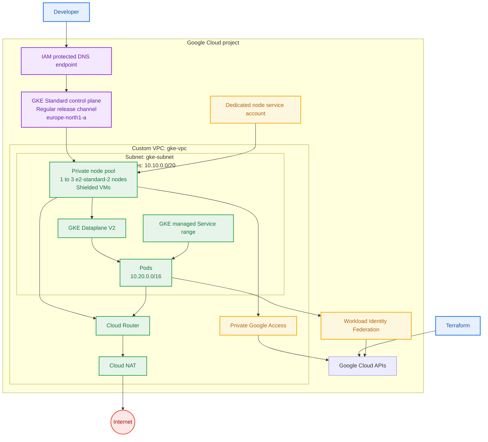

# GKE Platform

- Terraform enables seven required Google Cloud APIs.
- A custom VPC provides explicit node and Pod address ranges.
- Private nodes use Cloud NAT for outbound internet access.
- The GKE control plane is reachable only through its IAM protected DNS endpoint.
- Dataplane V2, Workload Identity Federation, Shielded Nodes, auto-repair, and auto-upgrade are enabled.
- The general node pool scales from one to three `e2-standard-2` nodes.
- Next: deploy Kubernetes workloads, namespaces, policies, and resource controls.
- Next: decide Artifact Registry, Gateway or Ingress, DNS, and TLS.
- Next: define observability, backup, and recovery requirements.
- Later: add remote state and CI/CD when collaboration or automation requires them.
- Before production: decide whether to use a regional cluster.
- See [decisions.md](decisions.md) for decisions and alternatives.
