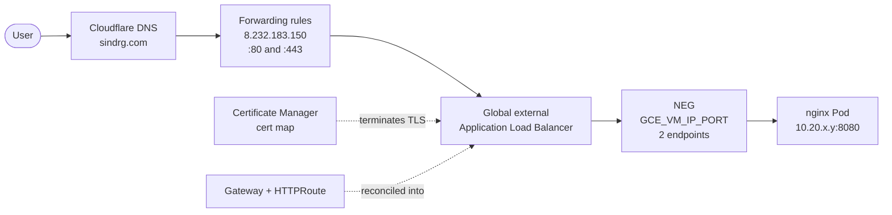
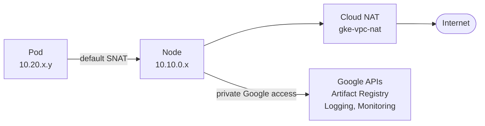
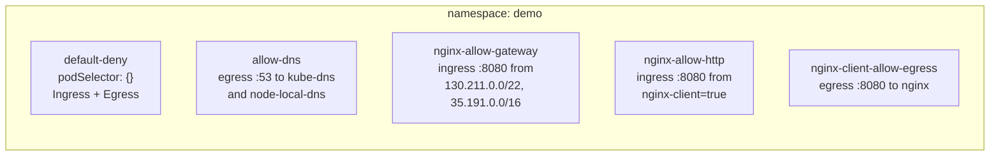

# Networking

How a request reaches a Pod on this platform, how a Pod reaches the internet, and what blocks everything else.

Scope: the `nginx` workload and the infrastructure around it. Values below are read from the running cluster, not from the manifests alone.

## Address plan

| Range | CIDR | Source | Routable in the VPC |
| --- | --- | --- | --- |
| Nodes | `10.10.0.0/20` | subnet primary range | Yes |
| Pods | `10.20.0.0/16` | subnet secondary range `gke-subnet-pods` | Yes |
| Services | `34.118.224.0/20` | assigned by GKE | No, cluster local |
| Per node Pod slice | `/24` | GKE allocation | Yes |

Pods and Services come from different places. The Pod range is a secondary range on the subnet, so Pod addresses are real VPC addresses and the load balancer can reach them directly. The Service range is managed by GKE, never appears in the subnet, and only Dataplane V2 resolves it.

Observed allocation:

| Node | Internal IP | Pod CIDR |
| --- | --- | --- |
| `gke-k8-lab-general-7d6bb7c7-0rru` | `10.10.0.15` | `10.20.2.0/24` |
| `gke-k8-lab-general-7d6bb7c7-kr98` | `10.10.0.13` | `10.20.3.0/24` |

## The VPC

`gke-vpc` is a custom VPC with `auto_create_subnetworks = false` and one subnet, `gke-subnet`, in `europe-north1`.

| Setting | Value | Effect |
| --- | --- | --- |
| `networking_mode` | `VPC_NATIVE` | Pods use alias IPs from the secondary range |
| `datapath_provider` | `ADVANCED_DATAPATH` | Dataplane V2, eBPF instead of kube-proxy iptables |
| `private_ip_google_access` | `true` | Nodes reach Google APIs without a public address |
| `enable_private_nodes` | `true` | Nodes have no external IP |

Both nodes confirm the last point: neither has an external address.

## Ingress: internet to Pod

1. DNS resolves `sindrg.com` to the reserved global address `k8-lab-gateway`.
2. Two forwarding rules answer on that address, `:80` and `:443`, both `EXTERNAL_MANAGED`.
3. Port 80 matches `nginx-https-redirect`, which returns `301` at the load balancer. No plaintext request reaches a Pod.
4. Port 443 terminates TLS using the Certificate Manager map named by the Gateway annotation.
5. The load balancer forwards to a network endpoint group, not to the Service.

### Container-native load balancing

The NEG is type `GCE_VM_IP_PORT` and holds Pod addresses directly.

| | |
| --- | --- |
| NEG | `k8s1-0bf1ac7c-demo-nginx-80-49b21201` |
| Endpoints | 2 |
| Target | Pod IP on port 8080 |

The Service stays `ClusterIP` and never receives external traffic. It exists to give the NEG controller something to watch and to serve in-cluster clients.

Readiness matters twice. The Pod carries the readiness gate `cloud.google.com/load-balancer-neg-ready`, so a Pod joins the NEG only once the load balancer agrees it is healthy.

### Health checks

`HealthCheckPolicy` points the load balancer at `/healthz` on port 8080 rather than `/`, so the check does not depend on page content.

## Egress: Pod to internet

Two different paths leave the cluster:

| Destination | Path | Public IP used |
| --- | --- | --- |
| Internet | default SNAT to node IP, then Cloud NAT | NAT address, allocated `AUTO_ONLY` |
| Google APIs | private Google access from the subnet | none |

Cloud NAT covers `gke-subnet` with `ALL_IP_RANGES`, so both the node and Pod ranges are eligible. Logging is on with `ERRORS_ONLY`, which records translation failures without paying for every connection.

Image pulls take the second path. Artifact Registry is a Google API, so a node pulls without traversing Cloud NAT.

## Control plane access

IP endpoints are disabled. The cluster is reached through its DNS endpoint.

| Setting | Value |
| --- | --- |
| `ipEndpointsConfig.enabled` | `false` |
| DNS endpoint | `gke-fa262c863c1049a4b45c7ebc3e0a237f37c6-421458901689.europe-north1-a.gke.goog` |
| `allowExternalTraffic` | `true` |
| VPC peerings on `gke-vpc` | none |

There is no authorized-networks list and no peering to a control plane range, because there is no IP endpoint to protect. Access is authorized by IAM on the DNS endpoint instead of by source address. This is what lets GitHub Actions reach the cluster with `use_dns_endpoint: true` and no bastion.

The API still reports a `publicEndpoint` address. It is a leftover field; IP endpoints are off.

## NetworkPolicy

Dataplane V2 enforces these. The namespace holds eight policies. The five below cover the namespace-wide defaults and `nginx`; the other three are the same pattern applied to `sky`.

| Policy | Selects | Direction | Allows |
| --- | --- | --- | --- |
| `default-deny` | every Pod | both | nothing |
| `allow-dns` | every Pod | egress | UDP and TCP 53 to `kube-dns` and `node-local-dns` in `kube-system` |
| `nginx-allow-gateway` | `nginx` Pods | ingress | TCP 8080 from Google's load balancer ranges |
| `nginx-allow-http` | `nginx` Pods | ingress | TCP 8080 from Pods labelled `nginx-client=true` |
| `nginx-client-allow-egress` | `nginx-client=true` Pods | egress | TCP 8080 to `nginx` Pods |

Three things follow from this shape:

- **A default deny needs DNS restored explicitly.** Name resolution is egress like any other, and the deny removes it. TCP 53 is included because answers too large for UDP are retried over TCP.
- **The load balancer is not a Pod, so it needs `ipBlock`.** `130.211.0.0/22` and `35.191.0.0/16` are Google's fixed ranges for load balancer traffic and health checks. A `podSelector` cannot express them.
- **In-cluster access takes two policies.** One to let the client out, one to let it into `nginx`. Allowing only the ingress side leaves the client blocked by its own default deny egress.

## Firewall

`gke-vpc` carries three rules, all created by GKE.

| Rule | Source | Allows | Purpose |
| --- | --- | --- | --- |
| `gke-k8-lab-fa262c86-all` | `10.20.0.0/16` | tcp, udp, icmp, esp, ah, sctp | Pod to Pod |
| `gke-k8-lab-fa262c86-vms` | `10.10.0.0/20` | icmp, tcp, udp | node to node |
| `gkegw1-zs1b-l7-gke-vpc-global` | `130.211.0.0/22`, `35.191.0.0/16` | tcp | load balancer and health checks |

Nothing on `gke-vpc` is open to `0.0.0.0/0`.

The project also holds the `default` VPC with its stock `default-allow-ssh`, `default-allow-rdp` and `default-allow-icmp` rules open to the internet. Those rules are on `default`, not `gke-vpc`, and no instance runs there. They are worth deleting, and they do not affect this platform.

## Deliberately not here

| Not used | Reason |
| --- | --- |
| Authorized networks | No IP endpoint to restrict; IAM governs the DNS endpoint |
| VPC peering to the control plane | Not created for a DNS-only cluster |
| Internal load balancer | One public entry point is the whole requirement |
| Egress NetworkPolicy on `nginx` | The workload initiates nothing outbound except DNS |
| Cloud Armor | No policy to enforce yet |
| Multiple subnets | One zonal cluster, one region |

## References

- [VPC-native clusters](https://cloud.google.com/kubernetes-engine/docs/concepts/alias-ips)
- [Private clusters](https://cloud.google.com/kubernetes-engine/docs/concepts/private-cluster-concept)
- [DNS-based control plane endpoint](https://cloud.google.com/kubernetes-engine/docs/concepts/network-isolation)
- [Dataplane V2](https://cloud.google.com/kubernetes-engine/docs/concepts/dataplane-v2)
- [Container-native load balancing](https://cloud.google.com/kubernetes-engine/docs/concepts/container-native-load-balancing)
- [GKE Gateway API](https://cloud.google.com/kubernetes-engine/docs/concepts/gateway-api)
- [Health check source ranges](https://cloud.google.com/load-balancing/docs/health-check-concepts#ip-ranges)
- [Cloud NAT](https://cloud.google.com/nat/docs/overview)
- [Private Google Access](https://cloud.google.com/vpc/docs/private-google-access)
- [NetworkPolicy](https://kubernetes.io/docs/concepts/services-networking/network-policies/)
- [EndpointSlices](https://kubernetes.io/docs/concepts/services-networking/endpoint-slices/)
