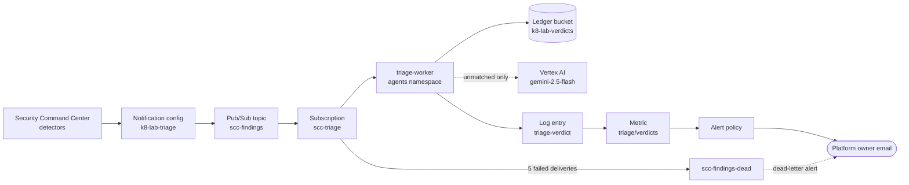
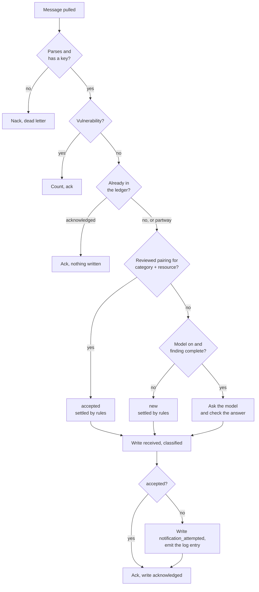

# Triage worker

How the Phase 15 worker turns a Security Command Center finding into a verdict, and where the model fits.

State on 2026-09-22: running `ai-k8s` [`a2159a1`](https://github.com/sindredg/ai-k8s/tree/a2159a1), image `sha256:a626b64f`, with `-model=gemini-2.5-flash` and 137 corpus entries. Evidence is in [the Phase 15 worklog](../worklog/phase-15-scc-triage.md). To roll it out, see [the operations reference](operations.md#rolling-out-the-triage-worker).

## The path

Security Command Center publishes changes, not state. A finding that has not changed since the worker started never reaches it. Changing a finding, even by muting it, publishes it again.

## One message

The order is fixed by [triage idempotency](../decisions.md#triage-idempotency): record before notifying, notify before acknowledging. A crash anywhere repeats work and never loses a finding.

## Who decides what

| Decision | Made by | Why not the model |
| --- | --- | --- |
| Whether a finding is `accepted` | The reviewed pairing in `mapping.yaml` | Acceptance is the quiet path. A model pairs findings to decisions by name, and did so wrongly twice while this phase was drafted |
| `new` versus `insufficient_evidence` for a finding missing a field | The worker | The boundary cannot drift if the model does not hold it |
| Whether a citation is real | Exact lookup in the compiled corpus | Injected text cannot create a corpus entry |
| Whether a contradiction lands on this finding | A cited control whose `applies_to` covers a resource the finding names | A citation can resolve and be about something else. Before this check the model raised 15 false contradictions in 125 runs, and after it none |
| Budget, spend ceiling, retries, notification | The worker | The model owns no delivery semantics |
| `new`, `contradicts_decision` or `insufficient_evidence` for an unmatched finding, and the explanation | The model | This is the judgement the rules cannot make |

Recorded in [model scope](../decisions.md#model-scope).

## The model call

| | |
| --- | --- |
| Sees | One finding the rules did not match, as escaped JSON, and all 137 corpus entries as id and summary |
| May return | `new`, `contradicts_decision`, `insufficient_evidence` |
| Never returns | `accepted`. It is absent from the schema, refused by the worker, and rejected by the validator |
| Tools | None declared. A tool call in the reply is rejected |
| Parameters | Temperature 0, thinking off, output constrained to a JSON schema |
| Input budget | 16384 tokens, estimated before the call. Over it is refused, never truncated |
| Output budget | 1024 tokens. A reply cut off at the limit is rejected |
| Spend ceiling | 1.00 USD a UTC day. Each call reserves its worst case in the ledger bucket first, so the ceiling survives restarts |
| Timeout | 30 s. A timeout is an error, not a verdict |
| Typical call | About 8900 tokens in, 100 out, 0.003 USD, 1.2 s |
| Repeatability | Not guaranteed. Four of 25 evaluation cases move between two defensible answers across five runs, and none moves between right and wrong. See [slice 14](../worklog/phase-15-scc-triage.md#slice-14-a-contradiction-has-to-land-on-something) |
| Measured quality | Cases right every run: 16 of 18 dev and 7 of 7 holdout, against 14 and 5 for the rules alone. How it is scored is in [the ai-k8s README](https://github.com/sindredg/ai-k8s#evaluation) |

A reply is refused as `insufficient_evidence`, naming the reason, when it does not decode strictly, cites an id that does not resolve, calls `new` something it also cites, returns `accepted`, or calls something a contradiction without citing a control that applies to it. The refusal is still a verdict and still notifies. Every model verdict records the model, parameters, prompt digest, tokens and estimated cost, on the ledger record and as labels on the log entry.

## When something fails

| Failure | What happens | Proven |
| --- | --- | --- |
| Ledger write refused | Nothing classified or notified, message nacked | [Slice 8](../worklog/phase-15-scc-triage.md#a-ledger-write-failure-made-to-happen) |
| Model timeout or 403 | Nothing written, message nacked | [Slice 11](../worklog/phase-15-scc-triage.md#a-failed-call-leaves-nothing-behind) |
| Five failed deliveries | Parked on `scc-findings-dead-sub`, body intact, alert fires | [Slice 11](../worklog/phase-15-scc-triage.md#a-failed-call-leaves-nothing-behind) |
| Worker killed mid-message | Redelivered, resumed from the furthest ledger state | [Slice 7](../worklog/phase-15-scc-triage.md#slice-7-the-crash-boundaries-drilled) |
| Worker stopped | Messages wait on the subscription and are triaged on restart | [Slice 7](../worklog/phase-15-scc-triage.md#a-finding-that-arrives-while-the-worker-is-stopped) |
| Instruction inside a finding | Same verdict as without it | [Slice 11](../worklog/phase-15-scc-triage.md#the-injection) |

A parked finding is not retried. Fix the cause, then mute and unmute the finding to publish it again.

## Identity

The worker runs as `k8-lab-triage@`, through Workload Identity, with no key. Recorded in [agent permission boundary](../decisions.md#agent-permission-boundary).

| Grant | Scope | Allows |
| --- | --- | --- |
| `roles/pubsub.subscriber` | `scc-triage` only | Pull and acknowledge |
| `k8_lab_ledger_appender` | The ledger bucket | Create, read, list. No delete, so no overwrite |
| `k8_lab_model_invoker` | The project | `aiplatform.endpoints.predict` only |
| `roles/logging.logWriter` | The project | Write log entries |

It holds no Security Command Center permission and no cluster credential.

## Where to look

| What | Where |
| --- | --- |
| Verdicts, with reasoning and cost | [Logs Explorer, `triage-verdict`](https://console.cloud.google.com/logs/query;query=logName%3D%22projects%2Fproject-69726555-c4de-48de-a69%2Flogs%2Ftriage-verdict%22?project=project-69726555-c4de-48de-a69) |
| The worker's own log and counters | `kubectl logs -n agents deploy/triage-worker` |
| Model traffic, errors, latency | [Vertex AI API metrics](https://console.cloud.google.com/apis/api/aiplatform.googleapis.com/metrics?project=project-69726555-c4de-48de-a69) |
| The ledger and spend reservations | [Ledger bucket](https://console.cloud.google.com/storage/browser/k8-lab-verdicts-project-69726555-c4de-48de-a69?project=project-69726555-c4de-48de-a69) |
| Parked findings | `gcloud pubsub subscriptions pull scc-findings-dead-sub --limit=10` |
| Alerts | [Monitoring incidents](https://console.cloud.google.com/monitoring/alerting/incidents?project=project-69726555-c4de-48de-a69) |

Vertex AI's Model Registry and Endpoints stay empty. The worker calls Google's hosted model and deploys none.

## Code and records

| | |
| --- | --- |
| Per-message state machine | [`internal/worker/worker.go`](https://github.com/sindredg/ai-k8s/blob/7135820/internal/worker/worker.go) |
| The model call and its checks | [`internal/model/settle.go`](https://github.com/sindredg/ai-k8s/blob/7135820/internal/model/settle.go), [`model.go`](https://github.com/sindredg/ai-k8s/blob/7135820/internal/model/model.go) |
| Spend ceiling | [`internal/model/spend.go`](https://github.com/sindredg/ai-k8s/blob/7135820/internal/model/spend.go) |
| Vertex AI adapter | [`internal/gcp/vertex.go`](https://github.com/sindredg/ai-k8s/blob/7135820/internal/gcp/vertex.go) |
| Verdict contract and validator | [`internal/verdict/record.go`](https://github.com/sindredg/ai-k8s/blob/7135820/internal/verdict/record.go) |
| Reviewed pairings | [`corpus/mapping.yaml`](https://github.com/sindredg/ai-k8s/blob/7135820/corpus/mapping.yaml) |
| Deployment | [`kubernetes/agents/deployment.yml`](../kubernetes/agents/deployment.yml) |
| Infrastructure | [`findings`](../terraform/modules/findings/main.tf), [`agent-identity`](../terraform/modules/agent-identity/main.tf), [`triage.tf`](../terraform/modules/observability/triage.tf) |
| Decisions | [Verdict record](../decisions.md#triage-verdict-record), [model scope](../decisions.md#model-scope), [vulnerability scope](../decisions.md#vulnerability-scope), [backfill](../decisions.md#triage-backfill), [inference provider](../decisions.md#inference-provider) |
