# Troubleshooting log

Faults encountered while building this platform. Each entry states the issue, the cause, and the fix, then records the evidence that connected them.

## Phase 4: Workload guardrails

### DNS stops resolving after the default deny

**Issue:** Applying `default-deny` to the `demo` namespace removes cluster DNS for every Pod in it. The `allow-dns` policy written alongside it does not restore DNS, and neither does a second version of that policy.

**Cause:** NodeLocal DNSCache answers on the kube-dns Service address but runs as its own Pod, labelled `k8s-app: node-local-dns`. The rule allows `k8s-app: kube-dns` only, so it permits a Pod that never receives the query and denies the one that does.

**Fix:** Allow both resolvers in one rule with `matchExpressions`.

```yaml
podSelector:
  matchExpressions:
    - key: k8s-app
      operator: In
      values:
        - kube-dns
        - node-local-dns
```

#### Where the request breaks

```text
Pod sends a request
    │
    ▼
1  Name resolution        egress to the DNS Pods        allow-dns
    │                     curl (6) Could not resolve host
    ▼
2  Sender egress          the client's own rules        default-deny
    │                                                   nginx-client-allow-egress
    │                     curl (28) Failed to connect
    ▼
3  Service translation    ClusterIP rewritten to a backend Pod
    │                     no error of its own, but policy is evaluated after this
    ▼
4  Receiver ingress       the target Pod's rules        nginx-allow-http
    │                     curl (28) Failed to connect
    ▼
5  Application            the server answers            any HTTP status
```

Step 1 fails differently from every other step, so `(6)` against `(28)` halves the search immediately. Steps 2 and 4 produce identical errors, because the dataplane checks sender and receiver separately and drops the packet either way.

#### Symptom

```bash
curl http://nginx
curl http://cloud.google.com
nslookup nginx
```

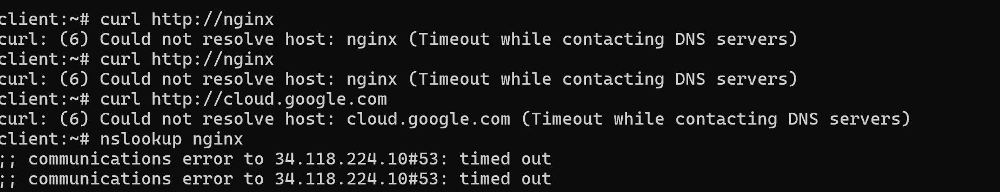

```text
curl: (6) Could not resolve host: nginx (Timeout while contacting DNS servers)
```

The query times out rather than returning `no such host`. The request left the Pod and nothing came back, which is what a dropped packet looks like. Both the cluster name and the external name fail identically, which places the fault on the hop they share.

#### Candidates eliminated

| Candidate | Evidence against it |
| --- | --- |
| The `nginx-client` label is wrong | `kubectl get pod client --show-labels` shows `nginx-client=true` applied |
| The Pod needs a restart to pick up the policy | Policy is evaluated continuously against current labels |
| The policy file is mistranscribed | `kubectl get netpol allow-dns -o yaml` shows the intended rule stored |
| The kube-system namespace lacks its name label | `kubernetes.io/metadata.name=kube-system` is present |
| NodeLocal DNSCache uses a link-local resolver | `resolv.conf` names an ordinary Service address |

#### The first fix, which does not work

`resolv.conf` points at the kube-dns Service address, so the next attempt allows that address with an `ipBlock` rule.

```bash
kubectl get svc kube-dns -n kube-system
```

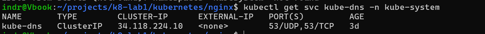

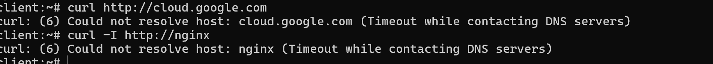

Nothing changes. A NetworkPolicy cannot name a Service address. The dataplane rewrites a Service IP to a backend Pod before it evaluates policy, so the rule never sees traffic. NetworkPolicy selects Pods, never Services.

#### Finding the resolver that answers

```bash
kubectl get pods -n kube-system --show-labels | grep dns
```

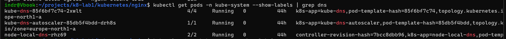

A third Pod that no rule mentions. Querying each resolver separately isolates the fault, because `dig @server` bypasses `resolv.conf` and asks a named server directly.

```bash
dig +short @34.118.224.10 nginx.demo.svc.cluster.local
dig +short @10.20.1.12 nginx.demo.svc.cluster.local
```

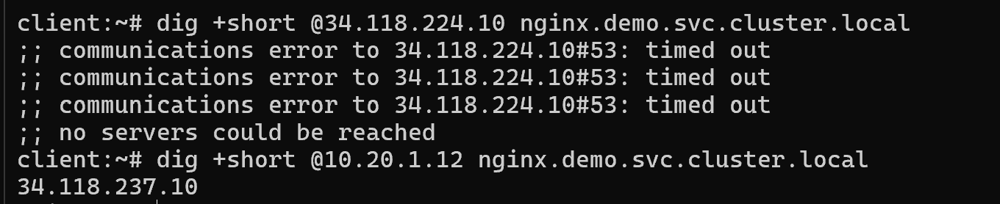

The kube-dns Pod answers and the Service address does not, so the rule is correct for the Pod it names and something else receives the query.

#### Disproving the host network theory

The working assumption is that NodeLocal DNSCache runs in the host network namespace, where no Pod selector can reach it. One command disproves it.

```bash
kubectl get nodes -o wide
```

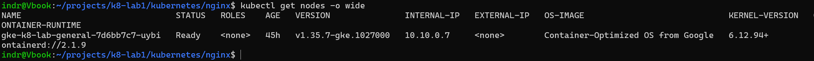

The node holds `10.10.0.7`. NodeLocal DNSCache holds `10.20.1.2`, inside the Pod range, so it is an ordinary Pod. One more query confirms the rule blocks it.

```bash
dig +short @10.20.1.2 nginx.demo.svc.cluster.local
```

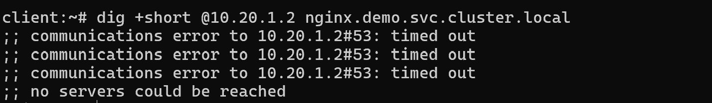

Believing the cache was host-networked led to a recommendation to disable NodeLocal DNSCache in Terraform, which recreates every node. The node address was one command away throughout.

#### Confirming the application path is not involved

```bash
curl -I http://34.118.237.10
```

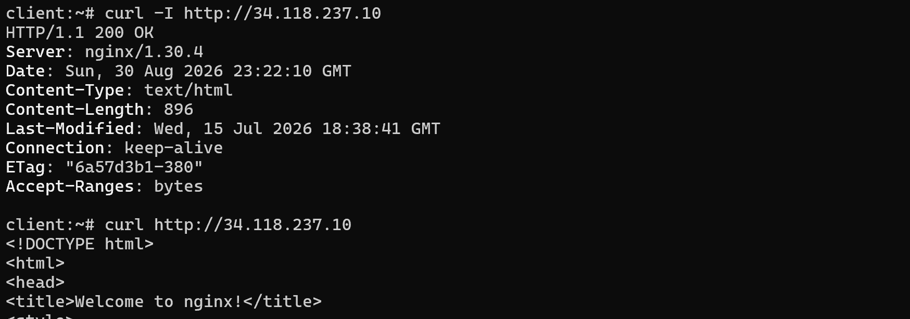

The Service returns `200 OK` while name resolution is still broken. The ingress and client egress rules are correct throughout, and every failed `curl` died at the name lookup without reaching them.

#### Verification

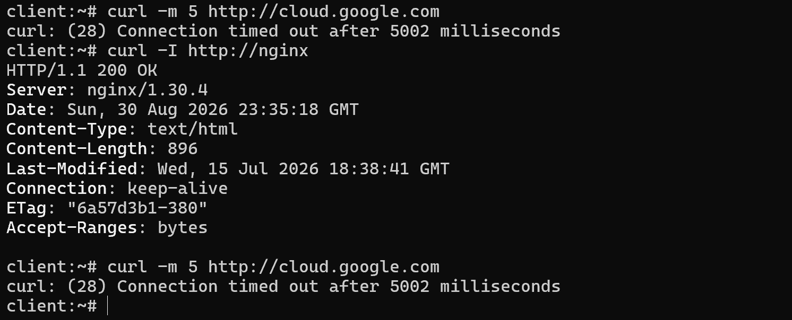

Name resolution returns, the labelled client reaches NGINX, and egress to the internet stays denied. The failure mode changes from `(6) Could not resolve host` to `(28) Connection timed out`, which confirms the block moves one layer further along.

#### What to check first next time

1. Read the error. Resolution failure and connection failure are different faults.
2. Run `kubectl get netpol -n NAMESPACE -o yaml`. What the API server stored is the only version that matters.
3. Run `cat /etc/resolv.conf` inside the Pod to find the configured resolver.
4. Run `kubectl get pods -n kube-system --show-labels | grep dns`. More than one component may answer.
5. Run `dig @server` against each candidate resolver in turn.

[Dataplane V2 policy logging](https://cloud.google.com/kubernetes-engine/docs/how-to/dataplane-v2#using-network-policy) names the denied connection directly. This cluster does not have it enabled, and the Phase 4 worklog records that as a gap.

### A Pod restart does not reload network policy

**Issue:** A policy or label change appears not to take effect, and restarting the Pod does not help.

**Cause:** Policy is not baked into a Pod at creation. The dataplane recomputes it continuously from current labels, so a restarted Pod returns with the same labels and the same verdict.

**Fix:** Change the label, the policy, or the Service selector. The running Pod picks it up within about a second. Only a change to the Pod template produces a new Pod.

### A denied connection hangs instead of failing

**Issue:** `curl` against a blocked destination sits for more than two minutes before reporting an error.

**Cause:** A denial drops the packet silently rather than refusing the connection, so the client waits out its own connect timeout with nothing to respond to.

**Fix:** Set a timeout with `curl -m 5`. The distinction still holds in the result: `(28)` is a timeout and `(7)` is a refusal.

## Phase 5: Custom image and Artifact Registry

### A Terraform plan proposes the same change after every apply

**Issue:** Every `terraform plan` proposes to unset `enable_private_endpoint` on the cluster, and applying it changes nothing.

```text
~ private_cluster_config {
    - enable_private_endpoint = true -> null
```

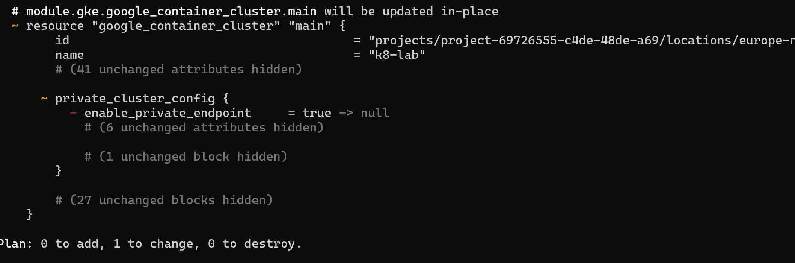

The apply reported success and the plan above was taken afterwards.

**Cause:** The configuration never declares the field, and GKE derives it from `control_plane_endpoints_config.ip_endpoints_config.enabled = false`. Terraform reads `true` from the API, finds nothing in the configuration, and resolves the difference in favour of the configuration. The API ignores the write because the value is derived, so the next refresh reads `true` again.

**Fix:** Declare the value the infrastructure already has.

```hcl
private_cluster_config {
  enable_private_nodes    = true
  enable_private_endpoint = true
}
```

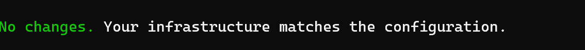

#### Checking exposure rather than reading it

The cluster description reports a public address, which reads alarming.

```bash
gcloud container clusters describe k8-lab --zone europe-north1-a \
  --format="yaml(privateClusterConfig,controlPlaneEndpointsConfig,endpoint)"
```

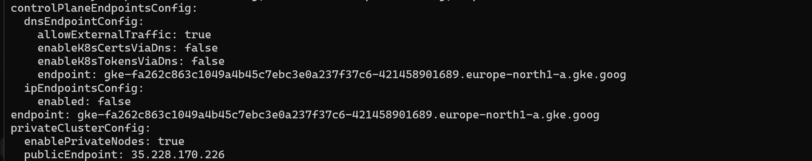

`publicEndpoint` is reported whether or not the endpoint serves traffic. Reachability is governed by `ipEndpointsConfig.enabled`, which is `false`, and the `endpoint` field holds the DNS name rather than an address. Connecting settles it.

```bash
curl -k --max-time 5 https://35.228.170.226/version
```

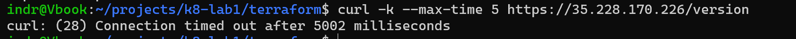

A timeout rather than a refusal, so nothing is listening. The posture recorded in the Phase 1 decision holds, and the only fault was the recurring diff.

#### Why it matters beyond the noise

A plan that always carries one expected modification trains the reader to skim that block. This block governs control plane exposure, so skimming it is how an unintended change eventually ships unreviewed.

The general rule: a plan diff on something nobody edited means the configuration is silent about a value the API has an opinion on. State the value. The same shape appears wherever an API normalises input, including durations returned in seconds when the configuration was written in days.

### An NGINX response carries the same header twice

**Issue:** A `/healthz` location returning a fixed string answers with two `Content-Type` headers, `application/octet-stream` followed by `text/plain`.

**Cause:** `add_header` appends a header. It does not replace one, so the directive added a second value beside the type NGINX had already chosen.

**Fix:** Set the type instead of adding a header.

```nginx
default_type text/plain;
```

The status and the body were correct throughout, so a check asserting only `200` would not have caught it.

### An image pull fails with NotFound although the digest exists

**Issue:** The Deployment referenced an image by digest that `gcloud artifacts docker images list` had just printed, and the pods stayed in `ImagePullBackOff`.

```
failed to resolve reference "...k8-lab/nginx@sha256:a0388fda...": not found
```

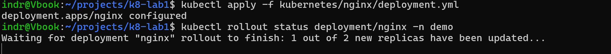

`maxUnavailable: 0` turns a failed pull into a stalled rollout rather than an outage: the new Pod never becomes Ready, so the old Pods are never terminated. `kubectl rollout status` reports only that the rollout has not finished, never why.

**Cause:** Two separate faults, one after the other, both reported as `NotFound`.

First, the repository path was wrong. The image was pushed to `k8-lab/frontend`, and the manifest named `k8-lab/nginx`. A digest resolves within a repository, so a correct digest under the wrong path is simply absent.

Second, once the path was corrected, the pull still failed. The image had been built with a bare `docker build` on an Apple Silicon workstation, which publishes an arm64-only index. The nodes are amd64, so the index held no manifest they could run.

**Fix:** Correct the path, then rebuild for both platforms and reference the new index digest.

```bash
docker buildx build --platform linux/amd64,linux/arm64 --push -t "$REGISTRY/frontend:$SHA-multiarch" app/
```

`immutable_tags` refused to move `2bb5f3a` onto the rebuild, which is the policy working rather than obstructing: the tag still names the bytes it originally named. The rebuild went out under a new tag.

#### Why the error message is unhelpful

Artifact Registry returns `NotFound` for a missing repository, a missing digest, and a caller without read access alike, so that it does not leak whether a private repository exists. The message therefore cannot distinguish a typo from a permissions gap, and reading it as one wastes time on the other.

The platform mismatch is a third case behind the same message. containerd is more specific when it gets that far, so the node's own log is worth reading before the pod events:

```bash
kubectl describe pod <pod> -n demo | sed -n '/Events:/,$p'
```

`no match for platform in manifest` is the phrase that separates it from the other two.

#### What to check first next time

1. Confirm the repository path, not just the digest. `gcloud artifacts docker images list "$REGISTRY/<image>"` fails loudly on a path that does not exist.
2. Check the platforms the index actually holds. `docker manifest inspect` lists them, and a single-entry index built on an arm workstation is the common case.
3. Only then look at IAM. A pull uses the node service account, not the identity that ran the successful `gcloud` command a moment earlier.

The general rule: an identity that can read something says nothing about whether a different identity can, and a registry that resolves a reference says nothing about whether the node can execute what it finds.

## Phase 6: Keyless application delivery

### A federated token exchange fails with ECONNRESET

**Issue:** The `google-github-actions/auth` step failed on the first delivery run, after having written its credential configuration.

```text
failed to generate Google Cloud federated token for
//iam.googleapis.com/projects/421458901689/locations/global/workloadIdentityPools/github/providers/github-oidc:
read ECONNRESET
```

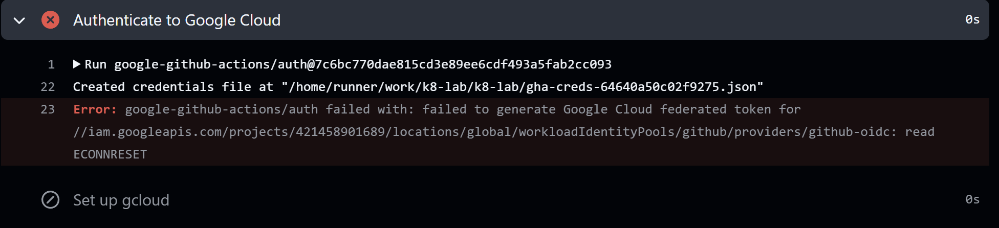

**Cause:** A transport failure, not an authorization failure. The connection to the Security Token Service was reset mid-request. Re-running the same commit with no changes succeeded.

**Fix:** Re-run the job. If it fails identically twice, check that `sts.googleapis.com` and `iamcredentials.googleapis.com` are enabled and that the provider path names the right project number.

```bash
gcloud services list --enabled | grep -E 'sts|iamcredentials'
gcloud projects describe PROJECT_ID --format='value(projectNumber)'
```

#### Why the distinction matters

A rejected token reads differently: `Unable to acquire impersonated credentials`, or a 403 naming the credential as rejected. Those mean the attribute condition, the `principalSet` binding, or the repository name is wrong, and they are worth hours of Terraform reading. `ECONNRESET` means none of that was ever reached, and reading it as an authorization problem sends you to inspect configuration that is already correct.

The general rule: separate "the request did not arrive" from "the request arrived and was refused" before forming any theory. The two have no causes in common.

### A container will not start because its user is a name rather than a number

**Issue:** The smoke test Pod was admitted and its image pulled successfully, then the container never started. `kubectl run --attach` reported only a timeout.

```text
error: timed out waiting for the condition
```

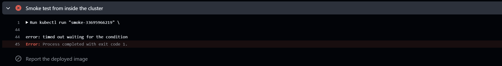

**Cause:** Visible only in the namespace events, not in the step log.

```bash
kubectl get events -n demo --sort-by=.lastTimestamp | tail -20
```

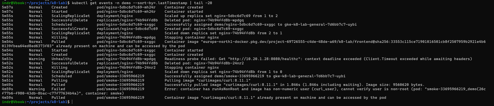

```text
Error: container has runAsNonRoot and image has non-numeric user (curl_user),
cannot verify user is non-root
```

`curlimages/curl` declares its user as a name. The kubelet enforces `runAsNonRoot` by checking that the UID is not 0, and it cannot resolve a username into a UID, because that mapping lives in the container's `/etc/passwd`, which the kubelet does not read. It refuses to start rather than guess.

**Fix:** State the UID explicitly alongside the flag. `curl_user` is UID 100.

```json
"securityContext": {
  "runAsNonRoot": true,
  "runAsUser": 100
}
```

#### The step hid its own cause

The original step used `kubectl run --attach --rm`, which waits for the Pod to reach Running and reports a bare timeout when it does not. The rewrite waits on the Pod's phase and dumps `kubectl describe` on failure, so the run log names the cause instead of the reader having to reconstruct it from events afterwards.

```bash
kubectl wait --for=jsonpath='{.status.phase}'=Succeeded "pod/$POD" -n demo --timeout=90s \
  || { kubectl describe "pod/$POD" -n demo; exit 1; }
```

Dropping `--attach` removed two other problems at once: a race where a container exiting in under a second finishes before kubectl observes it Running, and a dependency on the `pods/attach` subresource that the pipeline's Role does not grant.

#### What to check first next time

1. Read the events, not the step log. A Pod that never starts produces its reason there.
2. Separate "not admitted" from "admitted but not started". Admission rejections are immediate and name the policy; a start failure follows a successful pull.
3. Check whether the image declares a numeric user. `docker inspect --format '{{.Config.User}}' IMAGE` answers it, and anything non-numeric is incompatible with a bare `runAsNonRoot`.

### A pull request shows no changes although the fix is committed

**Issue:** A branch that broke `app/default.conf` and then restored it produced a pull request GitHub reported as having no changes, while `main` still carried the break.

**Cause:** GitHub computes a pull request's diff from the merge base, not from the target branch's tip. The earlier commit on that branch had already been squash-merged, which rewrote it onto `main` under a new hash, so the merge base stayed at the branch's original starting point. From there the branch broke a file and restored it: a net change of nothing.

**Fix:** Rebuild the branch on the current tip and replay only the intended commit.

```bash
git fetch origin
git checkout -B fix/restore-healthz origin/main
git cherry-pick COMMIT
git push -u origin fix/restore-healthz
```

#### Why this matters beyond the confusing display

Squash-merging that empty pull request would have produced an empty commit and left the break in place. The pull request was not merely rendering oddly; merging it would not have fixed anything.

Two rules follow, and both come from squash-merging specifically. Under a merge-commit strategy the shared history stays a genuine ancestor and neither problem arises.

- Never branch from a branch. Start every branch from `origin/main` by naming it: `git checkout -b NAME origin/main`.
- Never reuse a branch after its pull request merged. Under squashing a branch is single-use, because its commits now exist on `main` under different hashes.

## Phase 7: Gateway and managed TLS

### A Gateway provisions cleanly and every backend is unhealthy

**Issue:** The Gateway reported `Accepted` and `Programmed`, the reserved address answered, and every request returned `502`. Both Pods appeared in the endpoint group with the correct IPs and port, and both were `UNHEALTHY`.

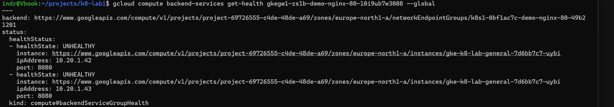

**Cause:** The namespace runs a default-deny NetworkPolicy. Load balancer health checks and forwarded requests both arrive from Google's infrastructure rather than from a Pod, so no `podSelector` rule can match them and the default deny drops every one.

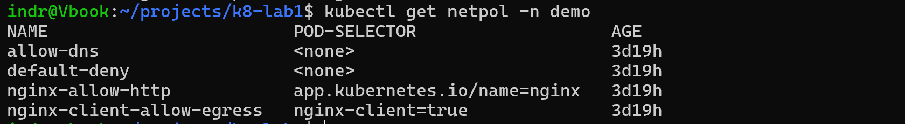

**Fix:** Admit Google's published ranges with an `ipBlock` rule.

```yaml
ingress:
  - from:
      - ipBlock:
          cidr: 130.211.0.0/22
      - ipBlock:
          cidr: 35.191.0.0/16
    ports:
      - protocol: TCP
        port: 8080
```

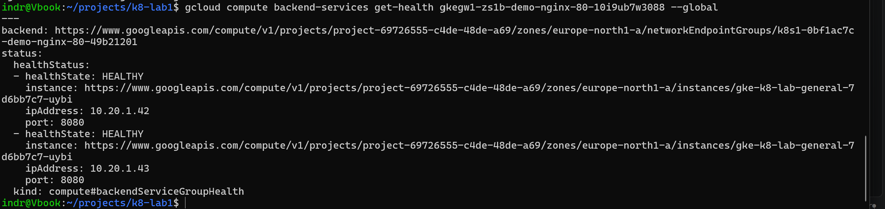

#### Why no Pod selector can express this

`podSelector` matches senders by label, which requires the sender to be a Pod the API server knows about. `ipBlock` matches by source address, which is the only way to name a sender outside the cluster. Neither form can express the other, so a namespace that denies by default needs both kinds of rule once it is published.

The ranges are Google's, not this project's, and every Google Cloud customer's load balancer traffic originates there. The rule still earns its place: it admits those proxies to one port on one set of Pods and nothing else.

#### Nothing in the Gateway's status says so

`kubectl describe gateway` reports the Gateway healthy throughout, because the Gateway is healthy. The fault is one layer further in, and only `get-health` on the backend service shows it.

```bash
for b in $(gcloud compute backend-services list --global --format="value(name)"); do
  echo "== $b"; gcloud compute backend-services get-health "$b" --global
done
```

GKE generates backend service names, so they are discovered rather than known. A Gateway also creates default 404 and 500 services, so expect more backends than routes.

### A managed certificate stays in PROVISIONING

**Issue:** A Certificate Manager certificate remained `PROVISIONING` indefinitely, and HTTPS failed with `SSL_ERROR_SYSCALL` rather than a certificate error.

**Cause:** Two separate faults, neither visible in the top-level state.

The first was a wrong value in Terraform. The `domain` variable held `sidnrg.com` rather than `sindrg.com`, so the certificate, the DNS authorization, and the map entry were all created for a domain nobody owns. The reason appeared only in `managed.authorizationAttemptInfo`:

```text
domain: sidnrg.com
failureReason: CONFIG
issues:
- CNAME_MISMATCH
```

The `CNAME` in the DNS provider was correct for that wrong name, because it had been copied faithfully from Terraform's output. Reading the record against the zone would never have found it.

The second was staleness after the fix. `domain` is immutable on a DNS authorization and a managed certificate, so correcting it replaced both, and replacement issues a new authorization with a new target.

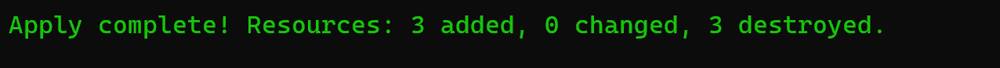

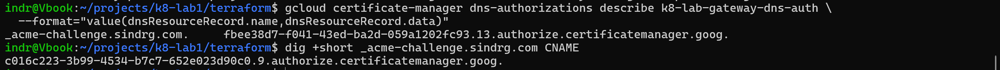

**Fix:** Compare the two values directly rather than checking that a record exists.

```bash
gcloud certificate-manager dns-authorizations describe NAME \
  --format="value(dnsResourceRecord.name,dnsResourceRecord.data)"
dig +short _acme-challenge.DOMAIN CNAME
```

The served value began `c016c223`, from the destroyed authorization; the expected value began `fbee38d7`. A record that exists and resolves is not the same as a record that matches.

#### Why HTTPS fails at the transport layer

`SSL_ERROR_SYSCALL` means nothing answered on 443. GKE does not stand up an HTTPS frontend without a usable certificate, so the listener exists in the Gateway spec while the load balancer has nothing to serve. An untrusted or mismatched certificate produces a *verify* error instead, which is a different fault at a different layer.

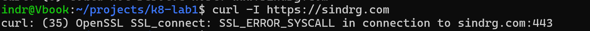

#### What to check first next time

1. Read `managed.authorizationAttemptInfo`, not `managed.state`. The state says stuck; the attempt says why.
2. Confirm the `domains` list holds the domain you own. A certificate for the wrong name fails identically to a missing DNS record.
3. Compare the expected authorization target against what DNS serves, character by character.
4. Separate a transport failure from a verify failure before forming any theory about the certificate.

### GatewayClasses appear in waves

**Issue:** After enabling the Gateway API, `kubectl get gatewayclass` returned only layer 4 classes, and `gke-l7-global-external-managed` was absent.

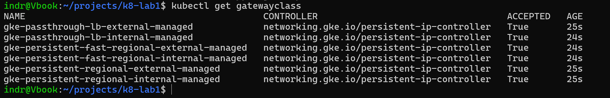

**Cause:** GKE installs the classes progressively. The L4 set from `persistent-ip-controller` registers before the L7 set from `networking.gke.io/gateway`.

**Fix:** Wait. The L7 classes appeared about twenty minutes later with no further action.

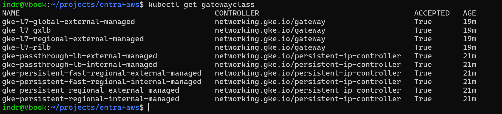

The diagnostic is the CONTROLLER column rather than the names: no row carrying `networking.gke.io/gateway` means the L7 controller has not registered yet. If the classes never appear, confirm the HTTP load balancing add-on is enabled, since the L7 classes depend on it.
