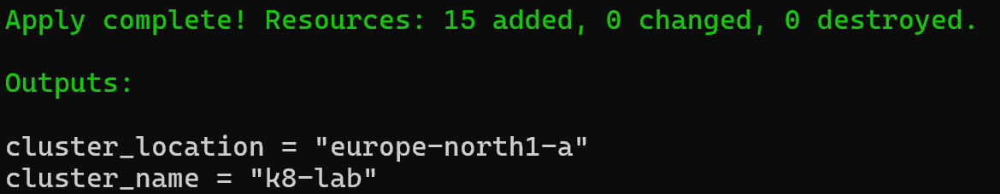
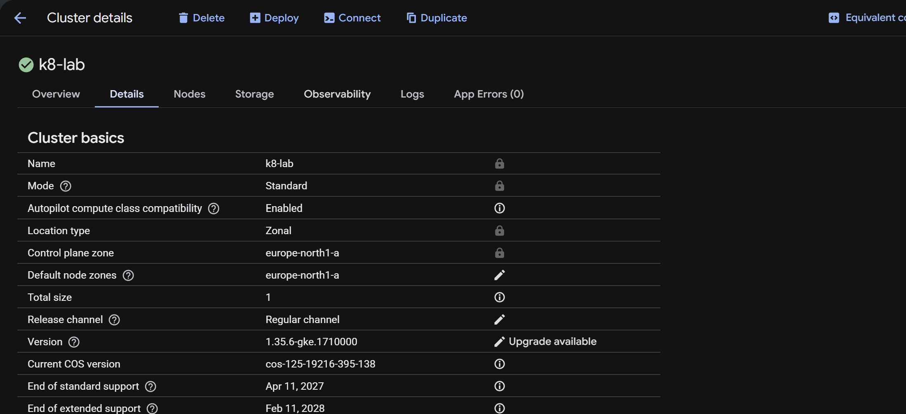
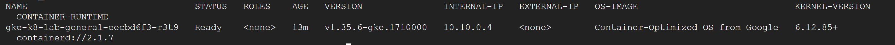
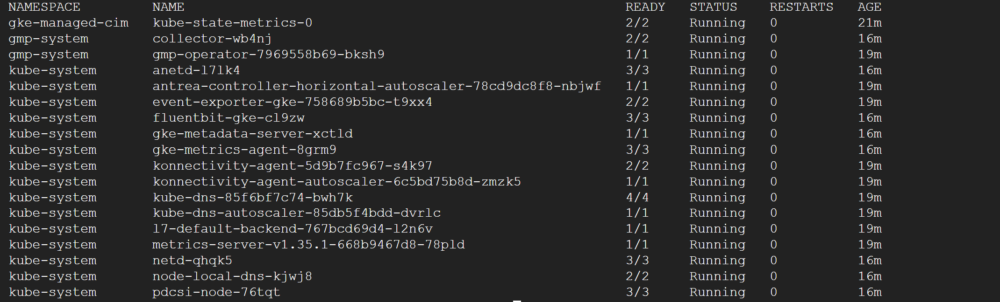

# Worklog: Phase 1 GKE Infrastructure

Date: 2026-08-28  
Status: Complete

## Outcome

- Terraform applied successfully: 15 added, 0 changed, 0 destroyed.
- GKE cluster `k8-lab` is running in `europe-north1-a`.



## Deployed

- Seven required Google Cloud APIs.
- Custom VPC, subnet, Cloud Router, and Cloud NAT.
- Zonal GKE Standard cluster with private nodes.
- DNS-only control plane, Dataplane V2, and Workload Identity Federation.
- Autoscaling `e2-standard-2` node pool with one to three nodes.



## Validation

Status: Passed

```bash
gcloud container clusters get-credentials k8-lab --location=europe-north1-a --dns-endpoint
kubectl config current-context
kubectl cluster-info
```

```bash
kubectl get nodes -o wide
```



```bash
kubectl get pods --all-namespaces
```


Result: one `Ready` node and healthy visible system workloads.

## Decisions

- Local Terraform state and manual deployment remain in use for now.
- Remote state and CI/CD are deferred.
- A regional cluster remains a production decision.

See [decisions.md](../decisions.md) for the full record.

## Next

- Deploy the first namespace, Deployment, and Service.
