# Worklog: Phase 2 NGINX Workload

Date: 2026-08-28  
Status: Complete

## Goal

Deploy and validate a private NGINX workload on GKE.

## Where the workload runs

```text
Your WSL terminal
    │
    │ kubectl sends YAML through the DNS control-plane endpoint
    ▼
GKE control plane
    │
    │ creates and manages the requested resources
    ▼
Deployment → ReplicaSet → 2 NGINX Pods
                         │
                         ▼
                 GKE node in Google Cloud
```

## How local access works

```text
Browser
    │
    │ localhost:8080
    ▼
kubectl port-forward in WSL
    │
    │ encrypted connection through the Kubernetes API
    ▼
One selected NGINX Pod in GKE
```

## Implemented

- Installed the GKE authentication plugin for `kubectl`.
- Created the `demo` namespace.
- Deployed two NGINX replicas using `nginx:1.30.4-alpine3.24`.
- Added health probes, resource controls, and a private ClusterIP Service.

## Validation

```bash
kubectl rollout status deployment/nginx -n demo
```

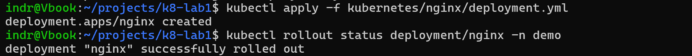

```bash
kubectl get deployments -n demo
```

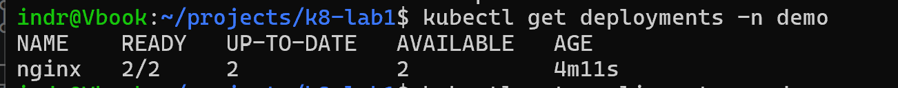

```bash
kubectl get pods -n demo -o wide
```

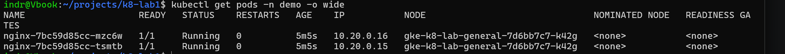

```bash
kubectl get endpointslices -n demo -l kubernetes.io/service-name=nginx
```

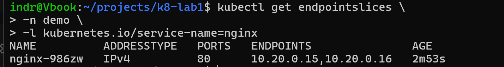

```bash
kubectl port-forward service/nginx 8080:80 -n demo
```

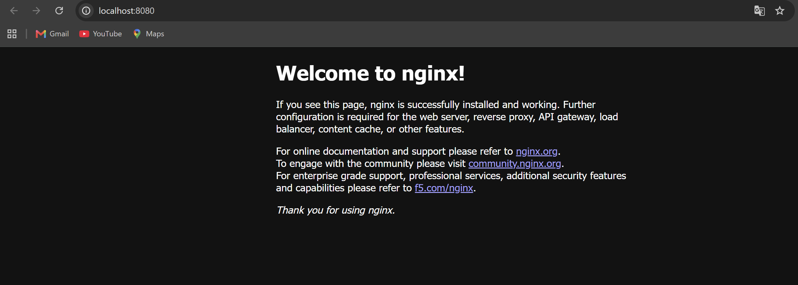

Result: rollout succeeded, both Pods are healthy, the Service selected both Pods, and NGINX responded locally.

```bash
kubectl get events -n demo
```

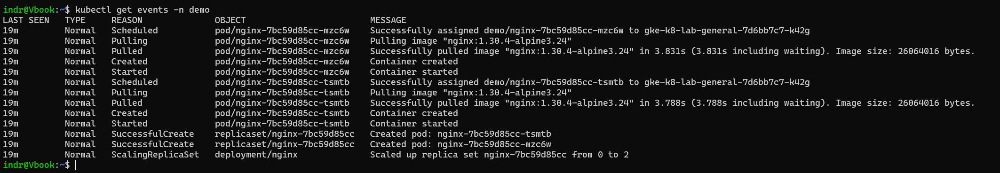

The events record the chain in order: the Deployment scales a ReplicaSet, the ReplicaSet creates Pods, the scheduler assigns each to a node, and the kubelet pulls the image and starts the container. Each object in that chain is visible separately, which is what makes a stall at any step diagnosable.

## Self-healing test

```bash
kubectl delete pod <pod-name> -n demo
```

```bash
kubectl get pods -n demo --watch
```

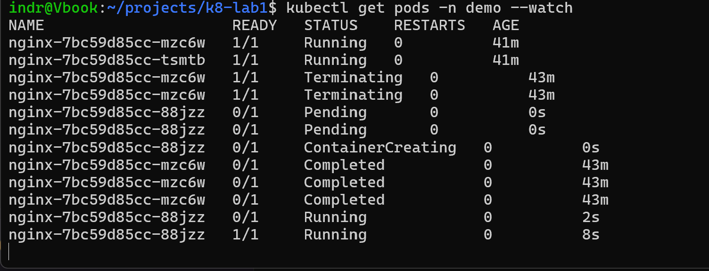

```bash
kubectl get deployments,replicasets,pods -n demo -o wide
```

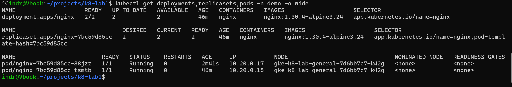

```bash
kubectl get events -n demo --sort-by=.metadata.creationTimestamp
```

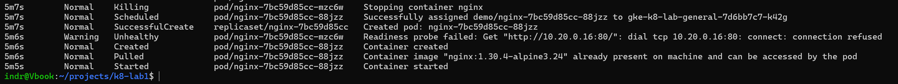

Result: Kubernetes replaced the deleted Pod and restored the Deployment to `2/2` ready replicas.

Note: one readiness check failed while NGINX was starting. The Pod recovered and became ready normally.

## Scaling test

```bash
kubectl scale deployment/nginx --replicas=3 -n demo
```

```bash
kubectl get pods -n demo -o wide
```

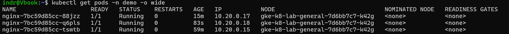

```bash
kubectl get endpointslices -n demo -l kubernetes.io/service-name=nginx
```

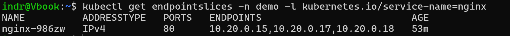

```bash
kubectl apply -f kubernetes/nginx/deployment.yml
```

```bash
kubectl get deployments,pods -n demo -o wide
```

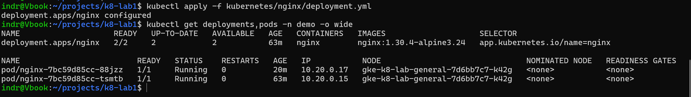

Result: live scaling added a third Pod and Service endpoint. Reapplying the manifest restored the declared two-replica state.

## Rolling restart and rollback

```bash
kubectl rollout restart deployment/nginx -n demo
```

```bash
kubectl get pods -n demo --watch
```

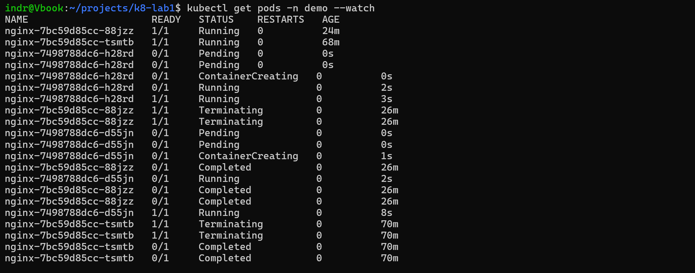

```bash
kubectl get replicasets,pods -n demo -o wide
```

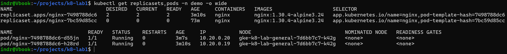

```bash
kubectl rollout undo deployment/nginx -n demo
```

```bash
kubectl get replicasets,pods -n demo -o wide
```

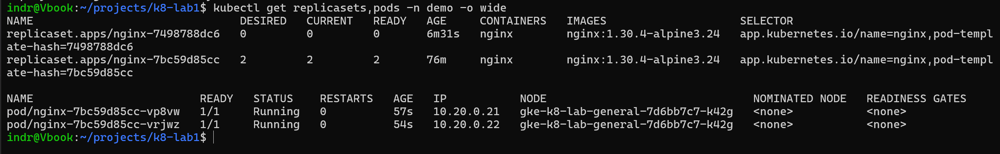

Result: revision 2 replaced the Pods gradually, then rollback restored revision 1 with two healthy Pods.

```bash
kubectl rollout history deployment/nginx -n demo
```

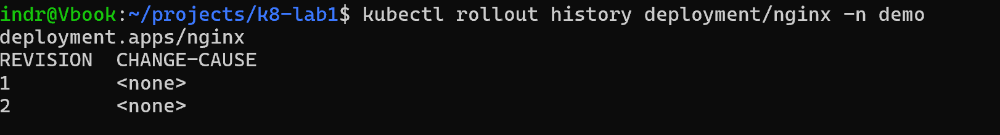

History recorded two Deployment revisions, which is what `rollout undo` restores from.

## Next

- Decide how the application should be exposed externally.

