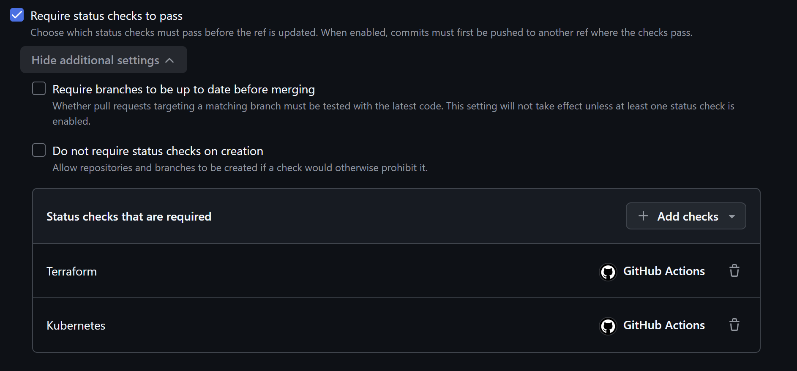
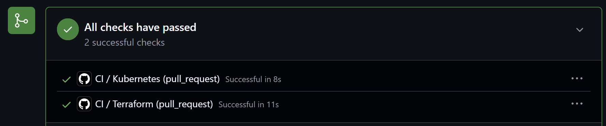

# Worklog: Phase 3 Credential-Free CI

Date: 2026-08-28  
Status: Complete

## Goal

Stop broken Terraform and Kubernetes configuration from reaching `main` without giving the pipeline any Google Cloud access.

## How validation runs

```text
Pull request opened against main
    │
    ▼
GitHub-hosted runner, no cloud credentials
    │
    ├── Terraform job: fmt, init without a backend, validate
    └── Kubernetes job: kubeconform schema validation, kube-linter report
    │
    ▼
Both checks must pass before main accepts the merge
```

## Implemented

- Added `.github/workflows/ci.yml` with separate Terraform and Kubernetes jobs.
- Restricted the workflow token to `contents: read` and granted no cloud identity.
- Pinned `actions/checkout` and `hashicorp/setup-terraform` to commit SHAs.
- Installed pinned kubeconform and kube-linter releases on the runner.
- Published kube-linter findings to the run summary as advisory output.
- Required both checks and a pull request on `main` through a repository ruleset.



## Why the pipeline needs no credentials

`terraform init -backend=false` installs providers and local modules so `terraform validate` can check the configuration, but skips backend initialization. Nothing reads state and nothing authenticates to the project. The workflow is never granted `id-token: write`, so it cannot mint a Google Cloud token even if a step tried.

## Validation

Status: Passed

```bash
terraform -chdir=terraform fmt -check -recursive -diff
terraform -chdir=terraform init -backend=false -input=false
terraform -chdir=terraform validate
```

```bash
kubeconform -strict -summary -verbose kubernetes/
kube-linter lint kubernetes/
```

Result: both checks passed on [pull request #7](https://github.com/sindredg/k8-lab/pull/7). Terraform completed in 11 seconds and Kubernetes in 8 seconds. kubeconform validated 3 resources in 3 files.



## Known gaps

- kube-linter is advisory and reports three findings on the NGINX Deployment: no inter-Pod anti-affinity, a writable root file system, and no `runAsNonRoot`. Phase 4 and Phase 5 close them, after which the check becomes blocking.
- YAML and Markdown linting are deferred until a change needs them.
- No failure path was recorded. Blocking behaviour rests on the ruleset rather than on a deliberately broken manifest.

## Next

- Guard the `demo` namespace with Pod Security Admission, NetworkPolicy, and resource limits.
