# Worklog: Phase 4 Workload Guardrails

Date: 2026-08-29 to 2026-08-31  
Status: Complete

## Goal

Protect the `demo` namespace by rejecting workloads that are unsafe, too large, or not allowed.

## Where the controls apply

```text
kubectl apply
    │
    ▼
GKE API server
    │
    ├── Authentication      who is calling
    ├── Authorization       is the caller allowed to do this
    ├── Admission control   is this specific object allowed as written
    │        │
    │        └── Pod Security Admission reads the namespace labels
    ▼
Cluster database
    │
    ▼
Scheduler assigns a node, kubelet starts the container
```

If admission control rejects an object, Kubernetes does not save it. No image is pulled, no node is selected, and no container starts.

## Slice 1: Pod Security and workload identity

Status: Complete

### Implemented

- Labelled the `demo` namespace to enforce the Pod Security `baseline` standard.
- Set `warn` and `audit` to the stricter `restricted` standard.
- Pinned all three to `v1.35` so a cluster upgrade cannot change enforcement.
- Added a dedicated `nginx` ServiceAccount with `automountServiceAccountToken` disabled.
- Moved the Deployment off the namespace `default` ServiceAccount.

### Validation

Status: Passed

```bash
kubectl apply -f kubernetes/nginx/namespace.yml
kubectl get namespace demo --show-labels
```


Applying the labels produced no warning about existing Pods, which confirms the running workload already satisfies `baseline`. Both Pods kept running with zero restarts.

```bash
kubectl apply -f kubernetes/nginx/deployment.yml
```


The `warn` label reported three `restricted` violations and applied the Deployment anyway: `allowPrivilegeEscalation != false`, unrestricted capabilities, and `runAsNonRoot != true`. These are the same gaps kube-linter reports in CI.

```bash
kubectl rollout status deployment/nginx -n demo
kubectl get pods -n demo -o jsonpath='{range .items[*]}{.metadata.name}{"\t"}{.spec.serviceAccountName}{"\n"}{end}'
kubectl exec -n demo deploy/nginx -- ls /var/run/secrets/kubernetes.io/
```


Result: changing `serviceAccountName` altered the Pod template, so a new ReplicaSet replaced both Pods. Both now run as `nginx`, and the API token directory does not exist inside the container.

### Failure test

```bash
kubectl apply -n demo -f - <<'YAML'
apiVersion: v1
kind: Pod
metadata:
  name: psa-test
spec:
  containers:
    - name: test
      image: nginx:1.30.4-alpine3.24
      securityContext:
        privileged: true
YAML
```


Result: the API server refused the Pod with `violates PodSecurity "baseline:v1.35": privileged`. Nothing was created, and the two NGINX Pods were unaffected.

The wording separates the two modes. `enforce` reports `violates` and rejects. `warn` reports `would violate` and allows.

## Slice 2: Namespace resource budget

Status: Complete

### Implemented

- Added a `LimitRange` that gives containers default CPU and memory values matching the NGINX workload.
- Added a `ResourceQuota` that limits the namespace to 1 CPU and 1Gi requested, 2 CPU and 2Gi limited, and 10 Pods.
- Applied the LimitRange first because the quota would reject Pods that are missing the resource values it tracks.

### Sizing

One `e2-standard-2` node has 1930m CPU and 6170272Ki (about 5.9Gi) available to workloads. GKE keeps the rest for the operating system, Kubernetes services, and system Pods. With a maximum of three nodes, the cluster can provide up to 5790m CPU and about 17.6Gi.


The quota is a policy limit, not a measure of the actual cluster capacity. A Pod must first pass the quota check and then find space on a node. These are separate checks.

### Validation

Status: Passed

```bash
kubectl apply -f kubernetes/nginx/limitrange.yml
kubectl describe limitrange demo-defaults -n demo
```


```bash
kubectl apply -f kubernetes/nginx/resourcequota.yml
kubectl describe resourcequota demo-budget -n demo
```


Result: the quota counted the running workload correctly. Two Pods request 100m CPU and 128Mi memory in total, with limits of 500m CPU and 256Mi memory.

### Defaulting test

A Pod with no CPU or memory values is still accepted because the LimitRange fills them in.

```bash
kubectl apply -n demo -f - <<'YAML'
apiVersion: v1
kind: Pod
metadata:
  name: defaults-test
spec:
  containers:
    - name: test
      image: nginx:1.30.4-alpine3.24
YAML

kubectl get pod defaults-test -n demo -o jsonpath='{.spec.containers[0].resources}'
```


```bash
kubectl describe pod defaults-test -n demo | grep -i limit-ranger
kubectl describe resourcequota demo-budget -n demo
```


Result: the Pod received the default values. Kubernetes recorded the fields it added in the `kubernetes.io/limit-ranger` annotation, and the quota counted the Pod just like one with values written in its manifest.

This Pod also received a fourth `restricted` warning for `seccompProfile`. The Deployment already sets `seccompProfile: RuntimeDefault`, while the test Pod did not. This shows that the warning is based on the actual Pod settings.

### Failure test

```bash
kubectl apply -n demo -f - <<'YAML'
apiVersion: v1
kind: Pod
metadata:
  name: quota-test
spec:
  containers:
    - name: test
      image: nginx:1.30.4-alpine3.24
      resources:
        requests:
          cpu: "4"
        limits:
          cpu: "4"
YAML
```


Result: the API server rejected the Pod with `exceeded quota: demo-budget`. The message showed the request, current usage, and configured limit. Nothing was created.

The Pod never reached the scheduler. Four CPUs would not fit on a 1930m node, but the quota rejected it before Kubernetes checked node capacity.

### Recovery

```bash
kubectl delete pod defaults-test -n demo
kubectl describe resourcequota demo-budget -n demo
```


Result: usage returned to two Pods, 100m CPU requested, and 500m CPU limited. `quota-test` needed no cleanup because it was never created.

### Deliberate omission

The LimitRange only sets defaults. It does not set a minimum or maximum for each container, which made it possible to test the quota separately. With a maximum in place, the LimitRange would have rejected the test Pod first. A shared namespace should normally use both controls.

## Slice 3: Network isolation

Status: Complete

### Implemented

- Added a `default-deny` NetworkPolicy that selects every Pod in the namespace for both directions.
- Added an `allow-dns` policy that permits egress to the cluster DNS Pods on port 53.
- Added `nginx-allow-http`, which admits traffic to the NGINX Pods from Pods labelled `nginx-client`.
- Added `nginx-client-allow-egress`, which lets those same clients open the connection.
- Left the NGINX Pods with no egress allowance, because the workload makes no outbound connections.

### Why the application path needs two policies

A connection is checked twice. The dataplane evaluates the sender's egress rules and the receiver's ingress rules separately, and both have to permit it. Once `default-deny` selects every Pod for egress, allowing ingress on the NGINX Pods is not enough on its own; the client is stopped before its packet leaves.

Enforcement comes from GKE Dataplane V2, which is already enabled. No cluster change was needed.

### Baseline

The namespace held no policies before this slice, so the same commands were recorded first as a control. Without a recorded success, a later failure proves nothing.

```bash
kubectl get networkpolicy -n demo
```

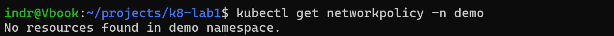

```bash
kubectl run client -n demo --image=nicolaka/netshoot --command -- sleep infinity
```

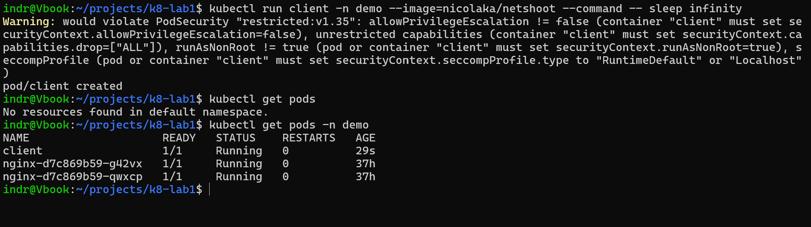

The Pod was admitted and reported four `restricted` violations, which is the `warn` label behaving as configured in Slice 1.

```bash
kubectl exec -n demo -it client -- bash
curl -i http://nginx
```

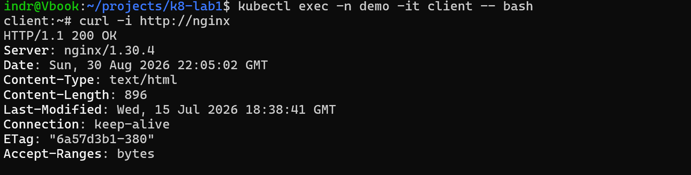

```bash
curl -I https://cloud.google.com
```

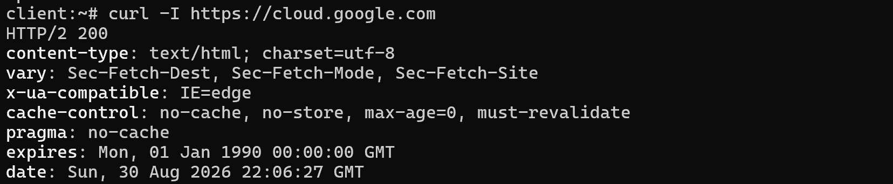

Result: any Pod in the namespace could reach the workload, and the workload could reach the entire internet through Cloud NAT. Both are the Kubernetes default, and both are what this slice closes.

```bash
cat /etc/resolv.conf
```

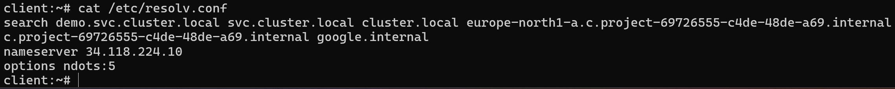

`resolv.conf` names the DNS server and the suffixes to try. It is not a list of what a Pod is allowed to resolve. `ndots:5` is why the short name `nginx` is tried as `nginx.demo.svc.cluster.local` first.

### Validation

Status: Passed

Allow rules are applied before the deny so that no Pod loses DNS in between.

```bash
kubectl apply -f kubernetes/nginx/networkpolicy-dns.yml
kubectl apply -f kubernetes/nginx/networkpolicy-nginx.yml
kubectl apply -f kubernetes/nginx/networkpolicy-default-deny.yml
kubectl get networkpolicy -n demo
```

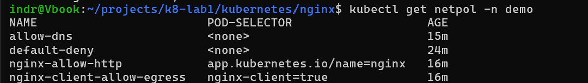

`POD-SELECTOR` reads `<none>` for `default-deny` and `allow-dns`. That means no selector terms, which selects every Pod, not none.

```bash
curl -m 5 http://cloud.google.com
curl -I http://nginx
```


Result: the labelled client reached NGINX and received `200 OK`, and the same Pod could not reach the internet.

### Getting there took a working DNS failure

Applying these policies removed cluster DNS from the whole namespace, and the first version of `allow-dns` did not restore it. The diagnosis is recorded separately in the [troubleshooting log](../troubleshooting.md#dns-stops-resolving-after-the-default-deny).

### Failure test

Removing the label from the running Pod is the whole test. Nothing is restarted and no policy is edited.

```bash
kubectl label pod client -n demo nginx-client-
kubectl get pod client -n demo --show-labels
```

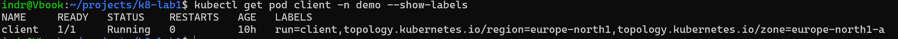

```bash
kubectl exec -n demo -it client -- bash
curl -I http://nginx
```

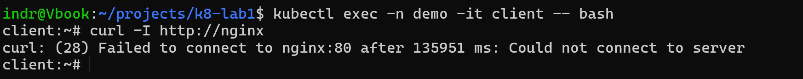

Result: `curl: (28) Failed to connect to nginx:80`. The name still resolved, so `allow-dns` is unaffected and the block is on the connection itself. This is a different failure from the `(6) Could not resolve host` seen during the DNS fault, and the wording is what separates them.

The same request by address removes DNS from the test entirely.

```bash
kubectl get svc nginx -n demo
```

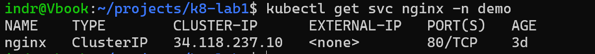

```bash
curl -I http://34.118.237.10
```

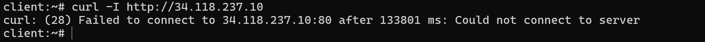

Result: identical failure with no name lookup anywhere in the request. The denial is the policy.

Both attempts took over two minutes to fail because no timeout was set. A denial drops the packet silently, so `curl` waits out its own connect timeout rather than receiving a refusal. `-m 5` caps that.

### Recovery

```bash
kubectl label pod client -n demo nginx-client=true
kubectl get pod client -n demo --show-labels
```

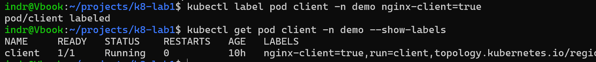

```bash
curl -I http://nginx
curl -I http://34.118.237.10
```

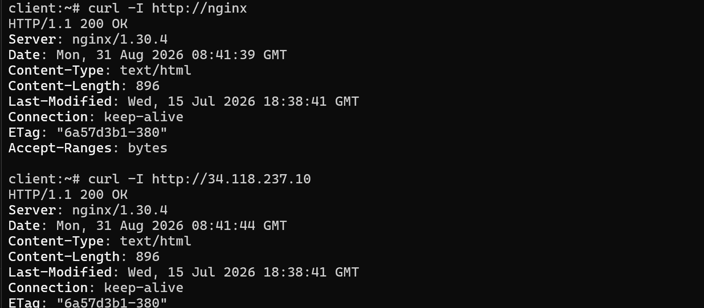

Result: both paths returned `200 OK` five seconds apart, on a Pod that was never restarted and stayed at zero restarts throughout. Policy is recomputed from current labels, so a label change takes effect on a running Pod within about a second.

### Egress

```bash
curl -m 6 -I http://cloud.google.com
curl -m 6 -I https://cloud.google.com
```

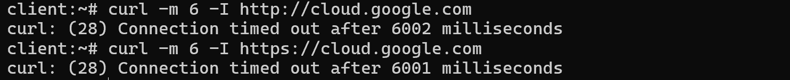

Result: both timed out. The same commands returned `HTTP/2 200` during the baseline, so Cloud NAT egress is now closed for this namespace on both HTTP and HTTPS.

### Cleanup

```bash
kubectl delete pod client -n demo
kubectl describe resourcequota demo-budget -n demo
kubectl get pods -n demo -o wide
```

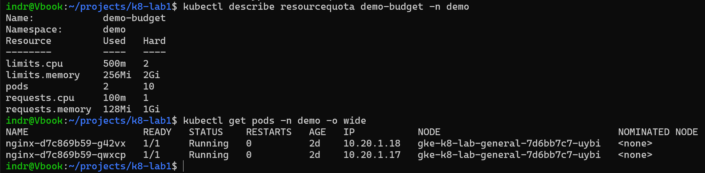

Result: the namespace returned to two Pods, 100m CPU and 128Mi requested. Both NGINX Pods are two days old with zero restarts, which is the evidence that the kubelet health probes kept reaching them through the default deny for the whole exercise. Probe traffic originates on the node rather than from a Pod, and Dataplane V2 permits it without a rule.

### Deliberate omissions

The NGINX Pods have no egress rule at all. Serving static content requires no outbound connection, so the workload cannot open one. This will need revisiting in Phase 5, when the image is replaced, and in Phase 7, when load balancer traffic arrives from outside the namespace.

Clients are selected by Pod label rather than by namespace. That keeps the rule readable while the only client lives in `demo`, and it will need a `namespaceSelector` once something outside the namespace has to reach the Service.

## Known gaps

- The workload still runs as root, so it cannot satisfy the `restricted` standard. Phase 5 replaces it with a non-root image, after which `enforce` can be raised.
- `audit` findings are written to the Google Cloud audit log and have not been reviewed yet.
- Network policy denials are not logged. Every diagnosis in this phase was made by testing from inside a Pod, which works but does not scale. Dataplane V2 policy logging is the tool for this and has not been enabled.
