# Worklog: Phase 4 Workload Guardrails

Date: 2026-08-29  
Status: In progress

## Goal

Protect the `demo` namespace by rejecting workloads that are unsafe, too large, or not allowed.

## Where the controls apply

```text
kubectl apply
    │
    ▼
GKE API server
    │
    ├── Authentication      who is calling
    ├── Authorization       is the caller allowed to do this
    ├── Admission control   is this specific object allowed as written
    │        │
    │        └── Pod Security Admission reads the namespace labels
    ▼
Cluster database
    │
    ▼
Scheduler assigns a node, kubelet starts the container
```

If admission control rejects an object, Kubernetes does not save it. No image is pulled, no node is selected, and no container starts.

## Slice 1: Pod Security and workload identity

Status: Complete

### Implemented

- Labelled the `demo` namespace to enforce the Pod Security `baseline` standard.
- Set `warn` and `audit` to the stricter `restricted` standard.
- Pinned all three to `v1.35` so a cluster upgrade cannot change enforcement.
- Added a dedicated `nginx` ServiceAccount with `automountServiceAccountToken` disabled.
- Moved the Deployment off the namespace `default` ServiceAccount.

### Validation

Status: Passed

```bash
kubectl apply -f kubernetes/nginx/namespace.yml
kubectl get namespace demo --show-labels
```

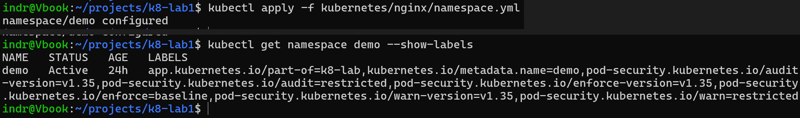

Applying the labels produced no warning about existing Pods, which confirms the running workload already satisfies `baseline`. Both Pods kept running with zero restarts.

```bash
kubectl apply -f kubernetes/nginx/deployment.yml
```

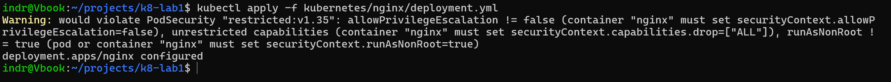

The `warn` label reported three `restricted` violations and applied the Deployment anyway: `allowPrivilegeEscalation != false`, unrestricted capabilities, and `runAsNonRoot != true`. These are the same gaps kube-linter reports in CI.

```bash
kubectl rollout status deployment/nginx -n demo
kubectl get pods -n demo -o jsonpath='{range .items[*]}{.metadata.name}{"\t"}{.spec.serviceAccountName}{"\n"}{end}'
kubectl exec -n demo deploy/nginx -- ls /var/run/secrets/kubernetes.io/
```

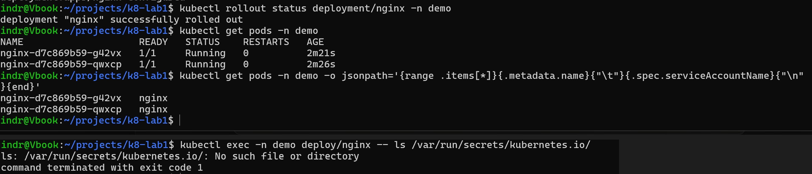

Result: changing `serviceAccountName` altered the Pod template, so a new ReplicaSet replaced both Pods. Both now run as `nginx`, and the API token directory does not exist inside the container.

### Failure test

```bash
kubectl apply -n demo -f - <<'YAML'
apiVersion: v1
kind: Pod
metadata:
  name: psa-test
spec:
  containers:
    - name: test
      image: nginx:1.30.4-alpine3.24
      securityContext:
        privileged: true
YAML
```

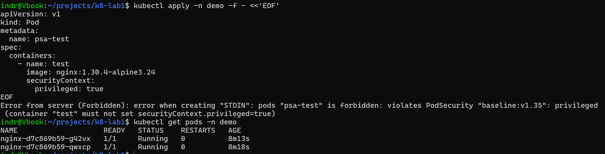

Result: the API server refused the Pod with `violates PodSecurity "baseline:v1.35": privileged`. Nothing was created, and the two NGINX Pods were unaffected.

The wording separates the two modes. `enforce` reports `violates` and rejects. `warn` reports `would violate` and allows.

## Slice 2: Namespace resource budget

Status: Complete

### Implemented

- Added a `LimitRange` that gives containers default CPU and memory values matching the NGINX workload.
- Added a `ResourceQuota` that limits the namespace to 1 CPU and 1Gi requested, 2 CPU and 2Gi limited, and 10 Pods.
- Applied the LimitRange first because the quota would reject Pods that are missing the resource values it tracks.

### Sizing

One `e2-standard-2` node has 1930m CPU and 6170272Ki (about 5.9Gi) available to workloads. GKE keeps the rest for the operating system, Kubernetes services, and system Pods. With a maximum of three nodes, the cluster can provide up to 5790m CPU and about 17.6Gi.

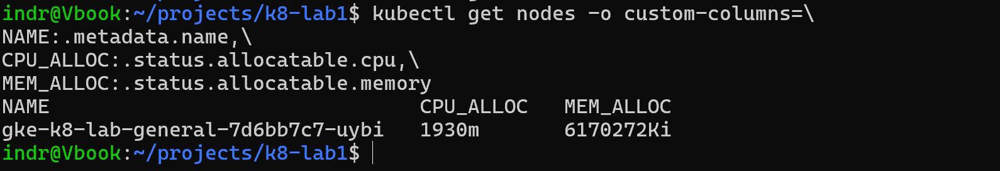

The quota is a policy limit, not a measure of the actual cluster capacity. A Pod must first pass the quota check and then find space on a node. These are separate checks.

### Validation

Status: Passed

```bash
kubectl apply -f kubernetes/nginx/limitrange.yml
kubectl describe limitrange demo-defaults -n demo
```

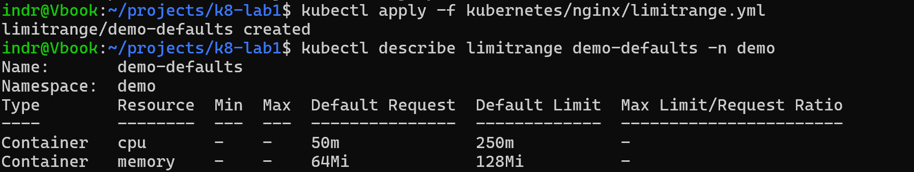

```bash
kubectl apply -f kubernetes/nginx/resourcequota.yml
kubectl describe resourcequota demo-budget -n demo
```

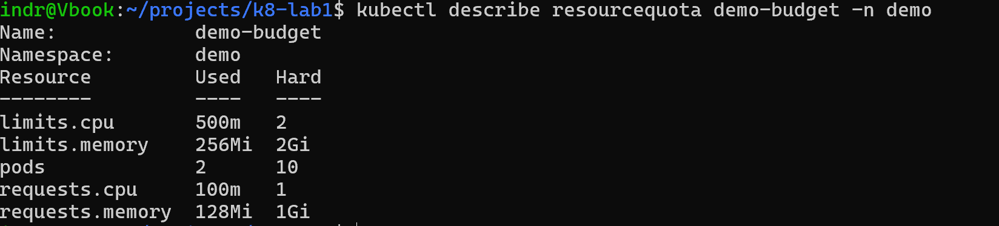

Result: the quota counted the running workload correctly. Two Pods request 100m CPU and 128Mi memory in total, with limits of 500m CPU and 256Mi memory.

### Defaulting test

A Pod with no CPU or memory values is still accepted because the LimitRange fills them in.

```bash
kubectl apply -n demo -f - <<'YAML'
apiVersion: v1
kind: Pod
metadata:
  name: defaults-test
spec:
  containers:
    - name: test
      image: nginx:1.30.4-alpine3.24
YAML

kubectl get pod defaults-test -n demo -o jsonpath='{.spec.containers[0].resources}'
```

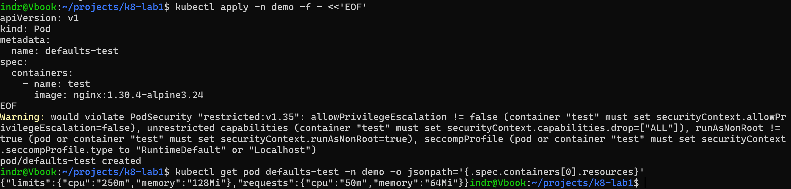

```bash
kubectl describe pod defaults-test -n demo | grep -i limit-ranger
kubectl describe resourcequota demo-budget -n demo
```

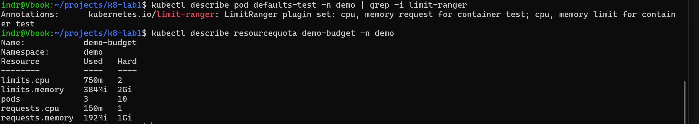

Result: the Pod received the default values. Kubernetes recorded the fields it added in the `kubernetes.io/limit-ranger` annotation, and the quota counted the Pod just like one with values written in its manifest.

This Pod also received a fourth `restricted` warning for `seccompProfile`. The Deployment already sets `seccompProfile: RuntimeDefault`, while the test Pod did not. This shows that the warning is based on the actual Pod settings.

### Failure test

```bash
kubectl apply -n demo -f - <<'YAML'
apiVersion: v1
kind: Pod
metadata:
  name: quota-test
spec:
  containers:
    - name: test
      image: nginx:1.30.4-alpine3.24
      resources:
        requests:
          cpu: "4"
        limits:
          cpu: "4"
YAML
```

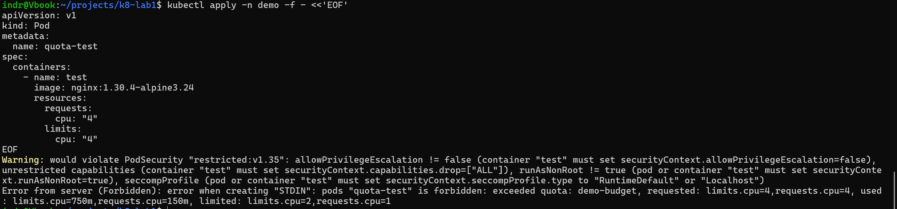

Result: the API server rejected the Pod with `exceeded quota: demo-budget`. The message showed the request, current usage, and configured limit. Nothing was created.

The Pod never reached the scheduler. Four CPUs would not fit on a 1930m node, but the quota rejected it before Kubernetes checked node capacity.

### Recovery

```bash
kubectl delete pod defaults-test -n demo
kubectl describe resourcequota demo-budget -n demo
```

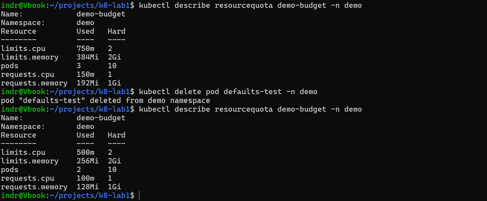

Result: usage returned to two Pods, 100m CPU requested, and 500m CPU limited. `quota-test` needed no cleanup because it was never created.

### Deliberate omission

The LimitRange only sets defaults. It does not set a minimum or maximum for each container, which made it possible to test the quota separately. With a maximum in place, the LimitRange would have rejected the test Pod first. A shared namespace should normally use both controls.

## Known gaps

- The workload still runs as root, so it cannot satisfy the `restricted` standard. Phase 5 replaces it with a non-root image, after which `enforce` can be raised.
- `audit` findings are written to the Google Cloud audit log and have not been reviewed yet.
