# Worklog: Phase 5 Custom Image and Artifact Registry

Date: 2026-08-31  
Status: Complete

## Goal

Replace the public NGINX image with a project-owned non-root image, published to a private repository and deployed by an immutable digest.

## Why the current image is a gap

The workload runs `nginx:1.30.4-alpine3.24`, pulled from a public registry at deploy time and referenced by tag.

- A tag is a label that can be repointed, so the same manifest can deploy different bytes on different days.
- The image runs as root, which is why Phase 4 could enforce only `baseline` and had to leave `restricted` reporting.
- The cluster depends on a public registry being reachable and willing to serve it.

## Slice 1: Private image repository

Status: Complete

### Implemented

- Added a `registry` Terraform module creating a regional Artifact Registry repository in the cluster region.
- Set `immutable_tags` so the repository refuses to move a tag that already exists.
- Added cleanup policies that delete untagged images after seven days and protect the ten most recent versions.
- Granted the node service account `roles/artifactregistry.reader`, scoped to this repository.
- Enabled the Artifact Registry and Container Scanning APIs.
- Published the repository path as the `registry_url` output.

### Why the nodes need an explicit binding

Image pulls use the node identity. The kubelet fetches the image before the container exists, so Workload Identity is not available at that point and cannot be used for pulls.

The node account already holds `roles/container.defaultNodeServiceAccount`, whose name suggests it covers what a node needs.

```bash
gcloud iam roles describe roles/container.defaultNodeServiceAccount
```


Result: six permissions, covering logging, monitoring, and autoscaling metrics. None for Artifact Registry. Without the repository binding, pulls fail with `ImagePullBackOff`.

Guidance stating that GKE nodes can pull without an extra role describes the Compute Engine default service account, which receives broad automatic grants. Phase 1 replaced that account with a dedicated one, so that guidance does not apply here.

### Validation

Status: Passed

```bash
terraform -chdir=terraform init
terraform -chdir=terraform plan
terraform -chdir=terraform apply
```


Result: the repository, the repository IAM binding, and the two API enablements were created. Nothing was destroyed.

### Unexpected change to the cluster

The same plan proposed a modification to the cluster that no one had made, and applying it changed nothing. The diagnosis is recorded in the [troubleshooting log](../troubleshooting.md#a-terraform-plan-proposes-the-same-change-after-every-apply).

Two things came out of it. The cluster's control plane exposure was verified by connection rather than by reading a field, and the plan now reports no changes, so a future diff on the cluster will stand out instead of being expected.

## Slice 2: Non-root image

Status: Complete

### Implemented

- Added `app/`, holding a Dockerfile, an NGINX server block, the page, and a build context filter.
- Built on `nginxinc/nginx-unprivileged`, which runs as UID 101 and owns the paths it writes to.
- Pinned the base image by digest as well as tag, so the build cannot silently change.
- Served on port 8080, because binding a lower port needs a capability `restricted` forbids.
- Added a `/healthz` location for probes, excluded from the access log.

### Pinning the base image

```bash
docker inspect nginxinc/nginx-unprivileged:1.30.4-alpine
```

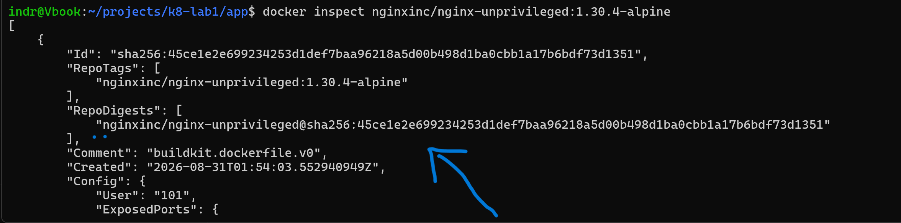

`RepoDigests` holds the value the `FROM` line now carries. `Config.User` is `101`, which is what the base image contributes and what the rest of this slice depends on.

The `FROM` line keeps the tag next to the digest. The tag is for a reader, the digest is what resolves.

### Validation

Status: Passed

```bash
docker build -t k8-lab-test .
docker run --rm k8-lab-test id
```

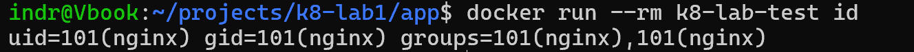

```bash
docker run --rm --user 65532 k8-lab-test id
```

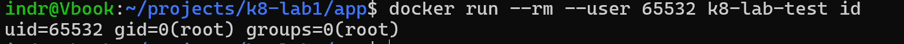

Result: the image runs as UID 101 by default and starts under an arbitrary UID that has no entry in its user database. The second test matters because `restricted` may assign a UID of its own, so the image must not depend on being one specific user.

```bash
docker run -d --name k8-lab-run -p 8080:8080 k8-lab-test
docker ps
```

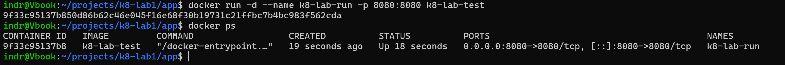

```bash
curl -I http://localhost:8080
curl -I http://localhost:8080/test
```

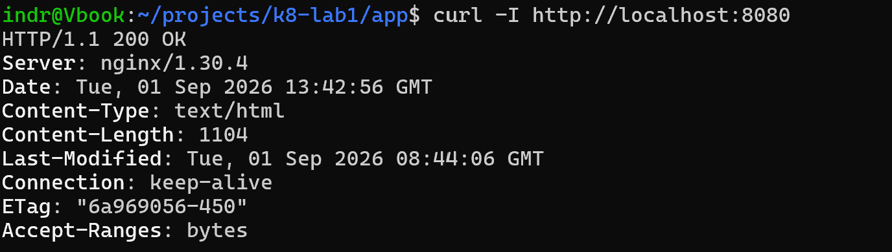

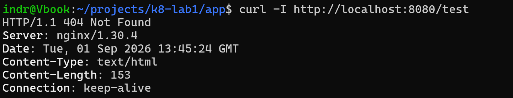

Result: the page returns `200` with `Content-Type: text/html`, and an unknown path returns `404` from `try_files`.

### The serving processes are non-root

The identity test above ran a container that never started NGINX. This one inspects the running server.

```bash
docker exec k8-lab-run id
docker exec k8-lab-run ps aux
```

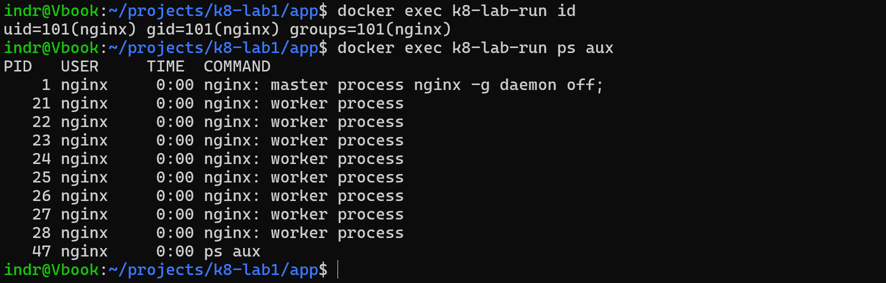

Result: the master process and all eight workers run as `nginx`. The standard NGINX image runs its master as root, which is the difference this slice exists to remove. Together with the two identity tests, this is the evidence that lets Slice 4 raise enforcement to `restricted`.

### Probe traffic stays out of the log

```bash
docker logs k8-lab-run
```

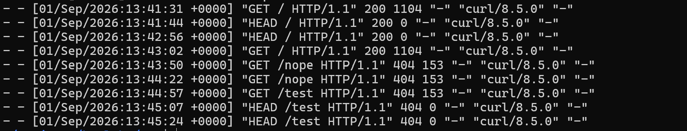

Result: the log holds the page and the two rejected paths, and no entry for `/healthz`. A probe every ten seconds against a logged path would otherwise dominate the log.

### Defect found during validation

```bash
curl -i http://localhost:8080/healthz
```

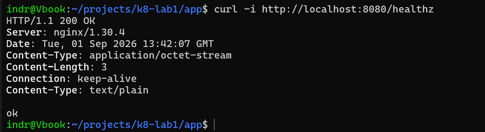

The response carries `Content-Type` twice, `application/octet-stream` followed by `text/plain`. `add_header` appends a header rather than replacing one, so the directive added a second value beside the default instead of correcting it.

Fixed by setting the type instead of adding a header.

```nginx
default_type text/plain;
```

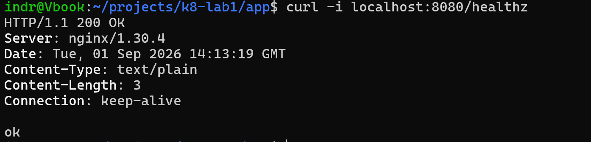

Result: one `Content-Type: text/plain`, and the body unchanged.

The status and body were correct throughout, so a check that only asserted `200` would have passed. Reading the whole response is what surfaced it. The entry in the [troubleshooting log](../troubleshooting.md#an-nginx-response-carries-the-same-header-twice) records the directive difference.

## Slice 3: Publish to the repository

Status: Complete

### Implemented

- Authenticated Docker against the registry host through the gcloud credential helper, so no key material is stored.
- Tagged the image with the short commit that built it, rather than a moving name like `latest`.
- Pushed it to the `frontend` repository path and read back the digest the registry assigned.
- Read the vulnerability scan Artifact Analysis produced on push.

### Why the tag is a commit

```bash
git rev-parse --short HEAD
```

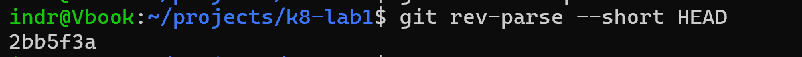

A tag has to answer one question: which source produced these bytes. A commit answers it exactly, and `immutable_tags` on the repository means the answer cannot later be repointed at a different build.

### Authenticating without a key

```bash
gcloud auth configure-docker europe-north1-docker.pkg.dev
```

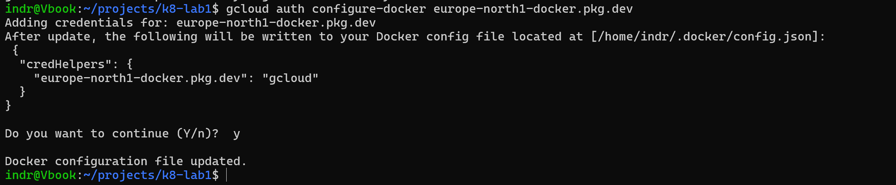

The helper writes no credential to disk. Docker calls gcloud for a short-lived token on each push, so there is no long-lived key to leak or rotate.

### Push

```bash
docker images "$REGISTRY/frontend"
```

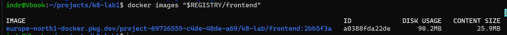

```bash
docker push "$REGISTRY/frontend:$SHA"
```

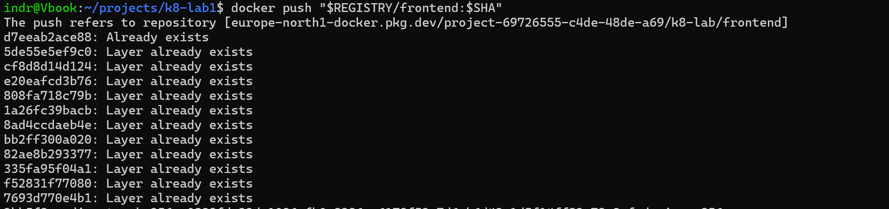

### Validation

Status: Passed

```bash
gcloud artifacts repositories list
```

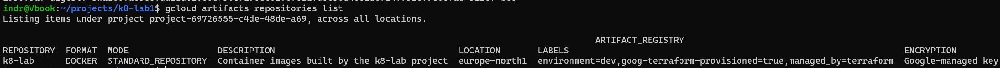

```bash
gcloud artifacts docker images list "$REGISTRY/frontend" --include-tags
```

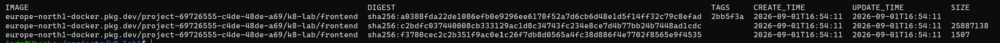

Result: the image is present under the `2bb5f3a` tag, and the registry reports the digest that Slice 4 deploys.

### Reading the scan

```bash
gcloud artifacts docker images describe "$REGISTRY/frontend:$SHA" --show-package-vulnerability
```

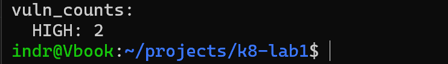

Result: two HIGH findings, both inherited from the base image rather than introduced by this build. They are recorded rather than acted on, because closing them means waiting for an upstream release. The value of the scan here is that the count is now visible on every push instead of unknown.

## Slice 4: Deploy by digest

Status: Complete

### Implemented

- Pointed the Deployment at the published image by digest, keeping the tag beside it for a reader.
- Moved the container to port 8080 and carried that port through both NetworkPolicy rules, which name the container port rather than the Service port.
- Left the Service unchanged, because `targetPort` resolves the named port.
- Raised Pod Security enforcement from `baseline` to `restricted`, which the non-root image now satisfies.

### The first push could not run on the nodes

The digest resolved in the registry and still failed to pull. The image had been built with a bare `docker build` on an Apple Silicon workstation, which produces an arm64-only index, and the nodes are amd64.

Rebuilding for both platforms produced a new digest. `immutable_tags` refused to move `2bb5f3a` onto it, so the rebuild went out as `2bb5f3a-multiarch`. The policy behaved exactly as intended: the tag still names the bytes it originally named.

The [troubleshooting log](../troubleshooting.md#an-image-pull-fails-with-notfound-although-the-digest-exists) records the diagnosis, including why the registry reports this as `NotFound`.

### Validation

Status: Not yet recorded

```bash
kubectl apply -f kubernetes/nginx/
kubectl get pods -n demo
kubectl get deploy nginx -n demo -o jsonpath='{.spec.template.spec.containers[0].image}{"\n"}'
```

Both replicas should run the multi-architecture digest, and no pod should remain from the ReplicaSet that ran the public image.

## Known gaps

- The Slice 4 rollout was verified on the workstation but the output was not captured, so the validation above is unevidenced.
- The image carries two HIGH findings inherited from its base image, pending an upstream release.
- Deployment is still a manual `kubectl apply` from a workstation. Phase 6 replaces it.
- Nothing enforces that a pushed image is built for the node architecture. Phase 6 builds in CI, which removes the workstation as a variable.
