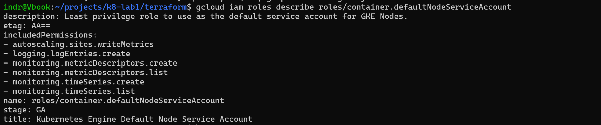
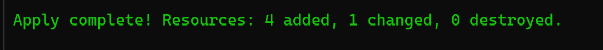

# Worklog: Phase 5 Custom Image and Artifact Registry

Date: 2026-08-31  
Status: In progress

## Goal

Replace the public NGINX image with a project-owned non-root image, published to a private repository and deployed by an immutable digest.

## Why the current image is a gap

The workload runs `nginx:1.30.4-alpine3.24`, pulled from a public registry at deploy time and referenced by tag.

- A tag is a label that can be repointed, so the same manifest can deploy different bytes on different days.
- The image runs as root, which is why Phase 4 could enforce only `baseline` and had to leave `restricted` reporting.
- The cluster depends on a public registry being reachable and willing to serve it.

## Slice 1: Private image repository

Status: Complete

### Implemented

- Added a `registry` Terraform module creating a regional Artifact Registry repository in the cluster region.
- Set `immutable_tags` so the repository refuses to move a tag that already exists.
- Added cleanup policies that delete untagged images after seven days and protect the ten most recent versions.
- Granted the node service account `roles/artifactregistry.reader`, scoped to this repository.
- Enabled the Artifact Registry and Container Scanning APIs.
- Published the repository path as the `registry_url` output.

### Why the nodes need an explicit binding

Image pulls use the node identity. The kubelet fetches the image before the container exists, so Workload Identity is not available at that point and cannot be used for pulls.

The node account already holds `roles/container.defaultNodeServiceAccount`, whose name suggests it covers what a node needs.

```bash
gcloud iam roles describe roles/container.defaultNodeServiceAccount
```



Result: six permissions, covering logging, monitoring, and autoscaling metrics. None for Artifact Registry. Without the repository binding, pulls fail with `ImagePullBackOff`.

Guidance stating that GKE nodes can pull without an extra role describes the Compute Engine default service account, which receives broad automatic grants. Phase 1 replaced that account with a dedicated one, so that guidance does not apply here.

### Validation

Status: Passed

```bash
terraform -chdir=terraform init
terraform -chdir=terraform plan
terraform -chdir=terraform apply
```



Result: the repository, the repository IAM binding, and the two API enablements were created. Nothing was destroyed.

### Unexpected change to the cluster

The same plan proposed a modification to the cluster that no one had made, and applying it changed nothing. The diagnosis is recorded in the [troubleshooting log](../troubleshooting.md#a-terraform-plan-proposes-the-same-change-after-every-apply).

Two things came out of it. The cluster's control plane exposure was verified by connection rather than by reading a field, and the plan now reports no changes, so a future diff on the cluster will stand out instead of being expected.

## Remaining slices

- Slice 2: build a non-root image serving a small project page, listening on 8080.
- Slice 3: push it to the repository under a commit-specific tag, and read the vulnerability scan.
- Slice 4: deploy by digest, move the container port through the Deployment and both NetworkPolicies, and raise Pod Security enforcement to `restricted`.

## Known gaps

- The repository is empty. Nothing has been built or pushed yet.
- The workload still runs the public root image, so the `restricted` gap from Phase 4 remains open.
- Deployment is still a manual `kubectl apply` from a workstation. Phase 6 replaces it.
