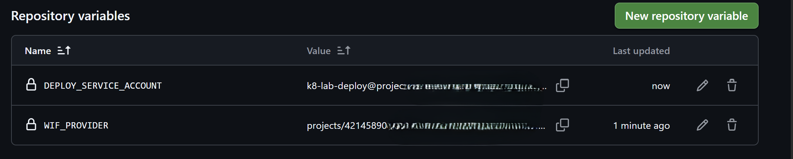
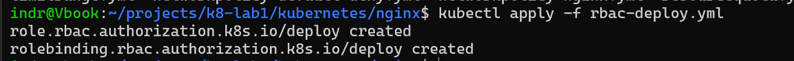
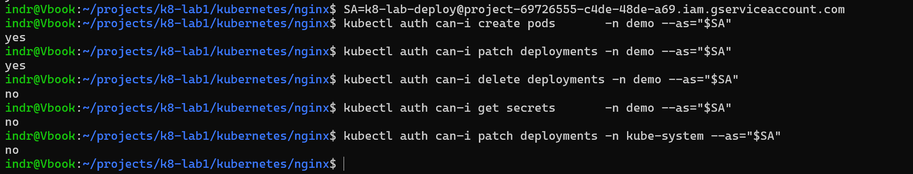
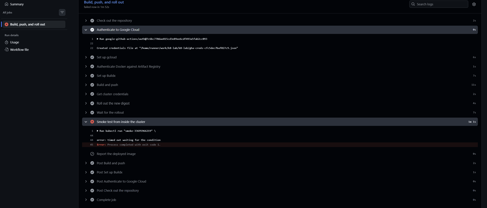
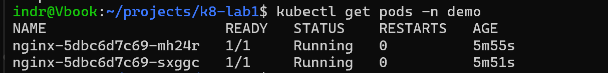
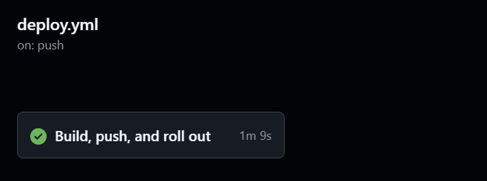
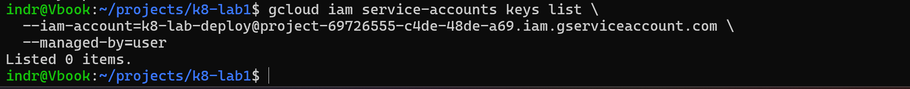
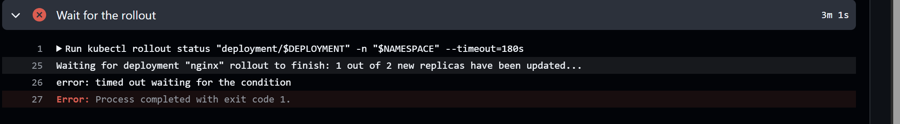
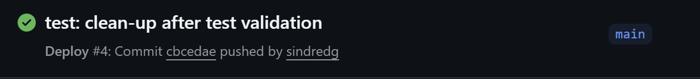

# Worklog: Phase 6 Keyless Application Delivery

Date: 2026-09-03  
Status: Complete

## Goal

Deploy the frontend image from GitHub Actions without a stored service account key, and stop the workflow when the rollout does not succeed.

## Why the manual step was a gap

Phase 5 ended with the image referenced by digest, but built and pushed by hand from a workstation.

- The workstation is an amd64 cluster's only supplier of images, and it is an arm64 machine. That mismatch produced the pull failure in the [troubleshooting log](../troubleshooting.md#an-image-pull-fails-with-notfound-although-the-digest-exists).
- A deployment nobody can reproduce is not a deployment procedure.
- The obvious automation, a downloaded service account key in a GitHub secret, is a permanent bearer credential. Anyone who reads it is the pipeline until someone notices.

## Slice 1: Federate GitHub into the project

Status: Complete

### Implemented

- A `delivery` Terraform module creating a Workload Identity Pool and an OIDC provider trusting GitHub's issuer.
- `assertion.sub`, `assertion.repository`, and `assertion.ref` mapped as provider attributes.
- An `attribute_condition` restricting the provider to this repository.
- A dedicated `k8-lab-deploy` service account, impersonated by pool members carrying this repository's attribute.
- `roles/artifactregistry.writer` scoped to the `k8-lab` repository, and `roles/container.clusterViewer` at the project.
- The Security Token Service and IAM Credentials APIs enabled.

### Why the attribute condition is not optional

The provider trusts an issuer, and every public repository on GitHub receives tokens from that same issuer. A provider with an attribute mapping and no condition accepts a validly signed token from a repository an attacker created.

```hcl
attribute_condition = "assertion.repository == '${var.github_repository}'"
```

- The condition narrows "signed by GitHub" to "signed by GitHub, for this repository". Federation guides frequently omit it, and the resulting provider is an open door that looks configured.
- The impersonation binding uses `principalSet://` rather than `principal://`, naming every identity sharing the repository attribute rather than one exact workflow on one branch. The branch and the workflow will change over this project's life; the repository will not.

### Validation

Status: Passed

```bash
terraform -chdir=terraform fmt -recursive
terraform -chdir=terraform init
terraform -chdir=terraform plan
terraform -chdir=terraform apply
```


Result: the pool, the provider, the service account, three IAM bindings, and the two API enablements were created.

```bash
terraform -chdir=terraform output workload_identity_provider
terraform -chdir=terraform output deploy_service_account_email
```



Both values are stored as repository **variables** rather than secrets, because neither is a credential:

- The provider name is a public resource path and the account email is an identifier. Possessing them grants nothing without a signed token from this repository.
- Storing them as secrets would mask them in logs, making federation failures materially harder to diagnose.
- It would also imply the pipeline holds something worth stealing. It does not, which is the point of the phase.

## Slice 2: Cluster access for the pipeline identity

Status: Complete

### Implemented

- `kubernetes/nginx/rbac-deploy.yml`, a namespaced `Role` and `RoleBinding` in `demo`.
- `get`, `list`, `watch`, and `patch` on Deployments; read on ReplicaSets; create, read, and delete on Pods and Pod logs.
- The Role bound to the deploy service account's email as an RBAC `User` subject.

### Two systems must both agree

| Layer | Decides | Granted here |
| --- | --- | --- |
| Google IAM | whether the pipeline can *reach* the cluster | `roles/container.clusterViewer` |
| Kubernetes RBAC | what it may *do* once inside | a namespaced `Role` in `demo` |

`clusterViewer` covers only the first, deliberately: it lets the runner discover the cluster and fetch credentials, and grants almost nothing through the Kubernetes API. Each absent line in the Role is a decision:

- No `create` or `delete` on Deployments, so a compromised workflow cannot replace the workload with its own.
- No rule for Secrets.
- No access to any namespace but `demo`.

### The pipeline cannot grant itself permission

The manifest is applied from a workstation, by a human, before the first workflow run. That bootstrapping step is a permanent property of the design rather than a one-off inconvenience, and it is what keeps the pipeline from widening its own access.

```bash
kubectl apply -f kubernetes/nginx/rbac-deploy.yml
```



### Validation

Status: Passed

`kubectl auth can-i` answers for another subject with `--as`, asking the API server the same questions the pipeline will ask, without running the pipeline.

```bash
SA=k8-lab-deploy@project-69726555-c4de-48de-a69.iam.gserviceaccount.com

kubectl auth can-i create pods        -n demo --as="$SA"
kubectl auth can-i patch deployments  -n demo --as="$SA"
kubectl auth can-i delete deployments -n demo --as="$SA"
kubectl auth can-i get secrets        -n demo --as="$SA"
kubectl auth can-i patch deployments  -n kube-system --as="$SA"
```



Result: `yes`, `yes`, `no`, `no`, `no`. The three refusals are what this slice exists to produce. A `yes` on any of them would mean a `ClusterRole` had been bound where a `Role` was intended.

## Slice 3: The delivery workflow

Status: Complete

### Implemented

- `.github/workflows/deploy.yml`, triggered by a push to `main` touching `app/**` or the workflow itself.
- `contents: read` and `id-token: write` on the job.
- Authentication through the federated provider, with no key material anywhere in the run.
- An explicit `linux/amd64` build, pushed under a tag carrying the commit, run ID, and attempt.
- Cluster credentials fetched through the DNS control plane endpoint.
- The Deployment image set to the digest the build produced, then a rollout wait and an in-cluster smoke test.

### Why this is a separate workflow

Phase 3 recorded that the validation workflow gets `contents: read` and no cloud identity, and that the absence of a token-minting permission is what makes it verifiably unable to reach the project. Adding `id-token: write` to `ci.yml` would erase that property for every pull request, including ones from forks, so delivery lives in its own file and `ci.yml` is untouched.

### The tag has to be unique per run

`immutable_tags` means a tag of `${{ github.sha }}` alone works exactly once: re-running the workflow on the same commit is refused, because that tag already names different bytes.

```yaml
tags: ${{ env.IMAGE }}:${{ github.sha }}-${{ github.run_id }}.${{ github.run_attempt }}
```

The tag remains a label for a reader. The digest is what the Deployment is set to.

### The smoke test inherits two earlier phases

- `nginx-client=true`, because Phase 4 added a default-deny NetworkPolicy and `nginx-client-allow-egress` is the rule that lets the test Pod open the connection.
- A full `securityContext`, because Phase 5 raised the namespace to `restricted`.

Removing either makes the test fail for a reason unrelated to the image being verified.

### Validation

Status: Passed

The first end-to-end run authenticated, built, pushed, fetched credentials, and completed the rollout. The smoke test failed.



```bash
kubectl get pods -n demo
```



Result: two replicas `1/1 Running` on `sha256:33553c115ce7…`, the digest the pipeline had just built. The delivery path worked; the verification step did not.

Two faults surfaced on the way, both in the troubleshooting log:

- A [transient reset during the token exchange](../troubleshooting.md#a-federated-token-exchange-fails-with-econnreset).
- A [smoke Pod that could not start under `runAsNonRoot`](../troubleshooting.md#a-container-will-not-start-because-its-user-is-a-name-rather-than-a-number).



Result: once the smoke test was corrected, a clean run completed in 1m 9s.

## Slice 4: Prove the claims

Status: Passed

### There is no key

```bash
gcloud iam service-accounts keys list \
  --iam-account=k8-lab-deploy@project-69726555-c4de-48de-a69.iam.gserviceaccount.com \
  --managed-by=user
```



Result: `Listed 0 items.` The `--managed-by=user` filter is the important part: every service account holds Google-managed signing keys it cannot function without, and those cannot be downloaded. A user-managed key is the thing this phase exists to avoid, and none exists.

### A failed rollout stops delivery

An untested failure path is an assumption. The probe location in `app/default.conf` was deliberately renamed so the readiness probe would return `404`, and the change was merged.




Result: the build and push succeeded, the new Pod never became Ready, and `kubectl rollout status` exited non-zero after its timeout.

- The smoke test never ran and the job stopped there. No extra logic produces this: a non-zero exit fails the job and every later step is skipped.
- Both existing Pods stayed `1/1 Running` throughout. `maxUnavailable: 0` makes a failed rollout a stalled rollout rather than an outage, the same property that kept the site serving through the Phase 5 image failure.

### Recovery is the same path

Reverting the probe location and merging restored the service through the ordinary pipeline, with no manual `kubectl` at any point.




The failure run and the recovery run together are the evidence for the "rollout is controlled" claim in the plan.

### Evidence against the plan's claims

| Claim | Evidence |
| --- | --- |
| Delivery is keyless | Empty user-managed key listing, plus a successful run whose authenticate step reads no key |
| Trust is scoped | The `attribute_condition` and `principalSet` member in the applied Terraform |
| Privilege is least | Five `kubectl auth can-i` answers, three of them `no` |
| Rollout is controlled | The timed-out rollout, both replicas surviving it, and the recovery run |
| Onboarding is repeatable | A push to `main` deploys in about 1m 9s with no local tooling |

## Known gaps

- The digest in `kubernetes/nginx/deployment.yml` no longer matches what runs, because the pipeline sets the image directly. Git describes the workload's shape; the cluster holds the current version. A controller reconciling from git closes this, and that is not this phase.
- The pipeline updates the image only. Changing the Deployment's probes, resources, or any other manifest still needs a manual `kubectl apply`.
- Nothing verifies that the image the pipeline deployed is the image the pipeline built. Binary Authorization closes that gap and is a phase of its own.
- The smoke test asserts that `/healthz` answers, not that the page is correct, so a build serving a broken page with a working probe would pass.
