# Worklog: Phase 7 Gateway and Managed TLS

Date: 2026-09-03  
Status: In progress. HTTP delivery through the Gateway is complete; the managed certificate is still issuing.

## Goal

Publish the workload on the public internet through a Google load balancer with a managed certificate, while its Service stays unreachable from outside the cluster.

## The idea the phase turns on

The load balancer does not send traffic through the Service. GKE creates a network endpoint group listing Pod IP and port pairs, and the load balancer reaches those Pods directly. The Service is used only to work out which Pods belong in the group.

That is what lets both halves of the exit criteria hold at once: publicly reachable, and the Service still `ClusterIP`.

## Slice 1: Enable the Gateway API

Status: Complete

### Implemented

- Added `gateway_api_config` with `CHANNEL_STANDARD` to the cluster, installing the Gateway API CRDs and starting the controller.
- Added a `gateway` Terraform module reserving a global external address, so the address outlives any Gateway object a DNS record points at.

### The controller is not on by default

```bash
kubectl get gatewayclass
```

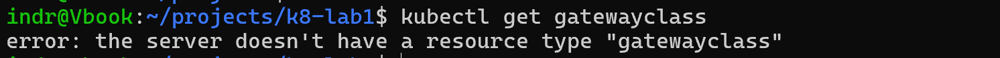

```bash
terraform -chdir=terraform apply
```


### Validation

Status: Passed

GatewayClasses appear in waves. The first listing after the cluster update held only the layer 4 classes, all from `persistent-ip-controller`.


Nineteen minutes later the layer 7 classes had registered under `networking.gke.io/gateway`.


Result: `gke-l7-global-external-managed` is `Accepted`. Reading the name as a specification gives the whole configuration — layer 7, global, external, and managed by Google rather than by this project.

The absence of any row carrying the `networking.gke.io/gateway` controller is the signal that the L7 set has not landed yet. Waiting is the correct response; nothing needs reapplying.

## Slice 2: Publish over HTTP

Status: Complete

### Implemented

- Added a `Gateway` naming the reserved address by its Google Cloud name, so Terraform owns the address and the manifest only points at it.
- Added an `HTTPRoute` sending traffic to the `nginx` Service.
- Added a `HealthCheckPolicy` aiming the load balancer's health check at `/healthz` rather than `/`, so the check does not depend on page content.
- Added a `NetworkPolicy` admitting Google's health check and proxy ranges to port 8080.

```bash
kubectl apply -f kubernetes/nginx/
```

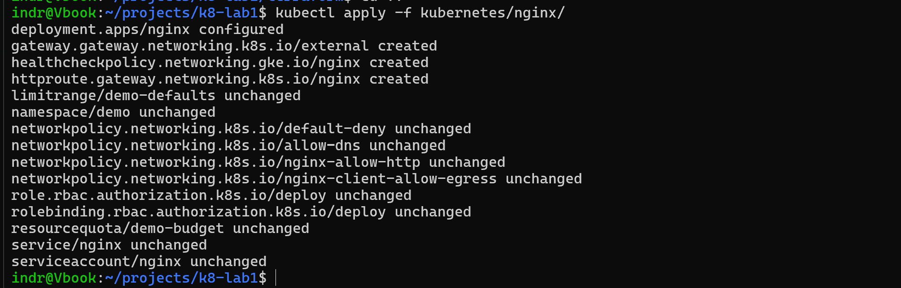

### What the controller built

```bash
kubectl describe gateway external -n demo
```

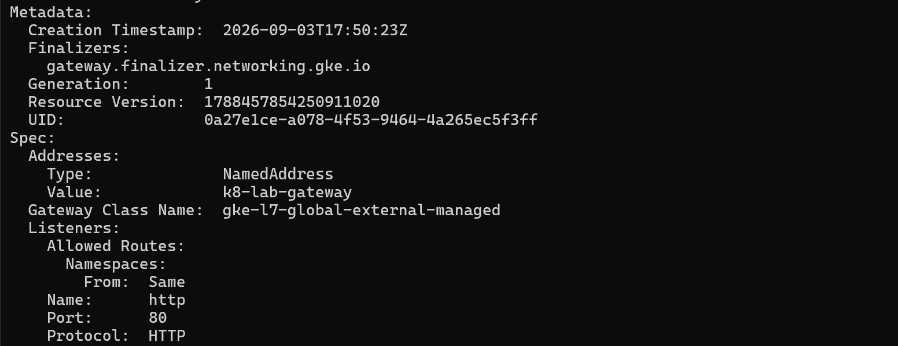

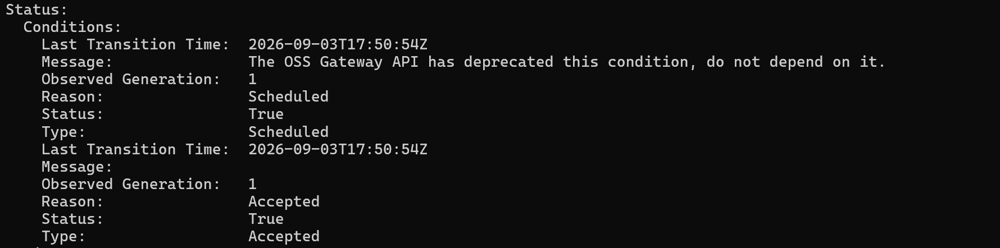

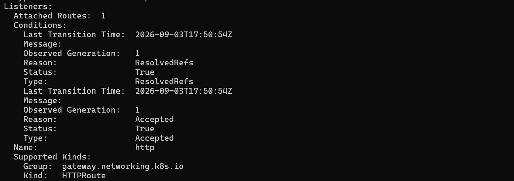

`Accepted` means the controller understood the manifest, and it flips within seconds. `Programmed` is the one worth waiting for, because it means the Google Cloud resources exist and are configured.

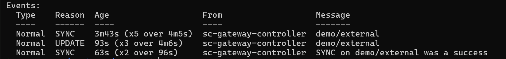

```bash
gcloud compute backend-services list --global --format="table(name,healthChecks)"
```

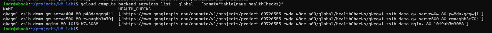

GKE generates these names, so they are discovered rather than known in advance. Two of the three are the default 404 and 500 services the Gateway creates for unmatched traffic.

### The default deny drops the health checks

Status: Failed, then fixed

```bash
gcloud compute backend-services get-health gkegw1-zs1b-demo-nginx-80-10i9ub7w3088 --global
```


Both Pods appear in the endpoint group with the right IPs and the right port, and both are `UNHEALTHY`. The Gateway provisioned cleanly and the address answered nothing.

```bash
kubectl get netpol -n demo
```


The cause is Phase 4 working as designed. Health checks arrive from Google's infrastructure rather than from a Pod, so no `podSelector` rule can ever match them and the default deny drops every one. Nothing in the Gateway's own status says so.

`ipBlock` matches by source address, which is the only way to name a sender that is not a Pod. Phase 4 used `podSelector` for in-cluster clients; neither form can express the other.

```bash
kubectl apply -f kubernetes/nginx/networkpolicy-gateway.yml
```

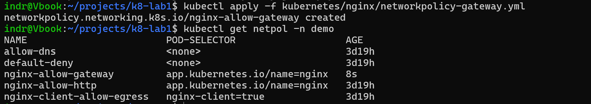


Result: both endpoints `HEALTHY` on the same IPs and port. The only thing that changed is that Google's proxies are now admitted to one port on one set of Pods.

### Validation

Status: Passed

```bash
IP=$(terraform -chdir=terraform output -raw gateway_address)
curl -sI "http://$IP"
curl -sI "http://$IP/healthz"
```

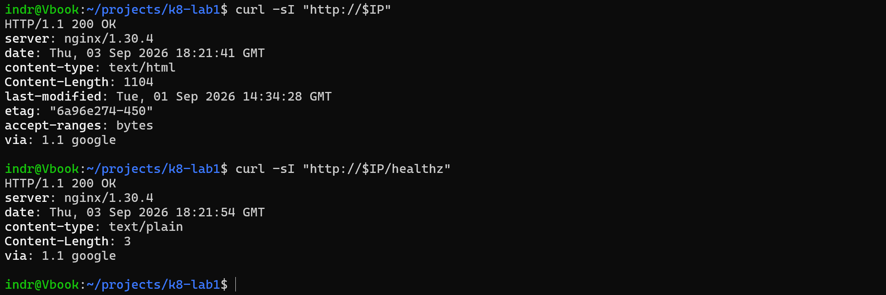

Result: `200 OK` for the page and for the probe path. The `via: 1.1 google` header is the evidence that the response came through the load balancer rather than from somewhere else.

That header sits ninth in the response, after `last-modified`, `etag`, and `accept-ranges`. A `head -5` truncates it, which reads as a missing header rather than a truncated listing.

## Slice 3: Domain and managed TLS

Status: In progress

### Implemented

- Registered `sindrg.com` and delegated it to Cloudflare.
- Added a Certificate Manager DNS authorization, a managed certificate, a certificate map, and a map entry.
- Added the `networking.gke.io/certmap` annotation and an HTTPS listener to the Gateway.
- Added a redirect route answering plain HTTP with a permanent redirect.

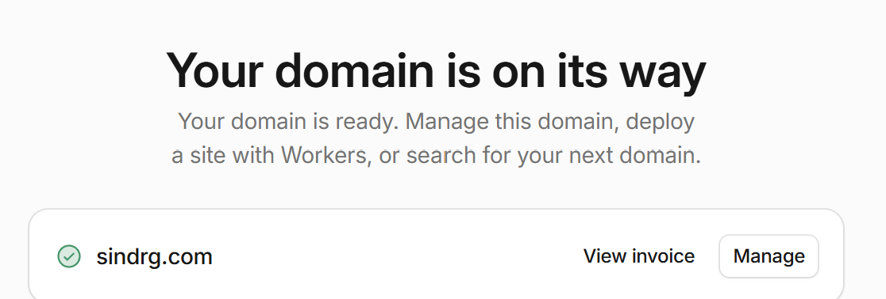

### Why DNS authorization

A certificate authority will not issue for a name until control of it is proven. DNS authorization proves control with one `CNAME` record that Google checks; load balancer authorization proves it by checking the live load balancer at that name.

DNS authorization decouples issuance from the cutover, so a valid certificate can exist before the domain points at anything. The cost is one extra record, permanently, because renewal re-checks it.

```bash
terraform -chdir=terraform apply
```

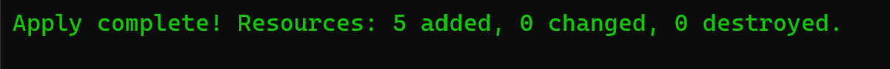

### DNS

```bash
dig +short sindrg.com NS
```

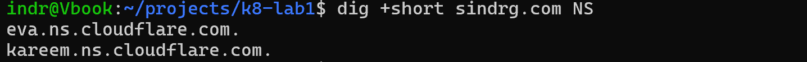

```bash
dig +short @1.1.1.1 sindrg.com A
dig +short @8.8.8.8 sindrg.com A
dig +short sindrg.com A
```

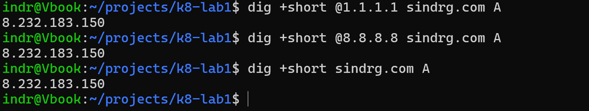

Querying a public resolver as well as the local one separates a record that does not exist from a negative answer cached locally. The apex took several minutes to appear locally after it resolved elsewhere.

```bash
curl -I http://sindrg.com
```

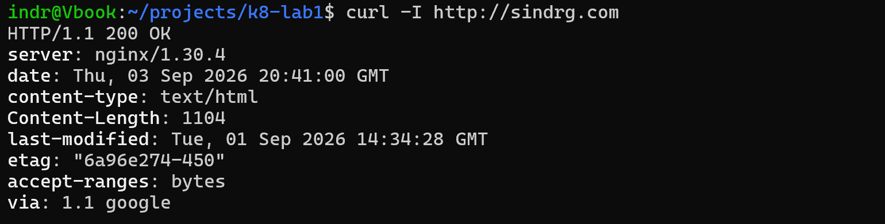

### The certificate was issued for the wrong domain

Status: Failed, then fixed

```bash
curl -I https://sindrg.com
```


`SSL_ERROR_SYSCALL` is a connection-level failure, not a certificate error. A rejected or mismatched certificate produces a verify error instead. Nothing was listening on 443, because GKE does not stand up an HTTPS frontend without a usable certificate.

The certificate itself reported `PROVISIONING` indefinitely. The reason was only visible in `managed.authorizationAttemptInfo`, not in the top-level state:

```text
domain: sidnrg.com
failureReason: CONFIG
issues:
- CNAME_MISMATCH
```

The Terraform `domain` variable held `sidnrg.com`. The certificate, the DNS authorization, and the map entry had all been created for a domain nobody owns, and the `CNAME` in Cloudflare was correct for that wrong name, because it had been copied faithfully from Terraform's output.

`domain` is immutable on both resources, so correcting it replaced them.

```bash
terraform -chdir=terraform apply
```


Replacement issues a new authorization with a new target, so the record in Cloudflare became stale the moment the apply finished.

```bash
gcloud certificate-manager dns-authorizations describe k8-lab-gateway-dns-auth \
  --format="value(dnsResourceRecord.name,dnsResourceRecord.data)"
dig +short _acme-challenge.sindrg.com CNAME
```


Comparing the two values directly is what identifies a stale record. The served value still began `c016c223`, from the destroyed authorization; the expected value began `fbee38d7`.

The [troubleshooting log](../troubleshooting.md#a-managed-certificate-stays-in-provisioning) records the diagnosis.

### The HTTPS listener

```bash
kubectl apply -f kubernetes/nginx/
```

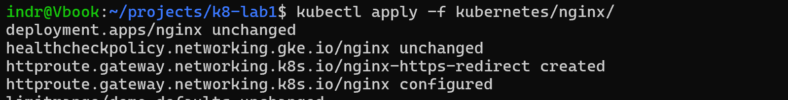

The main route is bound to `sectionName: https`, so it could not attach until the HTTPS listener existed. The redirect route attaches to the HTTP listener and answers with a `301`, so no request reaches a Pod in clear text.

### Validation

Status: Pending

```bash
gcloud certificate-manager certificates describe k8-lab-gateway-cert --format=yaml
```

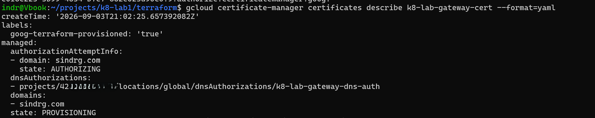

Result so far: `domains: sindrg.com`, `state: PROVISIONING`, and an attempt in `AUTHORIZING` with no `failureReason`. The `CNAME` has since been corrected and resolves to the expected target, so the next check should succeed.

Outstanding, to be recorded when the certificate reaches `ACTIVE`:

```bash
curl -sI http://sindrg.com  | grep -i '^HTTP\|^location'
curl -sI https://sindrg.com | grep -i '^HTTP'
curl -sv https://sindrg.com 2>&1 | grep -E 'subject:|issuer:'
```

Expected: a `301` to HTTPS, then `HTTP/2 200`, with the certificate issued by Google Trust Services for `sindrg.com`. No further apply is needed; GKE configures the HTTPS frontend once the certificate is usable.

## Slice 4: Prove the Service stayed private

Status: Pending

Publicly reachable is now demonstrated. The other half of the exit criteria is the claim a reader will doubt, and it is recorded here as outstanding:

```bash
kubectl get svc nginx -n demo -o jsonpath='{.spec.type}{"  externalIPs="}{.spec.externalIPs}{"\n"}'
kubectl get svcneg -n demo -o wide
```

Expected: `ClusterIP` with no external address, and a `ServiceNetworkEndpointGroup` listing the Pod endpoints the load balancer sends to. An unlabelled Pod must also still time out against the Service, confirming Phase 4's isolation survived going public.

## Known gaps

- The managed certificate has not yet reached `ACTIVE`, so HTTPS, the redirect, and the certificate evidence are unrecorded.
- The Gateway admits Google's health check ranges by source address. Every Google Cloud customer's proxies originate there, so this is the coarsest control that works rather than identity.
- Nothing rate-limits or filters requests. Cloud Armor is the answer and is a phase of its own.
- The certificate covers the apex only. `www.sindrg.com` has no record and is not in the certificate's domain list.
- `HealthCheckPolicy` is not schema-validated in CI. It is a GKE-proprietary CRD with no public schema, so `-ignore-missing-schemas` skips it.
