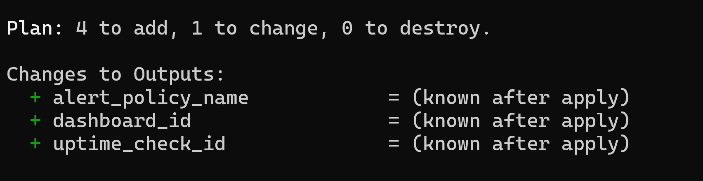
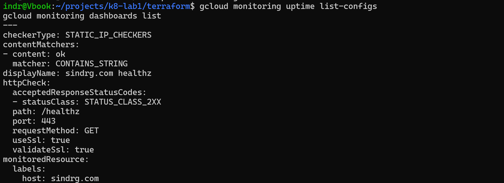
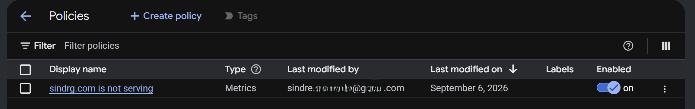
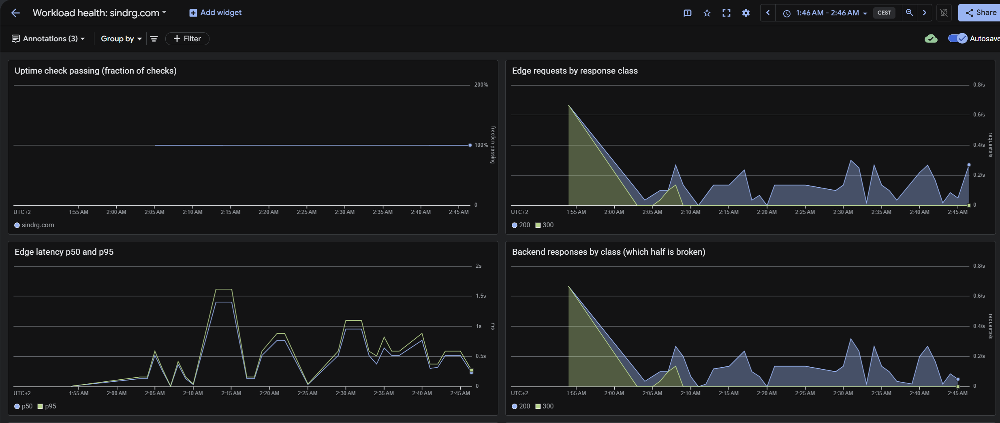

# Worklog: Phase 8 Observability and Evidence

Date: 2026-09-06  
Status: in progress. The signal path and the dashboard are built and taking data. The failure drills are done and recorded in Phase 10. The numbers and the cost snapshot are outstanding.

## Goal

Make platform health observable and provable:

- One dashboard that answers what is wrong.
- One alert that fires when the site stops serving.
- Recorded failure, recovery and cost numbers, to close Milestone 1.

## Problem: an alert on served traffic needs served traffic

This platform has close to no organic traffic, so a condition on the load balancer's 5xx ratio evaluates an empty series during an outage and stays silent. A flat line is indistinguishable from a quiet night. A Cloud Monitoring uptime check supplies its own traffic: a request from outside Google's network, on a fixed period, whose result is the metric.

| Vantage point | Answers | Covers |
| --- | --- | --- |
| Uptime check, from outside | Is the site up for a user? | DNS, certificate, load balancer, HTTPRoute, NetworkPolicy, Pods |
| Load balancer metrics | Which half is broken? | Frontend against backend, response classes, latency |
| Kubernetes metrics and logs | Why? | Restarts, limit pressure, container output |

Only the uptime check pages. The other two are diagnosis.

## Slice 1: Declare the telemetry

Status: Complete

### Changes

- `logging_config`: `SYSTEM_COMPONENTS` and `WORKLOADS`.
- `monitoring_config`: `SYSTEM_COMPONENTS`, with Managed Service for Prometheus.
- Control plane streams left off: `API_SERVER`, `SCHEDULER` and `CONTROLLER_MANAGER` answer "who changed this object", and are noisy and billable for everything else.

Container stdout is the largest ingest line on a cluster this size and Cloud Logging bills it, so keeping `WORKLOADS` is a cost decision rather than a free one.

```bash
terraform -chdir=terraform plan
```



Result: not a no-op. Both blocks were meant to describe behaviour GKE already ran by default, but the plan proposed a cluster change. The assumed default was not the configured state.

## Slice 2: Uptime check, notification channel, and one alert

Status: Complete

### Changes

- A `terraform/modules/observability` module holding the whole signal path.
- An HTTPS uptime check against `/healthz` from three prober regions, every 60 seconds.
- A content matcher requiring `ok`, so a 200 from something that is not this workload still fails.
- `validate_ssl`, making the check an expiry alarm for the managed certificate as well.
- An email notification channel, and one alert policy that opens an incident only when more than one checker location is failing.

`/healthz` rather than `/`, because the page content changes and the health endpoint is a contract. `access_log` is off for that path, so a request every minute adds nothing to log ingest.

```bash
terraform -chdir=terraform apply
```


```bash
gcloud monitoring uptime list-configs
```



Result: `STATIC_IP_CHECKERS` against `https://sindrg.com/healthz`, accepting `STATUS_CLASS_2XX`, matching `ok` in the body, validating the certificate.



### Alert tuning

| Setting | Value | Reason |
| --- | --- | --- |
| Locations failing | more than 1 | one failing location is a network path on the internet, not an outage |
| `auto_close` | 30 minutes | the default of 7 days leaves a recovered incident open when the next one arrives |
| Documentation body | the first commands to run | the notification carries the start of the diagnosis, Pods outwards to the edge |

Requiring two locations costs nothing in detection here: one zonal cluster behind one global load balancer has no partial-failure mode, so a real outage fails every location inside the same check period.

## Slice 3: One dashboard, as code

Status: Complete

### Changes

- A `google_monitoring_dashboard` built from a template file, so the layout is reviewable and the console is not the source of truth.
- Panels ordered the way they are read during an incident: is the site up, is traffic arriving and in what class, is latency degrading, did the load balancer or the Pods fail, are containers restarting, what do the warnings say.



| Panel | Reading |
| --- | --- |
| Uptime | 100% |
| Edge and backend traffic | agree on the same traffic |
| p50 and p95 | track each other, a few hundred milliseconds |
| `300` class | the HTTP to HTTPS redirect from Phase 7, not an error |

Nearly all of that traffic is the uptime check itself: without it the panels would be empty, and an outage would look like a quiet night.

### Deliberate omissions

- **No ready-replicas panel.** It needs kube-state-metrics, an exporter with Pod Security and NetworkPolicy consequences in a namespace that enforces `restricted`. Restart count and backend responses answer this phase's questions.
- **Console autosave is on.** Edits made there are silently overwritten by the next `terraform apply`. To keep one: `gcloud monitoring dashboards describe <id> --format=json`.

## Slice 4: Break it on purpose

Status: complete, as [Phase 10](phase-10-failure-drills.md).

Both drills were run on 2026-09-12 and are recorded in their own worklog, because they are the first work in this project that only tests what already exists.

| Drill | Result |
| --- | --- |
| Availability | the alert opened about 3m15s after the site stopped serving, and closed on recovery |
| Rollout | the pipeline failed at the rollout gate, and the previous digest kept serving throughout |

The availability drill also measured this phase's detection floor. Nothing shorter than roughly 3 minutes can open an incident, because the check runs every 60s per location, the condition needs more than one location failing, and `duration` holds it a further 60s.

## Slice 5: The numbers

Status: Not started

- Median deploy duration and the per-step split, plus commit to serving.
- Time from a configuration change to a Ready workload.
- A billing snapshot grouped by SKU, with the main cost sources named rather than only the total.

Evidence: the workflow run list with its step timings, and the billing report grouped by SKU.

## Slice 6: Close Milestone 1

Status: Not started

Fill every row of the claim table with a link to its evidence, mark the phase complete, and update the README status and capability table.

## Next

Slice 5: the deploy timings and the cost snapshot.
