# Worklog: Phase 10 Failure Drills

Date: 2026-09-12  
Status: Complete.

## Goal

Fire the signal path [Phase 8](phase-08-observability.md) built, and prove a bad version cannot reach users.

| Drill | Question | Expected |
| --- | --- | --- |
| Availability | does the alert fire when the site stops serving? | an incident opens, then closes |
| Rollout | does a bad version reach users? | the pipeline stops, the site does not move |

## Drill A: availability

Scale to zero rather than pulling the Gateway or the DNS record. Recovery from those waits on certificate issuance and DNS propagation, which tests Google's provisioning rather than this platform.

Baseline.

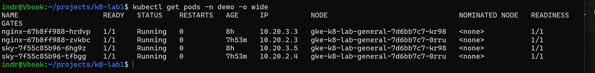

A probe against the public edge every 10 seconds, stamped in UTC. This is the outage clock.

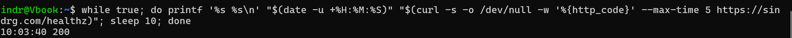

```bash
date -u; kubectl scale deployment/nginx -n demo --replicas=0
```

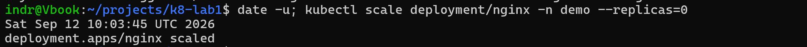

The edge failed 6 seconds later.

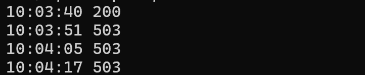

`sky` kept running, so `/sky`, `/api` and `/static` kept serving. The outage was scoped to `/`.

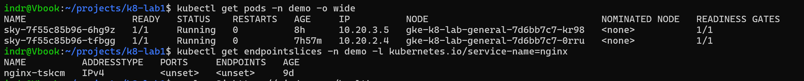

503 rather than 502: the backend service has no healthy backend to forward to.

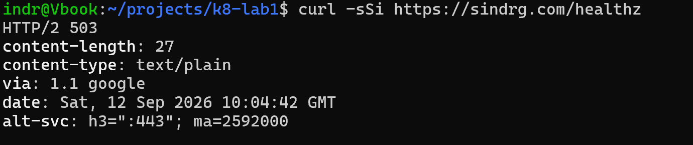

```bash
date -u; kubectl scale deployment/nginx -n demo --replicas=2
kubectl rollout status deployment/nginx -n demo
```

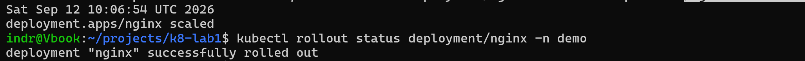

The edge recovered 16 seconds after the restore.

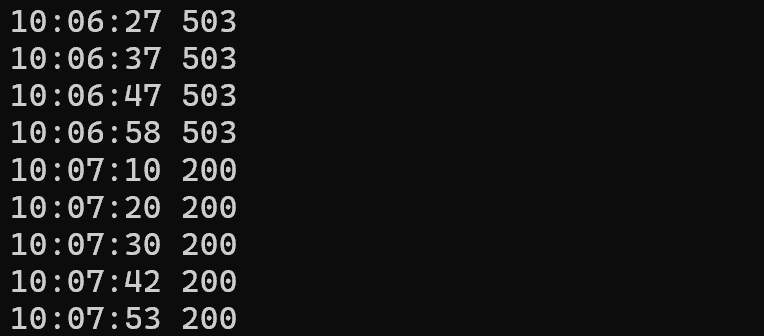

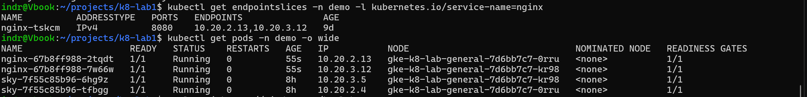

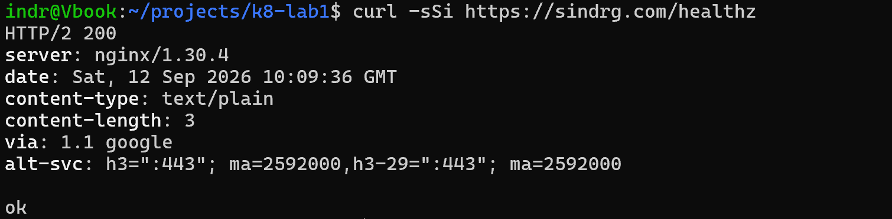

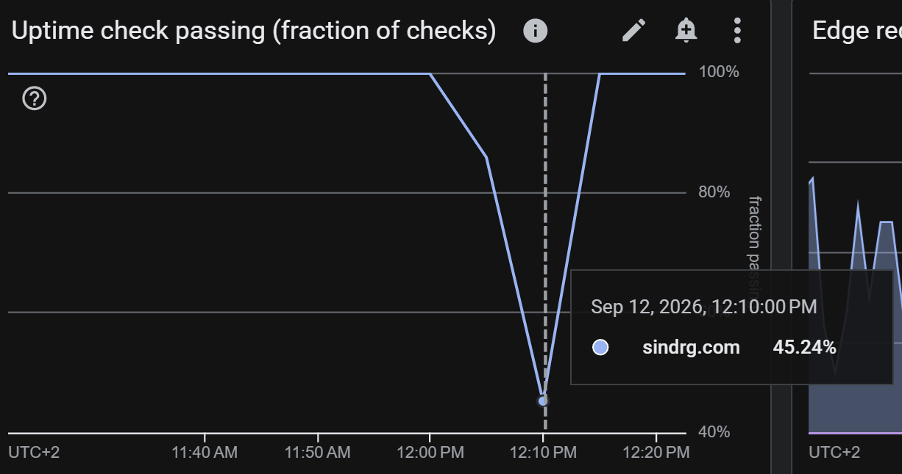

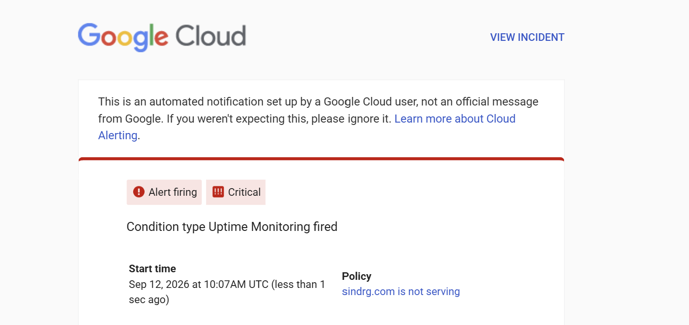

### Timeline

| Time (UTC) | Event | Source |
| --- | --- | --- |
| 10:03:40 | Last passing probe | probe loop |
| 10:03:45 | `nginx` scaled to zero | `date -u` beside the command |
| 10:03:51 | Edge returns 503 | probe loop |
| 10:06:54 | `nginx` scaled back to two | `date -u` beside the command |
| 10:07:10 | Edge returns 200 | probe loop |
| 10:07 | Alert opens | notification email |

| Interval | Duration |
| --- | --- |
| Scale to zero, to first 503 | 6s |
| Outage at the edge | 3m19s |
| Restore, to first 200 | 16s |
| Scale to zero, to alert | about 3m15s |

### Finding: detection has a three minute floor

The edge recovered at 10:07:10. The alert start time is 10:07. Detection took about 3m15s against an outage of 3m19s.

The floor is structural:

- the check runs every 60 seconds per location
- the condition needs more than one location failing
- `duration` holds the condition a further 60 seconds

Nothing shorter than roughly three minutes can open an incident. That is the intended trade, now measured rather than assumed.

## Drill B: failed rollout

Break `/healthz` and ship it through the real pipeline. Both probes target that path.

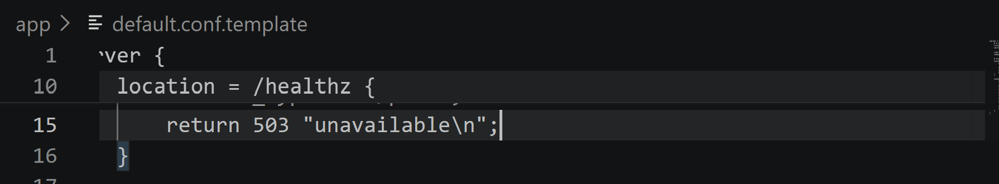

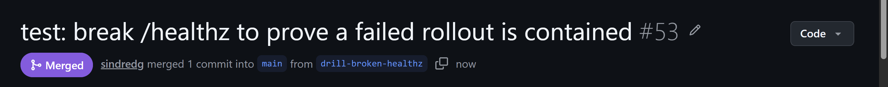

The edge probe never left 200.

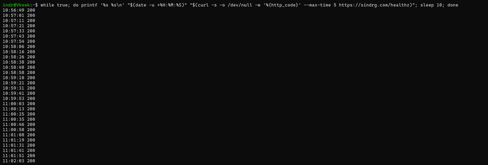

`maxUnavailable: 0` with `maxSurge: 1` creates exactly one surge Pod. It never went Ready.

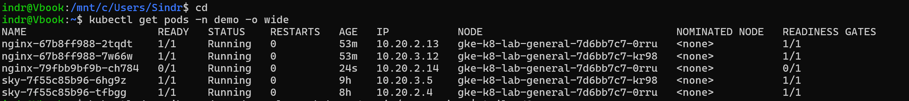

Readiness keeps the Pod out of the Service. Liveness restarts the container on its own cycle.

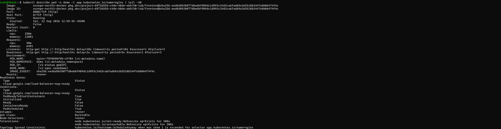

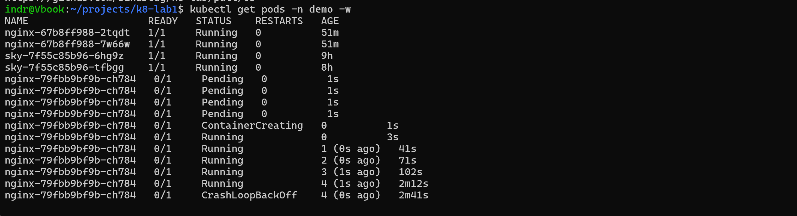

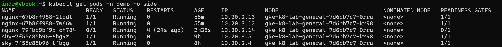

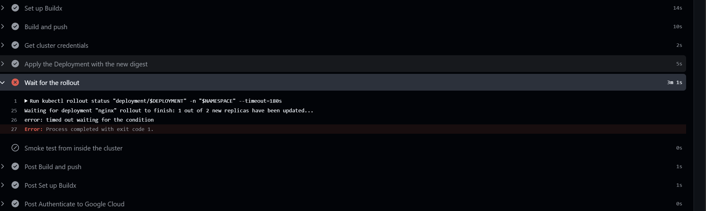

```
Waiting for deployment "nginx" rollout to finish: 1 out of 2 new replicas have been updated...
error: timed out waiting for the condition
```

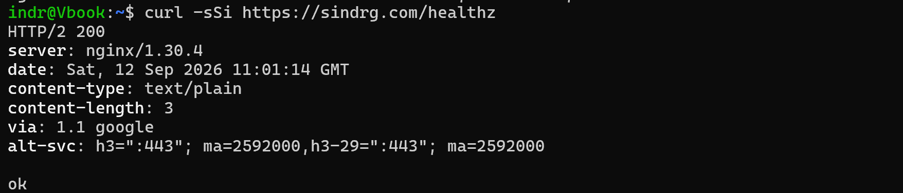

```bash
kubectl rollout undo deployment/nginx -n demo
```

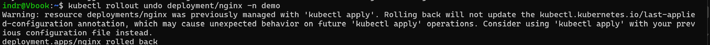

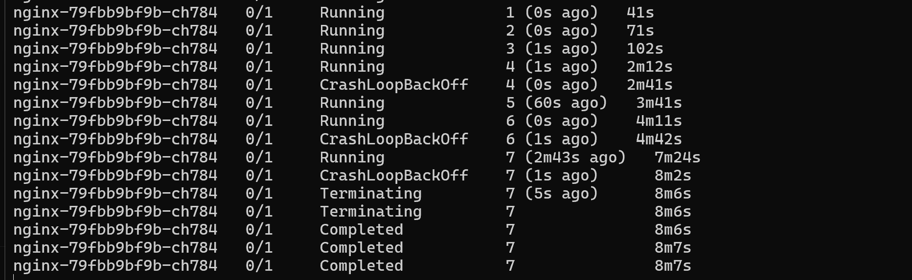

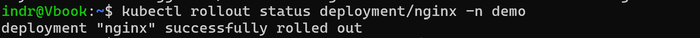

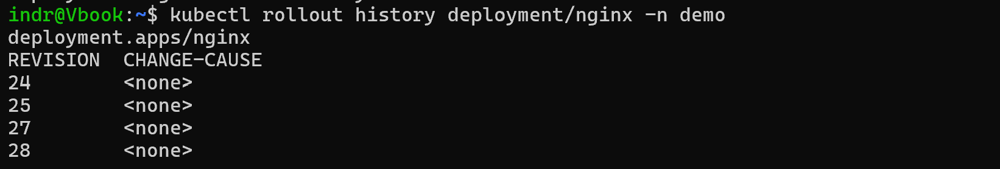

### Timeline

| Time (UTC) | Event | Source |
| --- | --- | --- |
| 10:56:49 | Probe starts, 200 | probe loop |
| 10:59:05 | Deploy run 34689846817 starts | `gh run list` |
| 10:59:55 | Surge Pod starts | `kubectl describe` |
| 11:02:03 | Probe still 200 | probe loop |
| 11:03:00 | Rollout wait times out, job fails | workflow run, 3m55s total |
| 11:08 | `rollout undo`, surge Pod terminated | Pod age 8m6s at termination |

| Step | Duration | Result |
| --- | --- | --- |
| Build and push | 10s | pass |
| Apply the Deployment with the new digest | 5s | pass |
| Wait for the rollout | 3m1s | fail, exit 1 |
| Smoke test from inside the cluster | 0s | skipped |

### Finding: the gate held

Users saw nothing. `maxUnavailable: 0` will not retire a healthy Pod for one that is not Ready.

### Finding: CI passed the broken change

Both required checks went green on the pull request that broke the health endpoint. CI validates Terraform and Kubernetes schemas, and nothing parses nginx configuration. This class of fault is caught after the image is built, not before.

### Finding: an EndpointSlice lists an address before it is ready

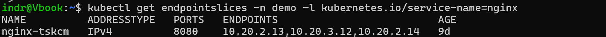

The `ENDPOINTS` column showed three backends while two were serving. It does not filter on readiness. Each endpoint carries its own `conditions.ready`, and that is what gates traffic.

```bash
kubectl get endpointslices -n demo -l kubernetes.io/service-name=nginx -o yaml | grep -A3 addresses
```

### Notes

- `rollout undo` leaves the `last-applied-configuration` annotation stale. The next pipeline apply reconciles it.
- `rollout history` records every revision as `CHANGE-CAUSE: <none>`. The workflow run is the only record of why.

## Result

| Claim | Evidence |
| --- | --- |
| Monitoring works | the alert opened about 3m15s after the outage began, and closed on recovery |
| Rollout is controlled | the pipeline failed at the gate, and the previous digest kept serving |

Drill A cut a notch in the uptime panel. Drill B left it flat while the pipeline went red.

Postmortem: [the availability drill](postmortem-availability-drill.md).
