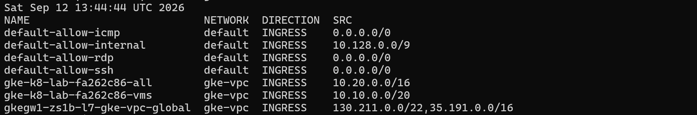
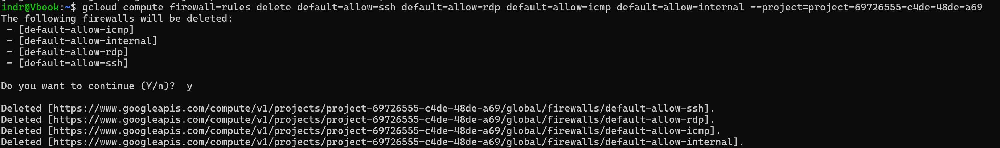
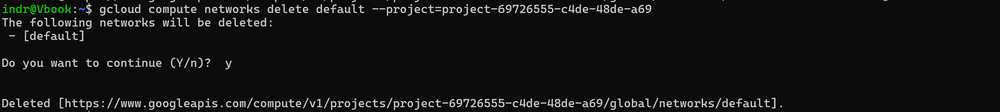
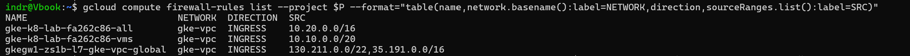
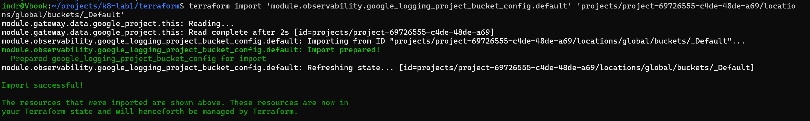
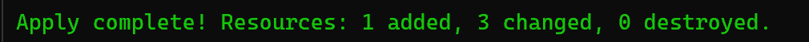
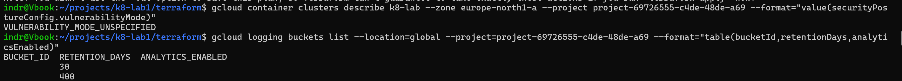
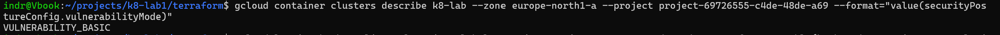
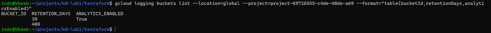

# Worklog: Phase 11 Hardening and Log Analytics

Date: 2026-09-12  
Status: Complete.

## Goal

A security pass over what Milestone 1 built, before leaving the platform running unattended.

The audit found three things: a network nobody used that was open to the internet, a free vulnerability scanner that was switched off, and logs that were already paid for and not queryable. Applying the fixes surfaced a fourth, which turned out to be the most valuable.

## Slice 1: Remove the open default network

Status: Complete

Every project starts with a `default` VPC carrying stock rules. This one had 42 subnets, 43 routes, and no instances.

```bash
gcloud compute firewall-rules list --project $P --format="table(name,network.basename():label=NETWORK,direction,sourceRanges.list():label=SRC)"
```



`default-allow-ssh`, `default-allow-rdp` and `default-allow-icmp` accept from `0.0.0.0/0`. They sit on `default`, not `gke-vpc`, so nothing on this platform was reachable through them. An unused network is still worth removing rather than explaining.

```bash
gcloud compute firewall-rules delete default-allow-ssh default-allow-rdp default-allow-icmp default-allow-internal --project=$P
```



```bash
gcloud compute networks delete default --project=$P
```





Result: `gke-vpc` is the only network in the project, and every remaining rule is one GKE created.

## Slice 2: The plan that would have destroyed both nodes

Status: Complete

This slice was not planned. It appeared while planning the two below.

Log Analytics needs `_Default` adopted into state first, because the bucket exists before Terraform does.

```bash
terraform -chdir=terraform import 'module.observability.google_logging_project_bucket_config.default' 'projects/PROJECT_ID/locations/global/buckets/_Default'
```



Then the plan.


Two destroys, for a change that should have added one metric and flipped two settings.

### Fault 1: the node pool

```
# module.gke.google_container_node_pool.general must be replaced
~ initial_node_count = 2 -> 1 # forces replacement
```

[Phase 9](phase-09-resilience.md) pinned `initial_node_count` to `1` precisely because the field is `ForceNew`, so that raising the autoscaling floor could not replace the pool. It then raised the floor by resizing the pool **by hand**, because the floor alone added no node.

That manual resize wrote `2` back into state. From that moment the pin protecting the pool was the thing proposing to delete it.

This was armed before this phase and had nothing to do with it. Any apply, carrying any change, would have offered to destroy both nodes.

Fix: the field only matters when the pool is created, so drift on it should never reach a plan.

```hcl
lifecycle {
  ignore_changes = [initial_node_count]
}
```

### Fault 2: the log bucket

```
~ project = "projects/PROJECT_ID" -> "PROJECT_ID" # forces replacement
```

Import stores `project` in the API's `projects/ID` form. The configuration supplied the bare ID, which reads as a change to an immutable field. Replacing a log bucket deletes it and every log in it.

Fix: match the stored form.

```hcl
project = "projects/${var.project_id}"
```


The node pool left the plan entirely.

| | Before | After |
| --- | --- | --- |
| Add | 3 | 1 |
| Change | 2 | 3 |
| Destroy | **2** | **0** |

## Slice 3: Turn on what was free and off

Status: Complete

The cluster reported `securityPostureConfig.mode: BASIC` with `vulnerabilityMode: VULNERABILITY_MODE_UNSPECIFIED`. Posture was on and scanning nothing.

```hcl
security_posture_config {
  mode               = "BASIC"
  vulnerability_mode = "VULNERABILITY_BASIC"
}
```

### The org policy that could not be set

`constraints/iam.disableServiceAccountKeyCreation` would make the keyless claim structural rather than conventional.

```bash
gcloud resource-manager org-policies enable-enforce constraints/iam.disableServiceAccountKeyCreation --project=$P
```

```
ERROR: does not have permission to access projects instance [...:setOrgPolicy]
The caller does not have permission.
```

Result: not possible from here. `setOrgPolicy` needs `roles/orgpolicy.policyAdmin`, which is held at the organization rather than by a project owner. The project has no org policies at all, so the constraint is unenforced and stays that way. Recorded rather than worked around.

## Slice 4: Log Analytics

Status: Complete

Two log buckets, `_Default` at 30 days and `_Required` at 400, with analytics off and no log-based metrics. The logs are already ingested and already billed, so analytics adds SQL over them at no extra storage cost.

Enabling analytics on a bucket cannot be undone.

### The metric, and the filter that would have been wrong

The first filter written for this metric was `severity>=ERROR`. Checked before committing it:

```bash
gcloud logging read 'resource.type="k8s_container" ... AND severity>=ERROR' --freshness=7d
```

Result: five entries over seven days, every one a `[notice]`, all from a single rollout. GKE labels everything a container writes to stderr as `ERROR`, and nginx writes its notices there. A metric on severity would have counted a graceful shutdown on every deploy.

nginx states its own level in the message, so that is the filter that means what it says:

```
textPayload=~"\[(error|crit|alert|emerg)\]"
```

Validated over 30 days: it matches real `[error]` lines and ignores the notices.

### Apply









Both nodes kept their creation timestamps through the apply, which is what says the pool was not replaced.

### No alert on the new metric

Deliberate. The metric has no baseline, and its only historical matches are favicon 404s from local image testing. A threshold now would be a guess. Collect first.

## Slice 5: Redact the control plane endpoint

Status: Complete

[The networking reference](../reference/networking.md) published the cluster's full DNS endpoint.

It is not a secret. IAM authorizes every call to that endpoint and the hostname grants nothing on its own. It is also the live API server address, and publishing it in a public repository removes a discovery step for no benefit. Replaced with a placeholder.

## Slice 6: The budget, left as it is

Status: Complete, as a decision to change nothing.

The audit flagged the budget as unable to warn, assuming credits zeroed the measured cost. Checking before fixing:

```bash
gcloud billing budgets describe "$BUDGET" --billing-account="$ACCOUNT" --format="yaml(amount,budgetFilter,thresholdRules)"
```

```
creditTypesTreatment: EXCLUDE_ALL_CREDITS
```

The assumption was wrong. The budget already measures usage cost rather than net cost, so it does fire. At `kr1000` a month against roughly `kr2000` of usage it fires every month, around day 8, day 11 and day 14.

Retuning it was rejected. The account runs on credits and cannot turn usage into a charge, so a budget threshold guards against something that cannot happen here. Raising the number would only quiet an alarm that costs nothing either way.

What the check did produce is the number worth having:

| Reading | Value |
| --- | --- |
| Spend, 1 to 12 September | kr695, about kr58 a day |
| Credit remaining | kr2369 |
| Runway at that rate | about 41 days |

When the credits are consumed the cluster stops. The availability alert from [Phase 10](phase-10-failure-drills.md) is what reports that, inside the three minute detection floor that phase measured. No new signal was needed.

One gap recorded and not closed: `notificationsRule` is empty, so budget alerts fall back to emailing billing administrators rather than the `Platform owner` notification channel the rest of the platform uses. Two alerting paths that do not meet. Not worth wiring up for a budget that has been rejected as a control.

## Result

| Finding | Outcome |
| --- | --- |
| `default` VPC open to the internet on SSH and RDP | Network deleted |
| Workload vulnerability scanning off | `VULNERABILITY_BASIC` |
| Logs not queryable | Log Analytics on `_Default` |
| No log-based metrics | One, on nginx error levels |
| Service account key creation unrestricted | Cannot be enforced from a project |
| Budget assumed unable to warn | Assumption wrong, and retuning rejected |
| A plan that destroyed both nodes | Fixed, and it predated this phase |

The audit was the cheap part. The node pool fault was worth more than everything it was looking for, and it only appeared because something unrelated was about to be applied.

## Open

- `terraform plan` is still not clean. The dashboard reports a permanent diff, now understood: the template writes `xPos` and `yPos` of `0`, which the API omits as defaults, and the API returns `etag` and `name`, which the template cannot carry. A noisy plan is what hid the node pool fault.
- No alert on `nginx-error-level` until it has a baseline.
