# Worklog: Phase 12a Load Baseline

Date: 2026-09-13  
Status: Complete.

## Goal

Measure what the platform holds today, before anything about it changes.

| Question | Expected |
| --- | --- |
| where does sky saturate? | on its CPU limit, before errors |
| can the load generator be trusted? | idle CPU above 30%, no dropped iterations |
| does saturation page anyone? | no, the only alert is availability |

## Slice 1: Scaling telemetry

Four metric packages and two dashboard panels, applied in place.

```bash
terraform -chdir=terraform apply
```


| Package | Question it answers |
| --- | --- |
| `CADVISOR` | is sky throttled? |
| `HPA`, `DEPLOYMENT` | do declared and available replicas part? |
| `POD` | is a Pod `Pending`? |

The first samples landed at 11:03:57 UTC.

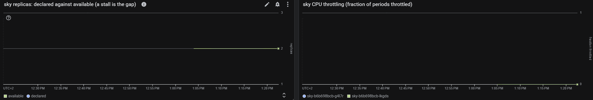

Result: both panels read the idle platform. Declared and available overlap at 2.

## Slice 2: Load generator

A throwaway VPC in `europe-west4`, SSH through IAP only, and one VM with no service account.

```bash
loadtest/loadgen.sh up
```

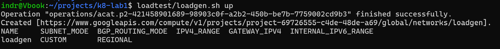

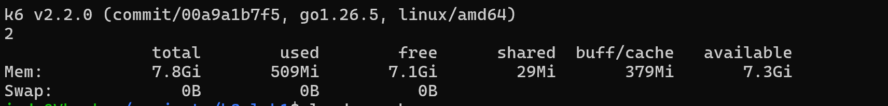

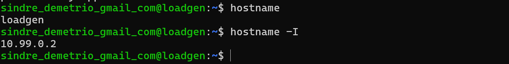

| Property | Value |
| --- | --- |
| Machine | `e2-standard-2` in `europe-west4-a` |
| Network | `loadgen`, `10.99.0.0/24` |
| Ingress | TCP 22 from `35.235.240.0/20` only |
| Identity | none |
| k6 | v2.2.0, checksum verified |

Result: requests reach `sindrg.com` through the public load balancer, from outside the platform network.

## Slice 3: Calibration

A fast pass on the first grid, 10 to 800 requests a second in 20 second steps.

```bash
k6 run -e RUN=calibrate -e STEP_SECONDS=20 ramp.js
```

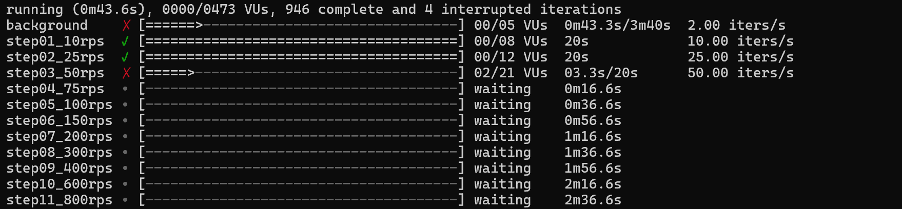

| Step | Requests | p95 | Result |
| --- | --- | --- | --- |
| 10 rps | 201 | 147ms | pass |
| 25 rps | 500 | 152ms | pass |
| 50 rps | 158 | 679ms | fail |

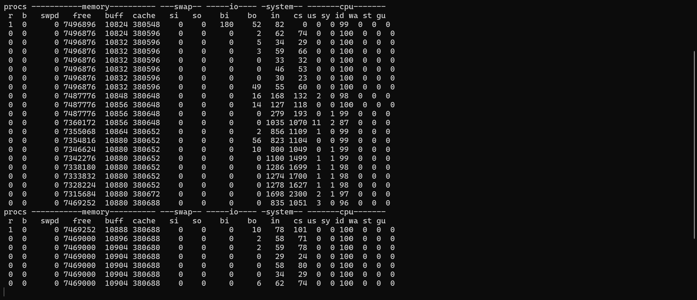

The generator was never the constraint. The grid was.

| Observation | Change |
| --- | --- |
| Saturation between 25 and 50 rps, and 8 of 11 steps never ran | Grid of 5, 10, 15, 20, 25, 30, 40, 50, 60, 80, 100, 125, 150, 200 |
| 3 dropped iterations, from VUs allocated mid-step | Every VU allocated at the start of its step |
| The IAP session dropped as the run ended | Runs start inside tmux |

Result: a grid fine enough to place saturation within one step, and a generator that drops nothing.

## Slice 4: Baseline ramp

The recorder on the operator's machine, the ramp on the generator, 60 seconds a step.


```bash
k6 run -e RUN=a-ramp ramp.js
```

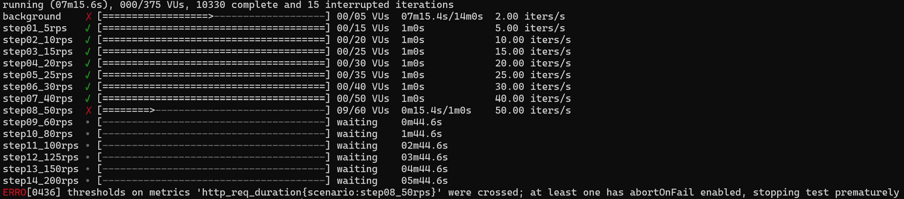

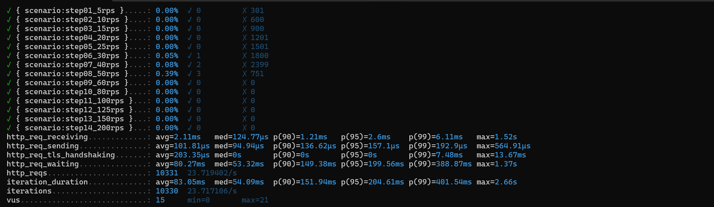

Started 12:15:22 UTC, stopped 12:22:37 UTC.

| Step | Requests | Median | p95 | p99 | Max | Failed |
| --- | --- | --- | --- | --- | --- | --- |
| 5 rps | 301 | 51ms | 149ms | 171ms | 249ms | 0 |
| 10 rps | 600 | 52ms | 140ms | 169ms | 195ms | 0 |
| 15 rps | 900 | 51ms | 134ms | 170ms | 234ms | 0 |
| 20 rps | 1,201 | 50ms | 138ms | 177ms | 250ms | 0 |
| 25 rps | 1,501 | 56ms | 175ms | 292ms | 389ms | 0 |
| 30 rps | 1,801 | 56ms | 170ms | 241ms | 558ms | 1 |
| 40 rps | 2,401 | 70ms | 230ms | 381ms | 1,039ms | 2 |
| 50 rps | 754 | 128ms | **696ms** | 991ms | 2,661ms | 3 |

| Total | Value |
| --- | --- |
| Requests | 10,331 |
| Failed | 6 (0.06%) |
| Dropped iterations | 0 |
| Background requests to `/` | 871, none failed |
| Saturation rate | **40 rps** |

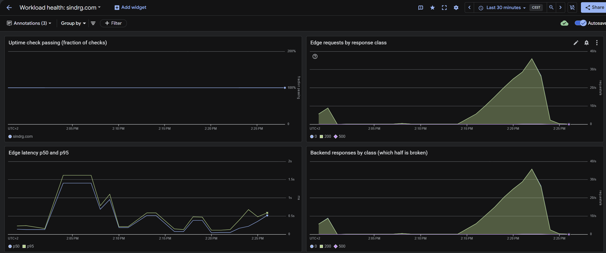

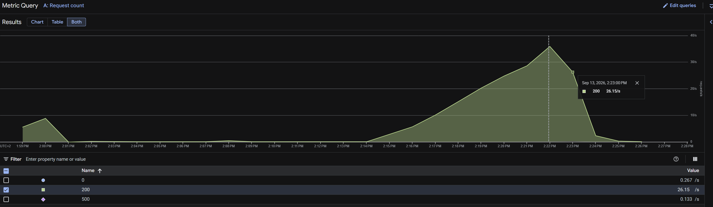

### Throttled before busy

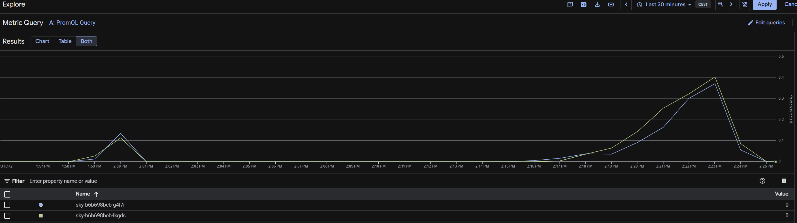

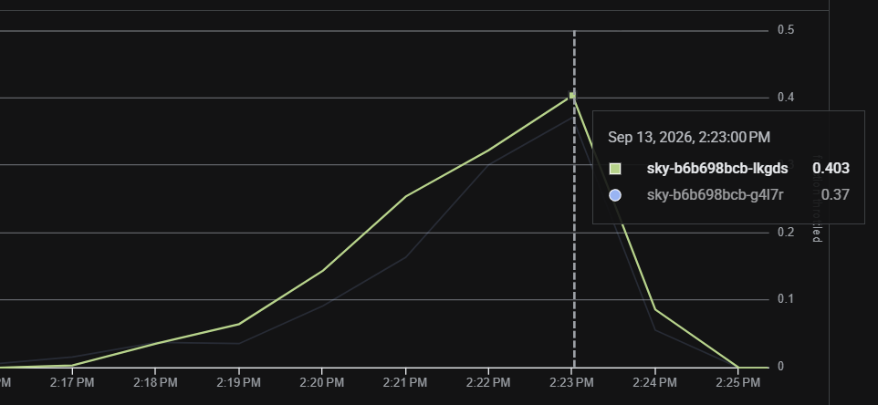

| Minute ending (UTC) | Load in that minute | CPU, `g4l7r` / `lkgds` | Throttled periods |
| --- | --- | --- | --- |
| 12:17 | 5 to 10 rps | 65m / 77m | 1.4% / 0.2% |
| 12:19 | 15 to 20 rps | 142m / 135m | 3.4% / 6.3% |
| 12:21 | 25 to 30 rps | 262m / 319m | 16.1% / 25.4% |
| 12:22 | 30 to 40 rps | 329m / 323m | 30.0% / 32.1% |
| 12:23 | 40 to 50 rps, idle from 12:22:37 | 219m / 267m | 37.1% / 40.3% |

The 500m limit is enforced as 50ms of CPU in every 100ms period. At 40 rps each Pod averaged about two thirds of its limit and was throttled in a third of its periods. uvicorn serves each Pod from one process, so a burst spends the period's quota and the requests behind it wait for the next one.

Memory held at 39 to 42 MiB on both Pods.

### Six 503s

One for one with k6's failure count.

```bash
gcloud logging read 'resource.type="http_load_balancer" httpRequest.status!=200 timestamp>="2026-09-13T12:13:00Z" timestamp<="2026-09-13T12:24:00Z"'
```

```text
12:20:31  503  /api/moon?place=barcelona      backend_connection_closed_before_data_sent_to_client
12:21:40  503  /api/places                    backend_connection_closed_before_data_sent_to_client
12:22:07  503  /api/places                    backend_connection_closed_before_data_sent_to_client
12:22:28  503  /api/milkyway?place=cape-town  backend_connection_closed_before_data_sent_to_client
12:22:36  503  /api/places                    backend_connection_closed_before_data_sent_to_client
12:22:36  503  /api/moon?place=alesund        backend_connection_closed_before_data_sent_to_client
```

sky closed the connection, not the load balancer. uvicorn 0.52.4 closes an idle connection after 5 seconds, and the manifest does not change it. The load balancer keeps backend connections for up to 600 seconds, so a connection uvicorn is closing can be the one it picks for the next request. The first failure landed in the 30 rps step.

The 13 `client_disconnected_before_any_response` entries at 12:22:37 are the requests in flight when k6 stopped the run.

### The cluster held still

```text
=== 2026-09-13T12:21:33Z
sky                      2        2      2      2
sky-b6b698bcb-g4l7r      294m     39Mi
sky-b6b698bcb-lkgds      310m     42Mi
limits.cpu               1500m    3
requests.cpu             300m     1
pods                     4        10
```

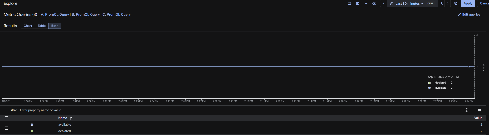

74 snapshots. No restarts, no evictions, and no events beyond Gateway syncs.

### Nobody was paged

The uptime check stayed at 100% while p95 reached 696ms. The availability alert asks whether the site answers, not how fast.

## Result

| Measure | Two replicas, 500m limit |
| --- | --- |
| Saturation rate | 40 rps |
| p95 at 40 rps | 230ms |
| p95 at 50 rps | 696ms |
| CPU per Pod at 40 rps | about 325m of 500m |
| Throttled periods at 40 rps | 30 to 32% |
| Failures | 6 of 10,331, all 503 |
| Generator idle CPU | 87% minimum |
| Alerts opened | 0 |

| Prediction | Outcome |
| --- | --- |
| sky saturates on its CPU limit first | Confirmed, at two thirds of the limit on average |
| Nothing fails below saturation | Wrong: closed backend connections from 30 rps |

## Open

- sky's keep-alive of 5s sits below the load balancer's 600s.
- A slow site pages nobody.
