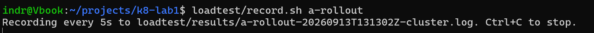
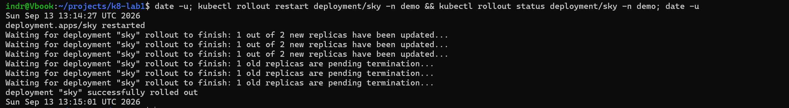
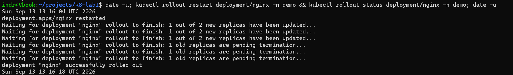
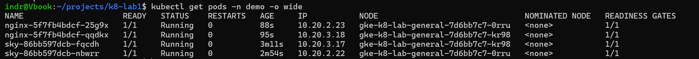
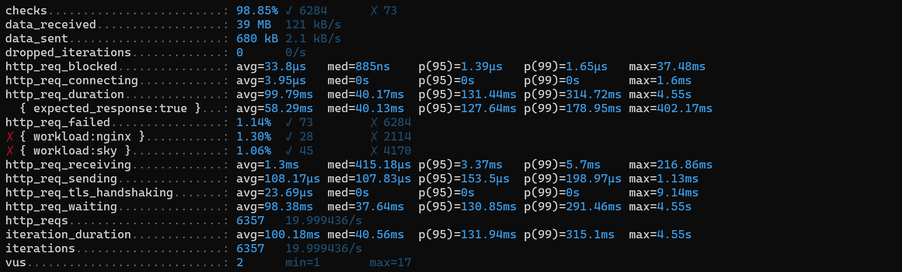
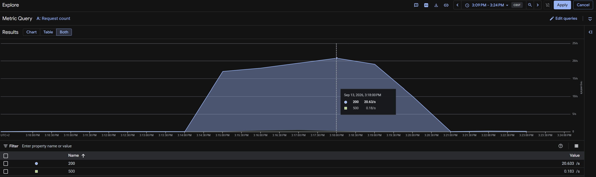
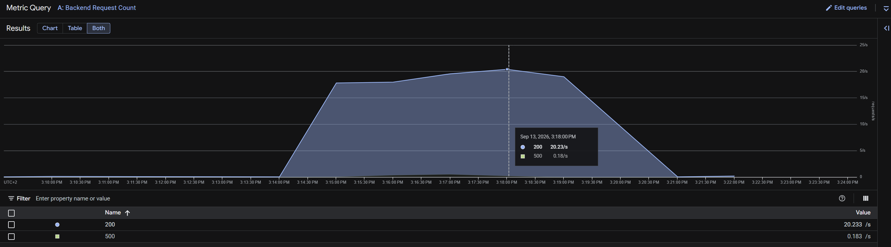
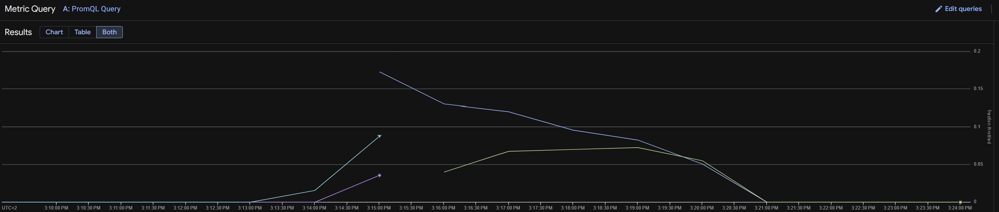

# Worklog: Phase 12b Rollout Baseline

Date: 2026-09-13  
Status: Complete.

## Goal

Measure what a routine rollout costs users, before anything protects an old Pod's exit.

| Question | Expected |
| --- | --- |
| does a rollout drop requests? | yes, as each old Pod stops |
| for how long? | as long as the load balancer takes to drop the endpoint |
| is "successfully rolled out" the end of it? | unknown |

## Slice 1: Steady load

20 rps, half the saturation rate [Phase 12a](phase-12a-load-baseline.md) measured, so a failure belongs to the rollout rather than to load.

| Path | Workload | Share |
| --- | --- | --- |
| `/api/moon?place=lofoten` | sky | one third |
| `/sky` | sky | one third |
| `/` | nginx | one third |



```bash
k6 run -e RUN=a-rollout -e RATE=20 -e DURATION=8m --log-output=file=results/a-rollout-failures.log rollout.js
```

k6 ran from 13:14:05 to 13:19:23 UTC, stopped by hand 2m55s after the last failure.

## Slice 2: Roll sky

```bash
date -u; kubectl rollout restart deployment/sky -n demo && kubectl rollout status deployment/sky -n demo; date -u
```



| Time (UTC) | Event | Source |
| --- | --- | --- |
| 13:14:27 | `rollout restart` | `date -u` |
| 13:14:29 | New Pod `fqcdh` created | events |
| 13:14:46 | `fqcdh` healthy in the NEG, old Pod `lkgds` stopped | events |
| 13:14:46.952 | First 503 | load balancer log |
| 13:14:59 | Endpoint detached, 13s after `lkgds` stopped | events |
| 13:15:01 | `successfully rolled out` | `date -u` |
| 13:15:02 | `nbwrr` healthy, old Pod `g4l7r` stopped | events |
| 13:15:07.303 | Last 503 | load balancer log |
| 13:15:14 | Endpoint detached, 12s after `g4l7r` stopped | events |

Result: 44 failures across 20.4s, the last 6s after the rollout reported success.

## Slice 3: Roll nginx

```bash
date -u; kubectl rollout restart deployment/nginx -n demo && kubectl rollout status deployment/nginx -n demo; date -u
```



| Time (UTC) | Event | Source |
| --- | --- | --- |
| 13:16:04 | `rollout restart` | `date -u` |
| 13:16:05 | New Pod `qqdkx` created | events |
| 13:16:12 | `qqdkx` healthy in the NEG, old Pod `x8989` stopped | events |
| 13:16:13.004 | First 503 | load balancer log |
| 13:16:18 | `successfully rolled out` | `date -u` |
| 13:16:19 | `25g9x` healthy, old Pod `cfw5r` stopped | events |
| 13:16:24.353 | Last 503 | load balancer log |
| 13:16:25 | Endpoint detached, 13s after `x8989` stopped | events |
| 13:16:32 | Endpoint detached, 13s after `cfw5r` stopped | events |

Result: 28 failures across 11.3s, the last 6s after the rollout reported success.



## Slice 4: What failed



| Workload | Requests | Failed | Rate | Error window |
| --- | --- | --- | --- | --- |
| sky | 4,215 | 45 | 1.06% | 20.4s |
| nginx | 2,142 | 28 | 1.30% | 11.3s |
| Total | 6,357 | 73 | 1.14% | |

| Latency | p95 | p99 | Max |
| --- | --- | --- | --- |
| Successful requests | 128ms | 179ms | 402ms |
| All requests | 131ms | 315ms | 4.55s |

Every failure is in the load balancer log.

| Workload | Status | `statusDetails` | Count | Under 100ms | 4s or more |
| --- | --- | --- | --- | --- | --- |
| sky | 503 | `failed_to_connect_to_backend` | 44 | 12 | 32 |
| sky | 503 | `backend_connection_closed_before_data_sent_to_client` | 1 | 1 | 0 |
| nginx | 503 | `failed_to_connect_to_backend` | 28 | 1 | 27 |

```text
13:14:46.952  503  /api/moon?place=lofoten  0.034s  failed_to_connect_to_backend
13:14:47.053  503  /api/moon?place=lofoten  0.036s  failed_to_connect_to_backend
13:15:07.303  503  /sky                     4.533s  failed_to_connect_to_backend
13:15:24.403  503  /api/moon?place=lofoten  0.034s  backend_connection_closed_before_data_sent_to_client
13:16:13.004  503  /                        0.034s  failed_to_connect_to_backend
13:16:24.353  503  /                        4.533s  failed_to_connect_to_backend
```

59 of 73 failures took 4.5s. A user caught by a rollout mostly waited for a connection that never opened, rather than seeing a fast error.





## Slice 5: Why

The start of a rollout is protected. Every Pod carries the NEG readiness gate, so an old Pod stops only once its replacement is healthy in the load balancer: 17s for sky's first new Pod, 7s for nginx's.

The end is not. An old Pod stops serving within a second of being told to stop, and the load balancer drops its endpoint 12 to 13s later. Every request routed to it in that gap fails.

| Pod | Stopped (UTC) | Endpoint detached | Gap |
| --- | --- | --- | --- |
| sky `lkgds` | 13:14:46 | 13:14:59 | 13s |
| sky `g4l7r` | 13:15:02 | 13:15:14 | 12s |
| nginx `x8989` | 13:16:12 | 13:16:25 | 13s |
| nginx `cfw5r` | 13:16:19 | 13:16:32 | 13s |

Detach events name the NEG rather than the Pod, so they are paired with Pods in order.

The one `backend_connection_closed_before_data_sent_to_client` at 13:15:24 came 17s after sky's rollout failures ended. It is the keep-alive mismatch from 12a, and it appears at 20 rps as well as at 30.



At 20 rps the old Pods stayed under 10% of periods throttled. One new Pod reached 17% in its first minute and fell to 5% by 13:20.

## Result

| Measure | sky | nginx |
| --- | --- | --- |
| Restart to reported success | 34s | 14s |
| New Pod healthy in the NEG | 17s | 7s |
| Stopped to endpoint detached | 12 to 13s | 13s |
| Error window | 20.4s | 11.3s |
| Failed requests | 45 of 4,215 | 28 of 2,142 |
| Failures after reported success | 6s | 6s |
| Failures lasting 4s or more | 32 | 27 |

| Question | Answer |
| --- | --- |
| does a rollout drop requests? | Yes: 73 requests at 20 rps |
| for how long? | About the 13s detach gap per Pod |
| is "successfully rolled out" the end of it? | No: failures continued 6s after on both |

## Open

- Old Pods stop 12 to 13s before the load balancer stops sending to them.
- sky's keep-alive of 5s sits below the load balancer's 600s.
