# Worklog: Phase 12c Rollouts and Connections

Date: 2026-09-15  
Status: Complete.

## Goal

Remove the two failure classes the baseline found, and prove each change against the same test that found it.

| Failure | Found in | Fix | Test |
| --- | --- | --- | --- |
| `failed_to_connect_to_backend` during a rollout | [12b](phase-12b-rollout-baseline.md), 72 requests | `preStop` sleep | rollout at 20 rps |
| `backend_connection_closed_before_data_sent_to_client` | [12a](phase-12a-load-baseline.md), 6 requests | backend keep-alive above 600s | ramp |

## Slice 1: A 20s preStop sleep

Both Deployments gained a 20s `preStop` sleep and a 40s grace period, sized from the 12 to 13s detach gap 12b measured.

```yaml
terminationGracePeriodSeconds: 40
lifecycle:
  preStop:
    sleep:
      seconds: 20
```

The same rollout test as 12b, at 20 rps.

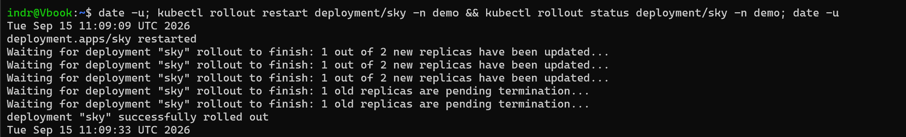

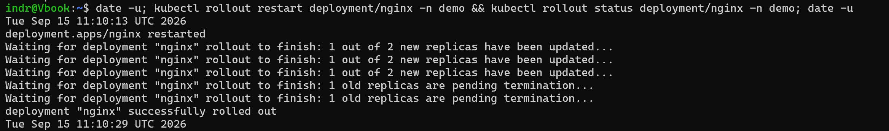

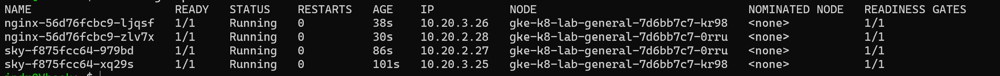

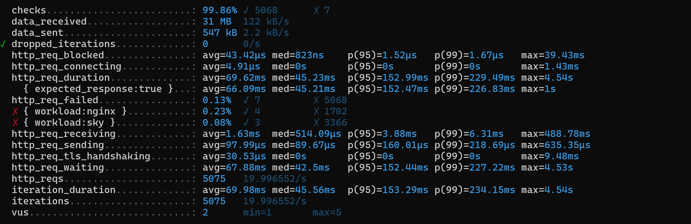

| Workload | Requests | Connection failures | Closed-connection 503s |
| --- | --- | --- | --- |
| sky | 3,369 | 0 | 3 |
| nginx | 1,706 | 4 | 0 |

sky went from 44 connection failures to none. nginx kept 4, all at 4.5s.

### The tail

The Compute Engine audit log records each detach with the endpoint's IP, and its operation ID pairs the request with its completion.

| Pod | Stopped (UTC) | Detach requested | Detach completed | Took | Sleep ends |
| --- | --- | --- | --- | --- | --- |
| sky, 10.20.3.21 | 11:09:25 | 11:09:25.6 | 11:09:37.3 | 11.7s | 11:09:45 |
| sky, 10.20.2.25 | 11:09:33 | 11:09:33.6 | 11:09:45.7 | 12.1s | 11:09:53 |
| nginx `6xrws`, 10.20.3.23 | 11:10:21 | 11:10:22.1 | 11:10:33.6 | 11.6s | 11:10:41 |
| nginx `2n4xl`, 10.20.2.26 | 11:10:29 | 11:10:29.8 | 11:10:42.0 | 12.2s | 11:10:49 |

The 4 nginx failures reached the load balancer between 11:10:42.6 and 11:10:49.6. `2n4xl` was still serving then, so they went to `6xrws`: 28.6s after it stopped, and 16s after its detach completed. About 4 of 50 nginx requests in that window failed, so a few of the load balancer's proxies still held the old endpoint.

Result: the detach takes 12s, and the proxies behind it can take more than 20s. The sleep went to 35s and the grace period to 60s.

## Slice 2: The quota refuses the deploys

Merging the 35s change started Deploy sky on the push. Deploy, for nginx, was started by hand 33s later. Both rolled out and both smoke tests were refused at 13:07:36.

```text
pods "smoke-sky-34972870400" is forbidden: exceeded quota: demo-budget, requested: limits.cpu=250m, used: limits.cpu=3, limited: limits.cpu=3
```


| Pods at 13:07:36 | Count | Limit each | Total |
| --- | --- | --- | --- |
| sky, new | 2 | 500m | 1000m |
| sky, in `preStop` sleep | 2 | 500m | 1000m |
| nginx, new | 2 | 250m | 500m |
| nginx, in `preStop` sleep | 2 | 250m | 500m |
| Used | 8 | | 3000m of 3000m |

A Pod in its `preStop` sleep still counts against the quota. The site kept serving; only the smoke Pods were refused.

Rerunning the failed jobs passed, and rolled out both workloads again.


| Workload | Digest before the rerun | Digest after |
| --- | --- | --- |
| sky | `sha256:7e22eb3d...` | `sha256:1701fa64...` |
| nginx | `sha256:1614acea...` | `sha256:77286fc0...` |

The build is not reproducible, so the same source publishes a new digest, and every deploy run is a rollout.

The two deploy workflows now share the concurrency group `deploy-demo`. The next merge touched both, and they ran in turn:

| Job | Started (UTC) | Completed |
| --- | --- | --- |
| Deploy | 13:35:01 | 13:36:04 |
| Deploy sky | 13:36:43 | 13:38:10 |

Result: one rollout at a time peaks at 2750m with the smoke Pod, and the quota stays at 3000m for step C.

## Slice 3: A 35s preStop sleep

The same rollout test again. Deploy sky was still rolling when the load started, so the run covers three rollouts: the pipeline's sky rollout, then a manual sky and a manual nginx rollout.

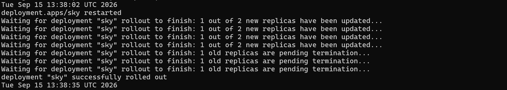

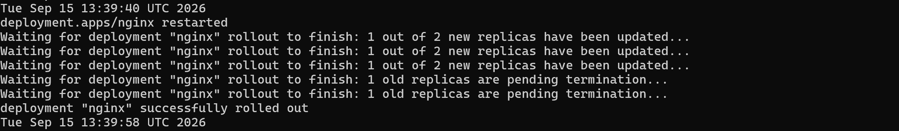

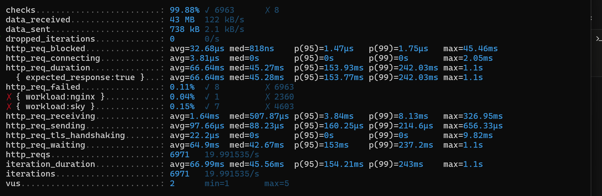

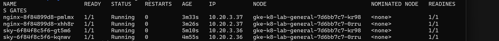

| Rollout | Pod | Detach took | Sleep |
| --- | --- | --- | --- |
| Pipeline, sky | 10.20.3.30 | 20.0s | 35s |
| Pipeline, sky | 10.20.2.33 | 11.8s | 35s |
| Manual, sky | 10.20.3.34 | 11.7s | 35s |
| Manual, sky | 10.20.2.35 | 12.3s | 35s |
| Manual, nginx | 10.20.3.32 | 12.1s | 35s |
| Manual, nginx | 10.20.2.34 | 11.9s | 35s |

| Workload | Requests | Connection failures | Closed-connection 503s |
| --- | --- | --- | --- |
| sky | 4,610 | 0 | 7 |
| nginx | 2,361 | 0 | 1 |

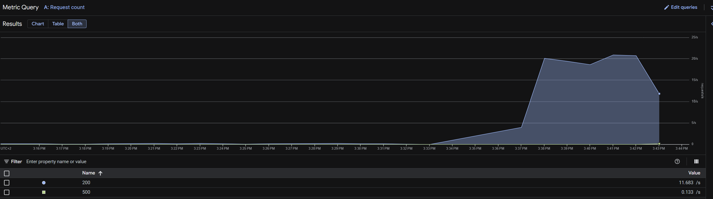

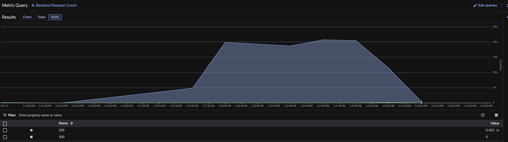

Every failure was a closed connection, and two landed at 13:37:03 and 13:37:04, before any rollout reached a Pod.

Result: no connection failures across three rollouts, including one detach that took 20.0s.

## Slice 4: Backend keep-alive

The load balancer reuses a backend connection for up to 600s. Both backends closed idle connections much sooner.

| Workload | Idle timeout | Read from | Now |
| --- | --- | --- | --- |
| sky | 5s | uvicorn 0.52.4 default, inside the Pod | `--timeout-keep-alive 620` |
| nginx | 65s | `keepalive_timeout 65;` in the image's `nginx.conf` | `keepalive_timeout 620s;` in the server block |


The same ramp as 12a.

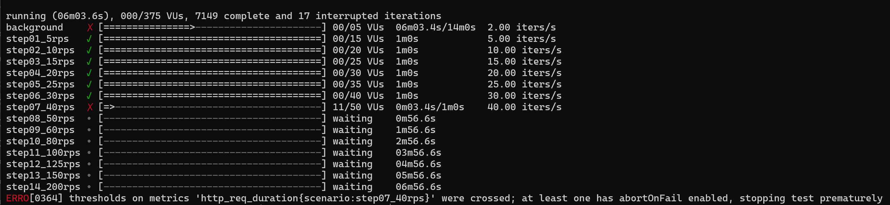

| Step | 12a p95 | Keep-alive 620s p95 | 12a failed | Keep-alive 620s failed |
| --- | --- | --- | --- | --- |
| 5 rps | 149ms | 163ms | 0 | 0 |
| 10 rps | 140ms | 163ms | 0 | 0 |
| 15 rps | 134ms | 156ms | 0 | 0 |
| 20 rps | 138ms | 176ms | 0 | 0 |
| 25 rps | 175ms | 220ms | 0 | 0 |
| 30 rps | 170ms | 211ms | 1 | 0 |
| 40 rps | 230ms | 776ms, 118 requests | 2 | 0 |
| 50 rps | 696ms | not reached | 3 | |

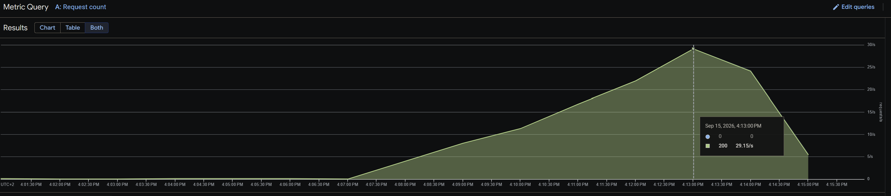

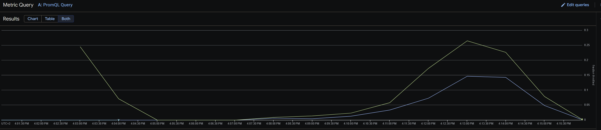

The load balancer logged no 5xx in the window. Its 13 `client_disconnected_before_any_response` entries are the requests in flight when k6 stopped.

Result: 7,150 requests, none failed, where 12a had 6 closed-connection 503s.

## Result

| Measure | Baseline | 20s sleep | 35s sleep | Keep-alive 620s |
| --- | --- | --- | --- | --- |
| Connection failures in a rollout | 72 | 4 | **0** | |
| Closed-connection 503s | 1 in a rollout, 6 in a ramp | 3 | 8 | **0** in a ramp |
| Longest detach observed | 13s | 12.2s | 20.0s | |
| Requests reaching a stopped Pod, latest | | 28.6s after stop | none | |

| Finding | Outcome |
| --- | --- |
| Rollouts drop requests while the load balancer detaches a Pod | `preStop` sleep of 35s, grace period 60s |
| The load balancer's proxies lag the detach by more than 20s | Measured at 28.6s, covered |
| Pods in their `preStop` sleep fill the quota when two deploys overlap | Deploy workflows serialized |
| A deploy rerun rolls out again | Recorded: the build is not reproducible |
| Backends close connections the load balancer reuses | Keep-alive at 620s on both |

## Open

- The ramp stopped 3.4s into the 40 rps step, on 118 requests. p95 was 14 to 45ms higher than 12a at every step, including 5 rps, so the saturation rate cannot be compared on this run. The ramp evaluates every step's abort from the start of the whole run, so the first seconds of a step can end it.
- Reruns rebuild a new digest from the same source.
