# Worklog: Phase 12d Autoscaling

Date: 2026-09-15  
Status: Complete.

## Goal

Prove the scaling path from a busy Pod to a new node, and record where it breaks.

| Question | Expected |
| --- | --- |
| what does sky hold on fixed replicas? | about 40 rps, the 12a baseline |
| does the HPA scale sky at today's size? | yes, until the quota stops it at five |
| does a deploy survive a stall? | no, it fails at the rollout gate |
| does a resized sky add a node? | yes, the sixth Pod goes `Pending` and a node joins |

## Slice 1: Fixed-replica reference

The ramp judges each step on requests sent after it settles, so C and D compare against a run judged the same way.

```bash
k6 run -e RUN=c0-ramp -e STEP_SECONDS=180 -e SETTLE_SECONDS=90 ramp.js
```

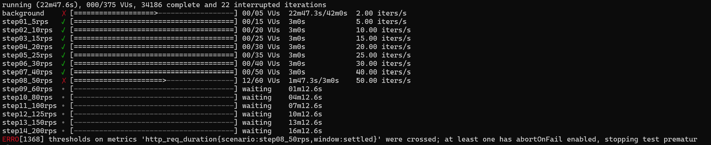

| Step | Settled requests | Settled p95 | sky CPU per Pod | Throttled periods |
| --- | --- | --- | --- | --- |
| 10 rps | 900 | 83ms | about 90m | 1% |
| 20 rps | 1,801 | 120ms | about 150m | 7 to 10% |
| 30 rps | 2,701 | 160ms | about 255m | 18 to 23% |
| 40 rps | 3,601 | **251ms** | about 375m | 37 to 41% |
| 50 rps | 845 | **580ms**, failed | about 400m | 66 to 72% |

34,187 requests, none failed, none dropped.

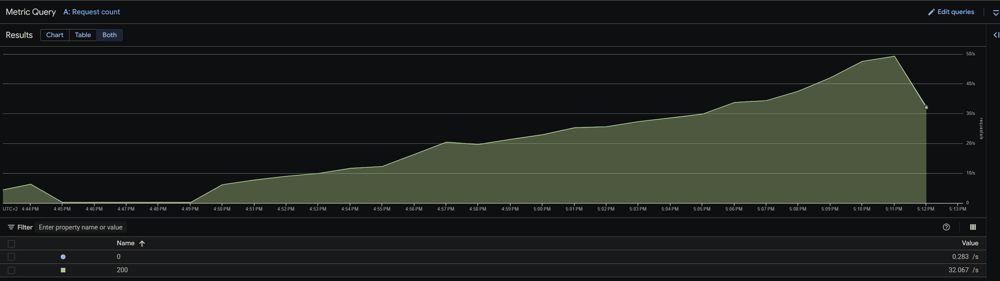

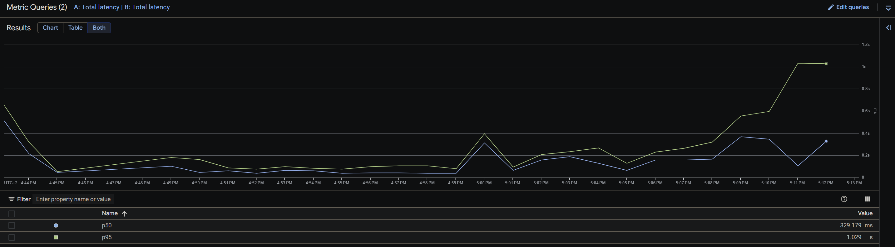

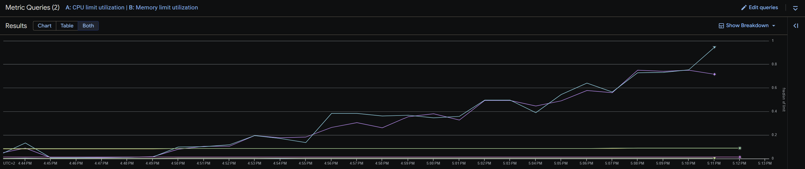

Result: two replicas hold **40 rps**. One Pod carries about 20 rps, and at 40 rps it averages 375m while a third of its periods are throttled.

## Slice 2: HPA at today's size

sky scales between two and eight replicas at 70% of its 100m request. `replicas` left the Deployment, and its last-applied record was rewritten first, or the pipeline's next apply would have set sky to one Pod.

```bash
kubectl apply set-last-applied -f kubernetes/sky/deployment.yml
kubectl apply -f kubernetes/sky/hpa.yml
```

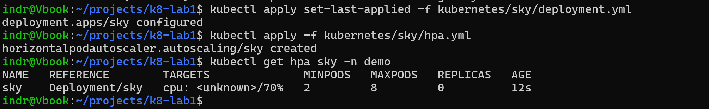

Autoscaling runs start at 20 rps in 120s steps settled after 75s.

```bash
k6 run -e RUN=c-ramp -e STEPS=20,40,60,80,100,125,150 -e STEP_SECONDS=120 -e SETTLE_SECONDS=75 ramp.js
```

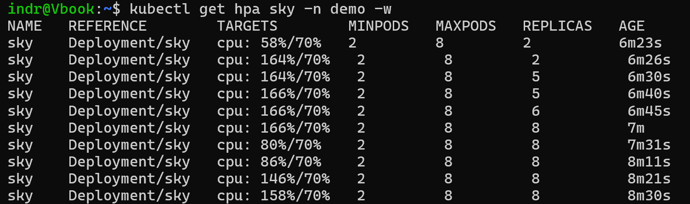

| Time (UTC) | Event |
| --- | --- |
| 15:35:37 | ramp starts at 20 rps |
| 15:36:04 | HPA 2 to 5 |
| 15:36:18 | HPA 5 to 6, first `FailedCreate` |
| 15:36:23 | HPA 6 to 8 |
| 15:37:07 | 5 available, 8 declared |

```text
Error creating: pods "sky-6c4797955b-ldl54" is forbidden: exceeded quota: demo-budget, requested: limits.cpu=500m, used: limits.cpu=3, limited: limits.cpu=3
```

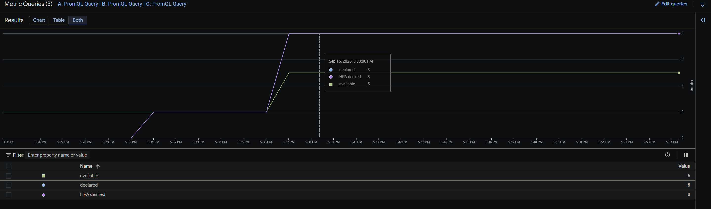

19 `FailedCreate` events. Five Pods at a 500m limit and nginx's 500m fill 3000m of 3000m.

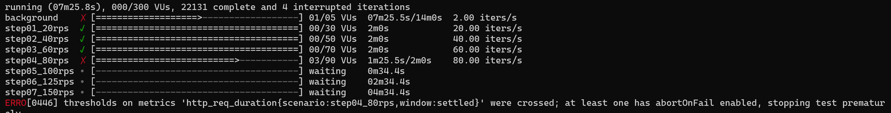

| Step | Settled requests | Settled p95 |
| --- | --- | --- |
| 20 rps | 901 | 101ms |
| 40 rps | 1,800 | 138ms |
| 60 rps | 2,701 | **240ms** |
| 80 rps | 838 | **562ms**, failed |

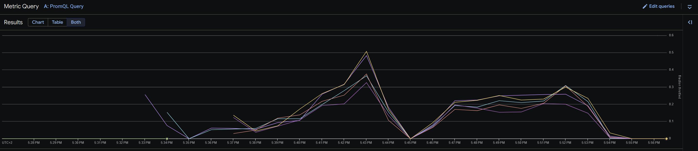

| At 80 rps | Value |
| --- | --- |
| CPU per Pod | 305 to 354m |
| Throttled periods | 31 to 48% |
| Busiest node | 1184m of 1930m |

Result: the HPA stalled at **5 of 8** on the quota, as predicted. Saturation was **60 rps**, not the predicted 100, because the limit throttled each Pod while its node had CPU to spare.

## Slice 3: A deploy during the stall

A steady 60 rps held sky at five, and Deploy sky was started by hand.

```bash
k6 run -e RUN=c-stall -e RATE=60 -e DURATION=7m --log-output=file=results/c-stall-failures.log rollout.js
```

```bash
gh workflow run deploy-sky.yml --ref main
```

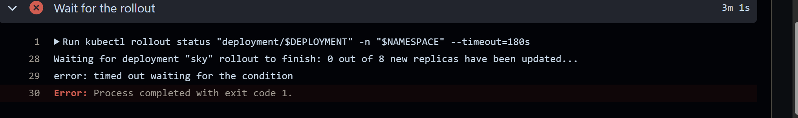

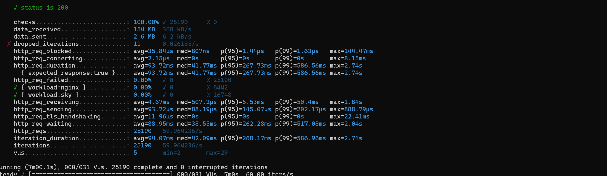

| Time (UTC) | Event |
| --- | --- |
| 15:48:18 | rollout starts; its surge Pod is refused by the quota |
| 15:51:19 | `rollout status` times out, the run fails |
| 15:52:42 | load stops |
| 15:56:16 | rerun: fails, `exceeded its progress deadline` at 15:58:19 |
| 15:58:45 | HPA scales sky to 2, six minutes after load stopped |
| 15:59:40 | rerun: rolled out in 37s, smoke test passed |

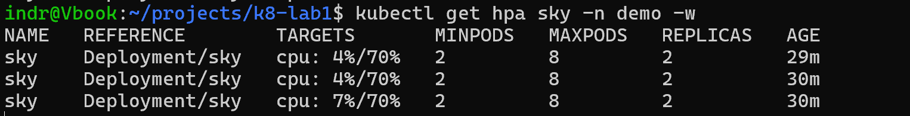

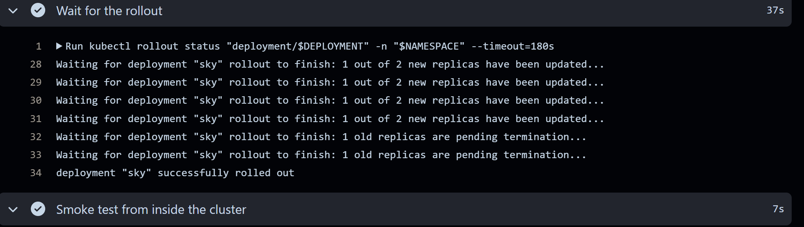

The held load had no failures; 16 surge Pods were refused, and the running five kept serving. The first rerun failed because the stalled rollout had already passed its 10 minute progress deadline, and the quota was still full.

Result: a deploy during the stall fails at the rollout gate, and succeeds once the HPA has scaled down. Recovery waits for scale-down, not for the load to stop.

## Slice 4: Resize, and a zone out of capacity

| Setting | Before | After |
| --- | --- | --- |
| sky CPU request | 100m | 350m |
| sky CPU limit | 500m | 1000m |
| quota `requests.cpu`, `limits.cpu`, `pods` | 1, 3, 10 | 5, 13, 16 |

One uvicorn process cannot use more than one core, so a one-core limit leaves little to throttle. The quota went first, because the resize's own rollout needed 3750m of limits.

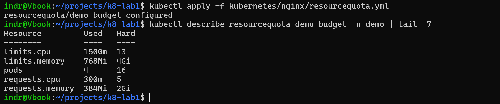


```bash
k6 run -e RUN=d-ramp -e STEPS=20,40,60,80,100,125,150 -e STEP_SECONDS=120 -e SETTLE_SECONDS=75 ramp.js
```

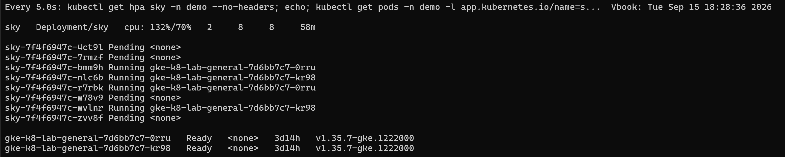

| Time (UTC) | Event |
| --- | --- |
| 16:23:58 | HPA 2 to 3 |
| 16:26:09 | HPA 4 to 6; the fifth Pod does not fit |
| 16:26:11 | autoscaler asks for 2 to 3 nodes |
| 16:26:22, 16:26:36 | `ZONE_RESOURCE_POOL_EXHAUSTED` |
| 16:28:23 | HPA 6 to 8 |
| 16:31:47 | autoscaler asks again |
| 16:31:55 | `ZONE_RESOURCE_POOL_EXHAUSTED` |

Each node had about 870m requested by system Pods, so each fit two sky Pods at 350m. Two nodes held four, not the predicted five.

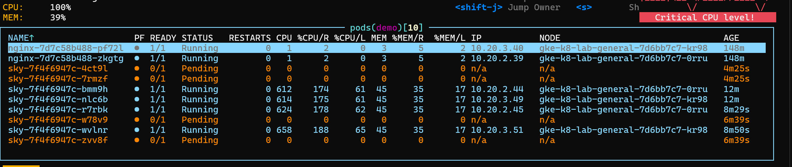

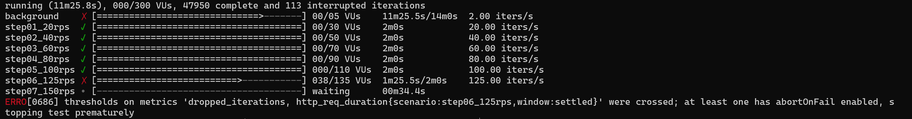

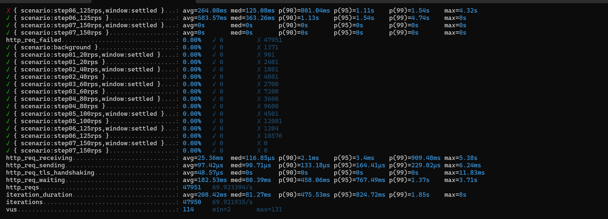

| Step | Settled requests | Settled p95 |
| --- | --- | --- |
| 60 rps | 2,700 | 122ms |
| 80 rps | 3,600 | 159ms |
| 100 rps | 4,501 | **489ms** |
| 125 rps | 1,204 | **1,110ms**, failed |

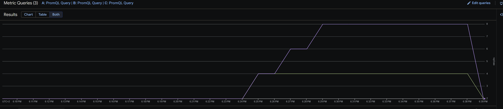

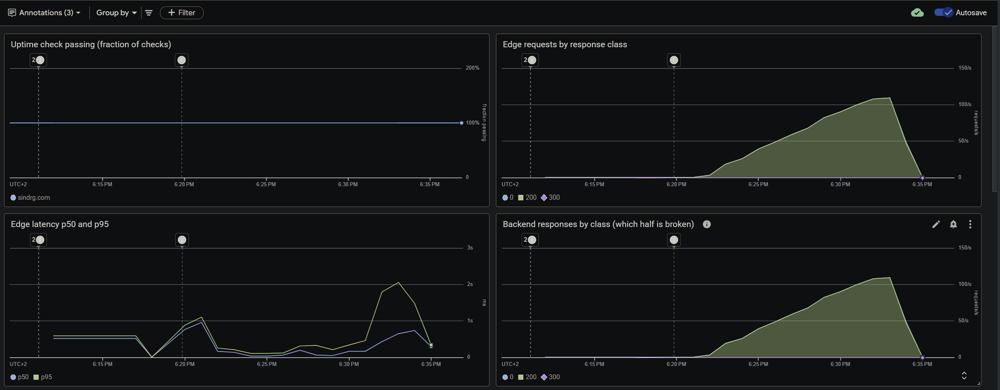

Throttling stayed at zero. At 125 rps each Pod used 516 to 763m, so the nodes' CPU, not the limit, was the ceiling.

Result: four resized Pods held **100 rps**, 2.5 times C0, and the third node never came.

## Slice 5: Nodes in every zone

The node pool and the cluster now list `europe-north1-a`, `-b` and `-c`. The control plane stays zonal.


The apply created four nodes, two in each new zone, above the pool's maximum of three.

| Time (UTC) | Event | Source |
| --- | --- | --- |
| 17:33:28 | `UpdateCluster`, locations a, b, c | audit log |
| 17:42:10 | 2 instances created in `-b`, 2 in `-c` | audit log |
| 17:43:24 | `UpdateNodePool` | audit log |
| 17:55:29 | autoscaler deletes both `-c` nodes | audit log |
| 17:56:11 | autoscaler deletes one `-b` node | audit log |

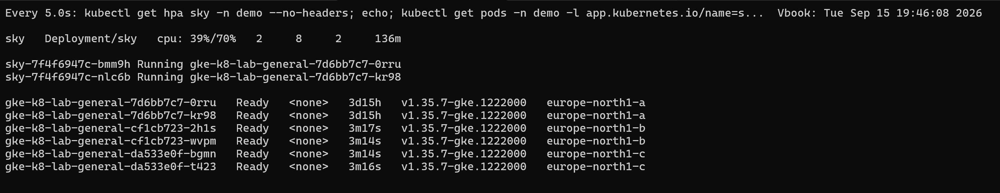

The pool reports `initialNodeCount: 2`, and GKE applies it per zone when a zone is added.

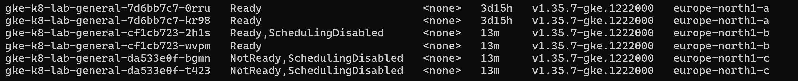

Result: nodes can land in any zone. Adding a zone creates nodes above the maximum until the autoscaler removes them.

## Slice 6: Eight Pods across zones

The same ramp, on the extra nodes the apply created.

```bash
k6 run -e RUN=d-ramp-2 -e STEPS=20,40,60,80,100,125,150 -e STEP_SECONDS=120 -e SETTLE_SECONDS=75 ramp.js
```

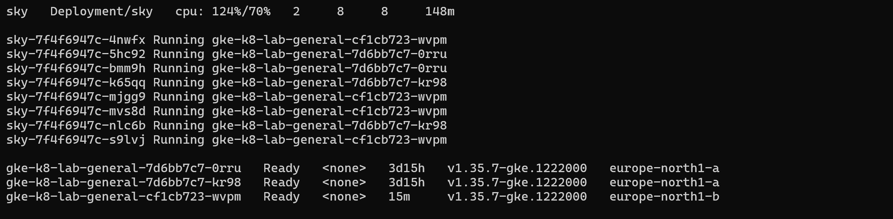

| Step | Settled requests | Settled p95 |
| --- | --- | --- |
| 80 rps | 3,601 | 132ms |
| 100 rps | 4,501 | 176ms |
| 125 rps | 5,626 | **394ms** |
| 150 rps | 1,509 | **1,018ms**, failed |

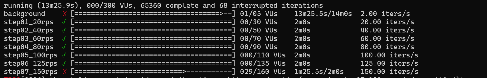

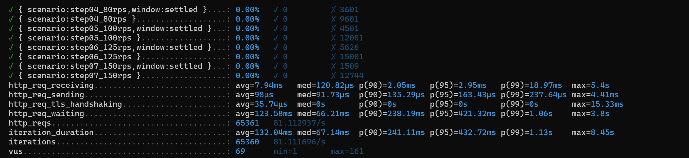

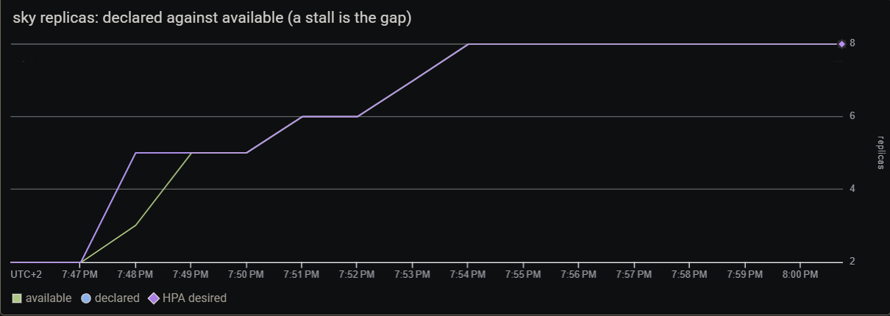

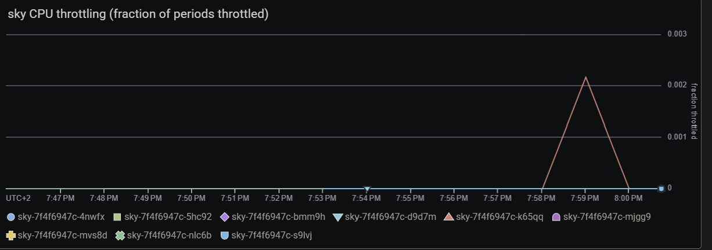

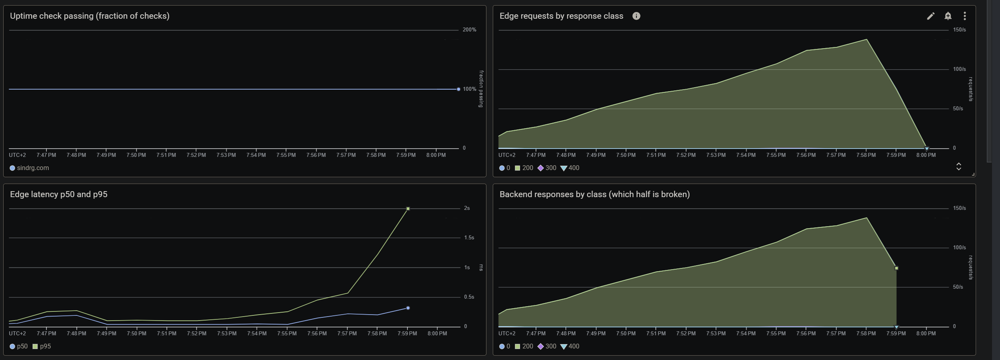

8 of 8 were available from 17:54:00. The autoscaler removed three nodes during the 125 rps step, and no request failed.

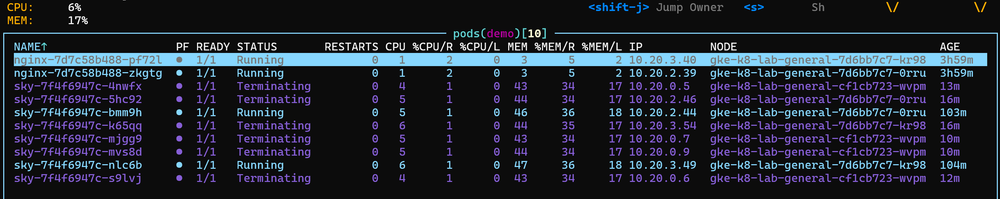

Result: eight Pods held **125 rps** with no failures, including through three node removals under load.

## Slice 7: A spike

A steady 150 rps from a standing start, about 100 rps to sky's two Pods, on three nodes.

```bash
k6 run -e RUN=d-scale -e RATE=150 -e DURATION=7m --log-output=file=results/d-scale-failures.log rollout.js
```

| Time (UTC) | Event |
| --- | --- |
| 18:12:53 | load starts |
| 18:13:13 | both Pods time out on `/health` at 2s |
| 18:13:19 | HPA 2 to 6 |
| 18:13:33 | third liveness failure: `bmm9h` and `nlc6b` restarted |
| 18:13:39 | HPA 6 to 8 |
| 18:14:02 | `2vps4` restarted |
| 18:15:23 | 8 of 8 available |
| 18:18:32 | `nq7x6` restarted, on a node at 1932m of 1930m |

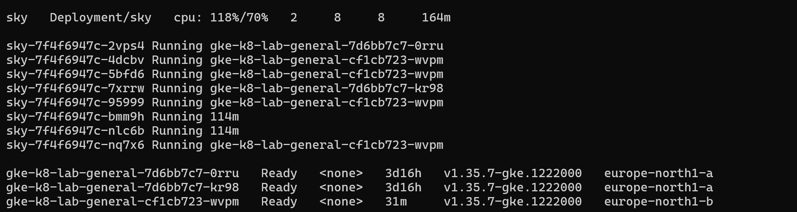

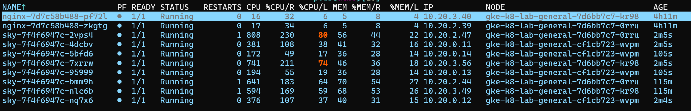

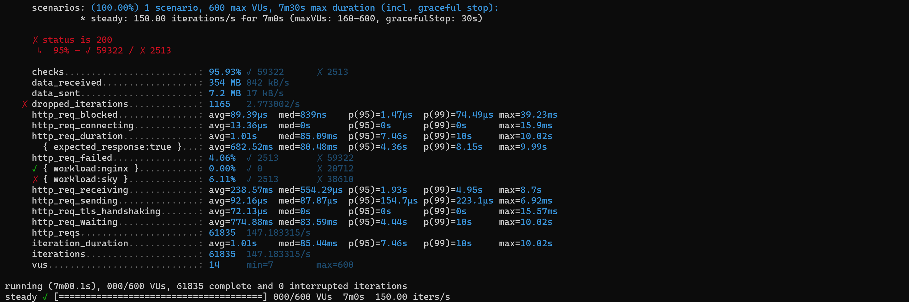

| Workload | Requests | Failed |
| --- | --- | --- |
| sky | 41,123 | 2,513 |
| nginx | 20,712 | 0 |

| Load balancer 5xx | Count |
| --- | --- |
| `failed_to_connect_to_backend` | 270 |
| `backend_connection_closed_before_data_sent_to_client` | 26 |

Throttling stayed near zero. The liveness probe used the same 2s timeout as readiness, so a Pod too busy to answer was restarted as well as taken out of rotation, and each restart refused connections while the rest were overloaded. The third node stayed after the run: the autoscaler logged `pod.not.enough.pdb` and `no.place.to.move.pods`.

Result: a spike outran scale-out for 2.5 minutes, and the liveness probe turned overload into restarts. The liveness probe now allows six failures at a 5s timeout.

## Result

| Run | Replicas | Settled saturation | Failed |
| --- | --- | --- | --- |
| C0, fixed | 2 | 40 rps | 0 |
| C, HPA at 100m and 500m | 5 of 8, quota | 60 rps | 0 |
| D, 350m and 1000m | 4 of 8, zone out of capacity | 100 rps | 0 |
| D, nodes in three zones | 8 of 8 | **125 rps** | 0 |
| Spike to 150 rps | 8 after 2.5 minutes | | 6.1% of sky |

| Finding | Outcome |
| --- | --- |
| The quota capped the HPA at five | Quota sized for eight replicas, a surge Pod and two stopping Pods |
| A deploy during a stall fails, and recovers only after scale-down | Recorded |
| A 500m limit throttled a single-process server | Limit at 1000m, request at 350m |
| A zone ran out of `e2-standard-2` | Node pool in three zones |
| Adding zones creates nodes above the maximum | Recorded; the autoscaler removes them |
| Liveness restarted overloaded Pods | Six failures at a 5s timeout |

## Open

- The spike has not been rerun on the new liveness probe.
- A scale-up into a second zone during a real shortage cannot be triggered on demand, so that path is configured, not observed.
- A spike beyond two Pods' capacity fails requests until new Pods are ready. Only a higher minimum removes that.
