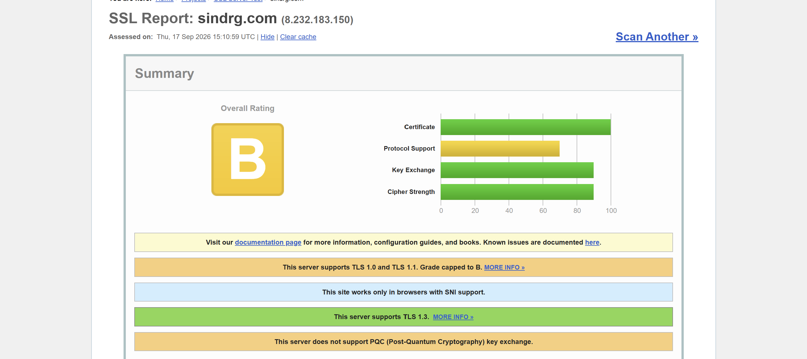
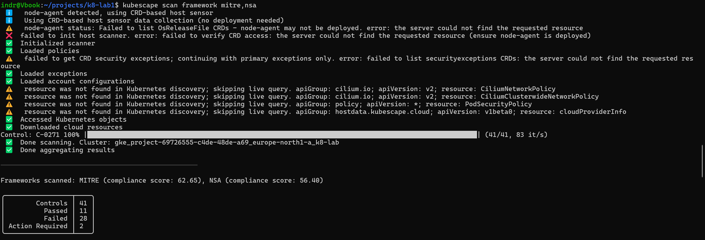

# Worklog: Phase 13 Security Baseline

Date: 2026-09-17
Status: Complete.

## Goal

Measure the platform against its own [threat model](../reference/threat-model.md) rather than against a reading of it.

Phase 11 audited by inspection and found real things. Two findings since did not arrive that way. A public TLS scan graded the load balancer `B` on an SSL policy nobody had chosen, and modelling the trust boundaries showed that merge protection is not a control on the path to Google Cloud. Neither is visible in a manifest, which is the argument for this phase.



## Slice 1: The public surface

Status: Complete

`scripts/check-public-surface.sh` probes TLS versions, response headers, the HTTP redirect, and the DNS records that govern certificate issuance. It needs no credential and no cluster access.

```bash
./scripts/check-public-surface.sh
```

```text
Checking the public surface of sindrg.com

known     tls10-refused    server accepted tls1
known     tls11-refused    server accepted tls1_1
ok        tls12-accepted   server accepted tls1_2
ok        tls13-accepted   server accepted tls1_3
ok        http-redirect    plain HTTP redirects to HTTPS
known     hsts             strict-transport-security missing on / /sky/
known     csp              content-security-policy missing on / /sky/
known     nosniff          x-content-type-options missing on / /sky/
known     referrer-policy  referrer-policy missing on / /sky/
known     frame-ancestors  content-security-policy missing on / /sky/
known     caa              no CAA record
known     dnssec           no DS record

3 ok, 9 known open, 0 regressed, 0 resolved, 0 inconclusive
```

Every finding the threat model predicted for this boundary is open, and nothing it did not predict turned up. Three properties hold: TLS 1.2 and 1.3 both negotiate, and plain HTTP redirects to HTTPS before any Pod sees it.

### What the run settles

Two findings were written into the threat model as unverified, because no file in this repository describes DNS state. Both could have turned out closed. Neither did.

**No CAA record.** Certificate issuance for this domain is proved by a DNS record, and no CA is excluded from honouring that proof. Anyone who can edit the Cloudflare zone can obtain a valid certificate for `sindrg.com` from any CA that will issue one. Private nodes, Workload Identity Federation, Pod Security and the network policies are all irrelevant on this path, because it never touches the cluster.

**No DS record.** The zone is unsigned, so the DNS answers carrying that proof are not authenticated either.

The two compound rather than add. The certificate depends on a DNS answer, the DNS answer is unauthenticated, and no CAA record constrains who will accept it. That is the threat model's second highest ranked path, and it is now measured rather than suspected.

**TLS 1.0 and 1.1 accepted**, confirming the public scan independently. Google's default SSL policy permits them and no policy is attached to the Gateway.

**Five response headers missing on both paths.** HSTS, CSP, `X-Content-Type-Options`, `Referrer-Policy` and a `frame-ancestors` directive are absent from the nginx root and from `/sky/` alike.

A first draft of this worklog said the fix was to set them once at the Gateway. That is not possible. Gateway API puts filters on an HTTPRoute rule, and a Gateway-wide response header filter exists only as an implementation-specific extension that this controller does not provide. The header set is therefore declared on every rule serving the host, which is three rules across two files, and keeping them identical is a review problem rather than a configuration one.

### What the script refuses to do

Three times while writing it, a check reported a result it had not established.

The first was the important one. OpenSSL 3 refuses TLS 1.0 client-side at its default security level, and the resulting error is nearly indistinguishable from a healthy server refusing the same connection. Read naively, a server that happily speaks TLS 1.0 reports as a pass. Legacy probes now set `SECLEVEL=0` so the offer is actually made, and a client-side refusal is reported as inconclusive rather than as success.

The second and third were the same mistake in other clothes: a request that never arrived read as a missing header, and an error status from an intermediary read as a missing redirect. Neither is evidence about the origin.

So the script has three outcomes rather than two, and the third never counts as a pass. A control whose verification silently fails open is worse than one known to be absent, because it appears in a worklog as evidence.

The run above is the first with nothing inconclusive: every probe reached the origin and every check returned a verdict.

### How it stays true

Findings the threat model records are listed in the script, so it gates against regression rather than against work Phase 14 has not done. A listed check that starts passing also fails, and names the line to delete. The list cannot quietly outlive the findings it describes.

Evidence: run recorded above, and the deliberate test below. Scheduled daily by `.github/workflows/security-scan.yml`.

### Applied and re-verified

The SSL policy, header filters, GCPGatewayPolicy and Cloud Armor rate limit landed on `main` (#93, #95, #98) but had not reached the cluster.

```text
$ terraform -chdir=terraform plan
Plan: 2 to add, 0 to change, 0 to destroy.
$ terraform -chdir=terraform apply
Apply complete! Resources: 2 added, 0 changed, 0 destroyed.
```

Also applied: `gcpgatewaypolicy.yml`, both `httproute.yml`, both `gcpbackendpolicy.yml`. The backend policies attach the Cloud Armor policy to each backend. Outside this phase's scope, but required for #98's rate limit to do anything.

Re-ran the script after the load balancer config propagated:

```text
$ ./scripts/check-public-surface.sh

ok        tls10-refused    server refused tls1
ok        tls11-refused    server refused tls1_1
ok        tls12-accepted   server accepted tls1_2
ok        tls13-accepted   server accepted tls1_3
ok        http-redirect    plain HTTP redirects to HTTPS
ok        hsts             strict-transport-security present on every path
known     csp              content-security-policy missing on / /sky/
ok        nosniff          x-content-type-options present on every path
ok        referrer-policy  referrer-policy present on every path
known     frame-ancestors  content-security-policy missing on / /sky/
known     caa              no CAA record
known     dnssec           no DS record

8 ok, 4 known open, 0 regressed, 0 resolved, 0 inconclusive
```

Five findings closed: `tls10-refused`, `tls11-refused`, `hsts`, `nosniff`, `referrer-policy`. Removed from `KNOWN_OPEN`, so a regression now fails the script instead of passing silently.

`csp` and `frame-ancestors` stay open until [sky#59](https://github.com/sindredg/sky/pull/59) lands. nginx serves no CSP. `caa` and `dnssec` are unchanged from the first run.

SSL Labs confirms the same state independently:

```text
$ curl -sS "https://api.ssllabs.com/api/v3/analyze?host=sindrg.com&all=done" | jq '.endpoints[] | {grade, hstsPolicy: .details.hstsPolicy}'
{
  "grade": "A",
  "hstsPolicy": {"LONG_MAX_AGE": 15552000, "header": "max-age=86400", "status": "present", "maxAge": 86400}
}
```

Grade `A`, not `A+`. HSTS is set to one day (`max-age=86400`), not the 180 days (`15552000`) A+ requires. That is deliberate: `includeSubDomains` and preload are both one-way doors.

### The gate, tested deliberately

A script that reports `0 regressed` has not shown that it can report anything else. Both directions were forced against the live host, on a copy of the script so the committed one stayed as it is.

A finding that regresses: `caa` deleted from `KNOWN_OPEN` while it still fails.

```text
$ sed '/^  "caa"/d' scripts/check-public-surface.sh > /tmp/regressed.sh
$ bash /tmp/regressed.sh sindrg.com

REGRESSED caa              no CAA record

8 ok, 3 known open, 1 regressed, 0 resolved, 0 inconclusive
$ echo $?
1
```

A finding that closed: `hsts` added back to `KNOWN_OPEN` while it now passes.

```text
$ sed 's|^  "csp"|  "hsts"\n  "csp"|' scripts/check-public-surface.sh > /tmp/resolved.sh
$ bash /tmp/resolved.sh sindrg.com

RESOLVED  hsts             strict-transport-security present on every path
          remove hsts from KNOWN_OPEN in resolved.sh

7 ok, 4 known open, 0 regressed, 1 resolved, 0 inconclusive
$ echo $?
1
```

Both exit `1`, so `security-scan.yml` fails on either. The list cannot drift from the findings in either direction without the workflow saying so.

## Slice 2: Static analysis of the Terraform and the manifests

Status: Complete

checkov 3.3.19 over both trees, wired into `ci.yml` so it runs on every pull request.

| Tree | Passed | Failed |
| --- | --- | --- |
| `kubernetes/` | 194 | 1 |
| `terraform/` | 30 | 9 |

### Two checks verified wrong here

Skipped in `.checkov.yml` with their reason, because a false positive silently carried in a baseline becomes indistinguishable from an accepted risk.

`CKV_GCP_12` wants NetworkPolicy enabled and reads the legacy `network_policy` block. This cluster sets `datapath_provider = "ADVANCED_DATAPATH"`, and Dataplane V2 enforces NetworkPolicy without that block. Phase 4 recorded an unlabelled client denied by both name and address.

`CKV_GCP_69` wants the GKE metadata server enabled and reads the cluster resource. `workload_metadata_config` is set to `GKE_METADATA` on the node pool resource, with legacy endpoints disabled.

The second was worth confirming rather than assuming. Had it been real, a compromised Pod could have reached the node's service account through the metadata endpoint, and the threat model's claim that boundary 3 leaves a Pod close to inert would have been wrong.

### Two findings the model had already reached

`CKV_GCP_125` flags the GitHub Actions OIDC trust policy and `CKV_GCP_66` flags the absence of Binary Authorization. These are threat model findings 2 and 10, arrived at independently by a tool that never read the model.

### The rest

Recorded in `.checkov.baseline` rather than skipped, because each is a decision to make rather than a default to bury: VPC flow logs against the cost posture, master authorized networks against a control plane that has no IP endpoint, Google Groups for RBAC against a single operator, CSEK against a platform with nothing confidential at rest, and client certificate authentication which GKE disables by default but does not state explicitly.

One new finding, low severity and genuine: nginx runs as uid 101 where `CKV_K8S_40` wants a uid above 10000, to avoid collision with a host user. `sky` already runs as 10001.

## Slice 3: Cluster assessment

Status: Complete

Kubescape 4.0.14, installed from the GitHub release binary (`kubescape_4.0.14_linux_arm64`). Checksum verified against the release's `checksums.sha256`. One-shot scan against MITRE and NSA from an operator kubeconfig, not the in-cluster operator: it needs broad cluster-read and this node pool has no headroom under the ResourceQuota.

```bash
kubescape scan framework mitre,nsa
```

```text
Frameworks scanned: MITRE (compliance score: 62.65), NSA (compliance score: 56.40)

Controls: 41   Passed: 11   Failed: 28   Action Required: 2

Failed resources by severity: Critical 0, High 255, Medium 328, Low 47
Resource Summary: 175/388 failed (61.56% compliance)
```



Worst-scoring controls:

| Control | Compliance | Failed / total |
| --- | --- | --- |
| CPU limits | 7% | 51 / 55 |
| Admission controller validation | 0% | not configured |
| Access to the container service account | 0% | 78 / 78 |
| Ingress/egress network policy coverage | 16% | 53 / 63 |

Expect noise from `kube-system` and GKE-managed namespaces. Those are Google's to fix, not the platform's. Full JSON kept out of git; re-run to reproduce.

### Two controls returned no verdict

The summary counts 41 controls. The CLI evaluated 39.

`C-0069` and `C-0070`, anonymous access to the Kubelet and Kubelet client TLS authentication, both report `Action Required` against zero resources out of zero. Neither ran. They read `KubeletInfo`, which the Kubescape operator collects and the CLI does not, and the host scanner fails to initialise at the top of every run for the same reason. The scan prints its own coverage as 95%.

Both are Critical, so the two highest-severity controls in either framework are absent from the scores above rather than passing them. That is the shape Slice 1 was built to refuse, arriving in Slice 3: a check that could not run, reported in a way that reads as a result.

Unmeasured, not closed. The operator runs in-cluster, and the note above on why this scan uses an operator kubeconfig is also why the operator is not installed: the node pool has no headroom under the `ResourceQuota`.

**Security Command Center**: not enabled on the project. The threat model assumed Standard tier had run since project creation, with an unread backlog. It has not.

```text
$ gcloud scc findings list projects/project-69726555-c4de-48de-a69
ERROR: PERMISSION_DENIED: Security Command Center API has not been used in project
project-69726555-c4de-48de-a69 before or it is disabled.
```

Left disabled pending a decision on whether to turn it on. Enabling it now would start monitoring from zero, not surface a backlog. That gap is itself a finding: no free security-posture signal has ever run on this project.

## Slice 4: Account controls

Status: Complete

Threat model finding 8: multi-factor authentication, who holds write access, and whether `main` requires status checks and an up-to-date branch. The model assumed all three. No scan reached any of them.

**Write access.** `sindredg` is the sole collaborator on both `k8-lab` and `sky`, with admin permission on each. No other user or team holds access.

```text
$ gh api repos/sindredg/k8-lab/collaborators --paginate --jq '.[] | .login'
sindredg
$ gh api repos/sindredg/sky/collaborators --paginate --jq '.[] | .login'
sindredg
```

**Branch protection on `main`.** The classic API read both repos as unprotected:

```text
$ gh api repos/sindredg/k8-lab/branches/main/protection
{"message":"Branch not protected", ... "status":"404"}
$ gh api repos/sindredg/sky/branches/main/protection
{"message":"Branch not protected", ... "status":"404"}
```

That reading is wrong for `k8-lab`. It uses a Ruleset, a separate GitHub mechanism the classic endpoint doesn't see:

```text
$ gh api repos/sindredg/k8-lab/rulesets
[{"id":21742516,"name":"Protect main","enforcement":"active", "created_at":"2026-08-28T17:16:30Z", ...}]
```

The ruleset was `active`, created 2026-08-28. Rules blocked deletion and force-push, and required the `Terraform`, `Kubernetes` and `Docs and scripts` checks. But `conditions.ref_name.include` was `[]`: an active ruleset matching no branch. It enforced nothing on `main` for three weeks. The classic endpoint's 404 was the correct practical answer, for the wrong reason. `Static analysis` (checkov) was also absent from the required-checks list, unrelated to targeting.

Fixed in this session. Targeting set to `~DEFAULT_BRANCH`. `strict_required_status_checks_policy` turned on: this is the "require branches to be up to date" setting the model needed answered.

```text
$ gh api repos/sindredg/k8-lab/rulesets/21742516
{"conditions":{"ref_name":{"include":["~DEFAULT_BRANCH"],"exclude":[]}},
 "rules":[{"type":"deletion"},{"type":"non_fast_forward"},
   {"type":"required_status_checks","parameters":{
     "strict_required_status_checks_policy":true,
     "required_status_checks":[{"context":"Terraform"},{"context":"Kubernetes"},{"context":"Docs and scripts"}]}},
   {"type":"pull_request","parameters":{"required_approving_review_count":0}}],
 "current_user_can_bypass":"never",
 "updated_at":"2026-09-17T20:28:40Z"}
```

`current_user_can_bypass: "never"` was already correct. The sole collaborator's admin permission cannot bypass this ruleset, so turning it on is not decorative.

`sky` has neither a ruleset nor classic protection. Still fully open. `Static analysis` remains outside the required-checks list on `k8-lab`, a separate decision not made in this session.

**MFA.** Not answerable from an API. `sindredg` is a personal account (`gh api orgs/sindredg` returns 404). GitHub's REST API no longer reports a personal account's own two-factor status. `GET /user` still returns the field, but it is deprecated and always null:

```text
$ gh api user --jq '{login, two_factor_authentication}'
{"login":"sindredg","two_factor_authentication":null}
```

No API path answers this. Confirmed instead by the account owner, checking github.com/settings/security directly: enabled.

At the start of this phase, finding 8 looked like this: one set of credentials, unconfirmed second factor, gating a production GCP deployment pipeline behind an active-looking ruleset that matched nothing.

As it stands now: MFA confirmed on. `main` on `k8-lab` enforces its required checks and cannot be bypassed by its own admin. `sky` remains the open item, same shape, unaddressed.

## Open question raised during the phase

CI did not run on two consecutive pushes to the pull request carrying this work. The branch advanced twice, confirmed against the remote, and the only workflow run on the branch remained the one from the first commit. The pull request displayed three passing checks throughout, all of them validating a commit two behind the branch head.

Nothing merged, and the cause was not established. It is recorded because the shape is the same one this phase exists to find: a control reporting success for work it did not examine. Whether `main` requires a branch to be up to date before merging decides whether that shape can reach production, and that is Slice 4's question.
