# Worklog: Phase 14 Close the Baseline

Date: 2026-09-17
Status: Complete. Seven slices measured, two findings raised.

## Goal

Close the findings [Phase 13](phase-13-security-baseline.md) measured, in the order the [threat model](../reference/threat-model.md) ranked them. See [Phase 14](../plan.md#phase-14-close-the-baseline).

One claim is not measured here, and it is marked where it is made: the overlap between Security Command Center and the static analysers.

## Slice 1: Federation scoped to refs/heads/main

Status: Complete. Finding 2 closed.

[#102](https://github.com/sindredg/k8-lab/pull/102) narrowed the provider's `attribute_condition` from the repository to the repository and the ref, closing finding 2 on [boundary 4](../reference/threat-model.md#boundary-4-github-actions-to-google-cloud). The reasoning is in [decisions.md](../decisions.md#federation-trust-boundary).

One resource, updated in place:

```bash
terraform -chdir=terraform plan
```

```text
  # module.delivery.google_iam_workload_identity_pool_provider.github will be updated in-place
  ~ resource "google_iam_workload_identity_pool_provider" "github" {
      ~ attribute_condition                = "assertion.repository == 'sindredg/k8-lab'" -> "assertion.repository == 'sindredg/k8-lab' && assertion.ref == 'refs/heads/main'"
        id                                 = "projects/project-69726555-c4de-48de-a69/locations/global/workloadIdentityPools/github/providers/github-oidc"
        name                               = "projects/421458901689/locations/global/workloadIdentityPools/github/providers/github-oidc"
        # (9 unchanged attributes hidden)

        # (1 unchanged block hidden)
    }

Plan: 0 to add, 1 to change, 0 to destroy.
```

The apply's own completion line was not captured. The saved plan was consumed, and a second invocation returned `Error: Saved plan is stale`, so convergence rests on the two reads below rather than on an `Apply complete!` line.

The condition that landed on the provider:

```bash
gcloud iam workload-identity-pools providers describe github-oidc \
  --location=global --workload-identity-pool=github --format=json
```

```text
{
  "attributeCondition": "assertion.repository == 'sindredg/k8-lab' && assertion.ref == 'refs/heads/main'",
  "attributeMapping": {
    "attribute.ref": "assertion.ref",
    "attribute.repository": "assertion.repository",
    "google.subject": "assertion.sub"
  },
  "displayName": "GitHub OIDC",
  "name": "projects/421458901689/locations/global/workloadIdentityPools/github/providers/github-oidc",
  "oidc": {
    "issuerUri": "https://token.actions.githubusercontent.com"
  },
  "state": "ACTIVE"
}
```

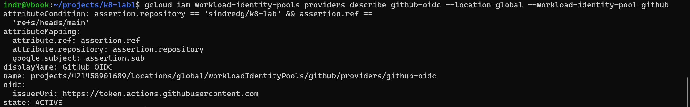

State matches configuration afterwards:

```bash
terraform -chdir=terraform plan -detailed-exitcode
```

```text
No changes. Your infrastructure matches the configuration.

Terraform has compared your real infrastructure against your configuration
and found no differences, so no changes are needed.
EXIT=0
```

### main still deploys

Run [35277444850](https://github.com/sindredg/k8-lab/actions/runs/35277444850), `workflow_dispatch` from `main` with `build_only=true`, conclusion `success`:

```text
1   Set up job                              completed  success
2   Check out this repository               completed  success
3   Read the pinned commit                  completed  success
4   Fetch the application source at the pinned commit  completed  success
5   Authenticate to Google Cloud            completed  success
6   Set up gcloud                           completed  success
7   Authenticate Docker against Artifact Registry      completed  success
8   Set up Buildx                           completed  success
9   Build and push                          completed  success
10  Report the digest                       completed  success
11  Get cluster credentials                 completed  skipped
12  Check the workload exists               completed  skipped
13  Apply the Deployment with the new digest            completed  skipped
14  Wait for the rollout                    completed  skipped
15  Smoke test from inside the cluster      completed  skipped
```

The auth step, which is the one the condition governs:

```text
2026-09-17T21:34:46.9615645Z   workload_identity_provider: projects/421458901689/locations/global/workloadIdentityPools/github/providers/github-oidc
2026-09-17T21:34:46.9616322Z   service_account: k8-lab-deploy@project-69726555-c4de-48de-a69.iam.gserviceaccount.com
2026-09-17T21:34:47.2527109Z Created credentials file at "/home/runner/work/k8-lab/k8-lab/gha-creds-6c6b25e2896b562c.json"
```

Steps 11 to 15 skipped, which is what `build_only` is for.

### A token from any other ref is refused

The allow run alone cannot tell a narrowed condition from one that silently failed to narrow. Dispatched from `bump-sky`, a branch that is not `main`:

```bash
gh workflow run "Deploy sky" --ref bump-sky -f build_only=true
gh run view 35357804630 --log-failed
```

```text
2026-09-18T14:41:42.7087254Z Created credentials file at "/home/runner/work/k8-lab/k8-lab/gha-creds-db0aeb9eba445067.json"
2026-09-18T14:41:42.7974694Z ##[error]google-github-actions/auth failed with: failed to generate Google
Cloud federated token for //iam.googleapis.com/projects/421458901689/locations/global/
workloadIdentityPools/github/providers/github-oidc: {"error":"unauthorized_client",
"error_description":"The given credential is rejected by the attribute condition."}
```

Failed at step 5, before the build, and Google names the attribute condition as the reason. Both directions are measured, so finding 2 is closed.

`Created credentials file at ...` appears in both runs, 89 milliseconds before the token exchange fails, because it records the action writing a file rather than Google accepting one. The allow run rests on `Build and push` succeeding, which needs a token.

## Slice 2: Branch protection

Status: Complete. Both repositories are protected, and the starting state was misread.

### What was already there

Both repositories answered the classic protection endpoint identically:

```bash
gh api repos/sindredg/k8-lab/branches/main/protection
gh api repos/sindredg/sky/branches/main/protection
```

```text
{"message":"Branch not protected","documentation_url":"https://docs.github.com/rest/branches/branch-protection#get-branch-protection","status":"404"}
gh: Branch not protected (HTTP 404)
```

For `k8-lab` that `404` means only that no classic rule exists. The repository is governed by a Ruleset, a separate mechanism the classic endpoint does not report, which [Phase 13](phase-13-security-baseline.md) had already recorded:

```bash
gh api repos/sindredg/k8-lab/rulesets
gh api repos/sindredg/k8-lab/rulesets/21742516
```

```text
21742516 Protect main active 2026-08-28T17:16:30.952+02:00 2026-09-17T20:28:40.082+02:00
```

```text
{"conditions":{"ref_name":{"exclude":[],"include":["~DEFAULT_BRANCH"]}},"current_user_can_bypass":"never","rules":[{"parameters":null,"type":"deletion"},{"parameters":null,"type":"non_fast_forward"},{"parameters":{"do_not_enforce_on_create":false,"required_status_checks":[{"context":"Terraform","integration_id":15368},{"context":"Kubernetes","integration_id":15368},{"context":"Docs and scripts","integration_id":15368}],"strict_required_status_checks_policy":true},"type":"required_status_checks"},{"parameters":{"allowed_merge_methods":["merge","squash","rebase"],"dismiss_stale_reviews_on_push":false,"require_code_owner_review":false,"require_extra_approval_for_unattributed_changes":true,"require_last_push_approval":false,"required_approving_review_count":0,"required_review_thread_resolution":false,"required_reviewers":[]},"type":"pull_request"}],"updated_at":"2026-09-17T20:28:40.082+02:00"}
```

So `k8-lab` already required `Terraform`, `Kubernetes` and `Docs and scripts`, with `strict_required_status_checks_policy: true` and `current_user_can_bypass: "never"`. `Static analysis` was the only missing check. `sky` has no ruleset, so there the `404` was the whole answer:

```bash
gh api repos/sindredg/sky/rulesets
```

```text
[]
```

### What was set

```bash
gh api -X PUT repos/sindredg/k8-lab/branches/main/protection --input k8lab-prot.json
```

```text
{"url":"https://api.github.com/repos/sindredg/k8-lab/branches/main/protection","required_status_checks":{"url":"https://api.github.com/repos/sindredg/k8-lab/branches/main/protection/required_status_checks","strict":false,"contexts":["Static analysis"],"contexts_url":"https://api.github.com/repos/sindredg/k8-lab/branches/main/protection/required_status_checks/contexts","checks":[{"context":"Static analysis","app_id":15368}]},"required_signatures":{"url":"https://api.github.com/repos/sindredg/k8-lab/branches/main/protection/required_signatures","enabled":false},"enforce_admins":{"url":"https://api.github.com/repos/sindredg/k8-lab/branches/main/protection/enforce_admins","enabled":false},"required_linear_history":{"enabled":false},"allow_force_pushes":{"enabled":false},"allow_deletions":{"enabled":false},"block_creations":{"enabled":false},"required_conversation_resolution":{"enabled":false},"lock_branch":{"enabled":false},"allow_fork_syncing":{"enabled":false}}
```

```bash
gh api -X PUT repos/sindredg/sky/branches/main/protection --input sky-prot.json
```

```text
{"url":"https://api.github.com/repos/sindredg/sky/branches/main/protection","required_status_checks":{"url":"https://api.github.com/repos/sindredg/sky/branches/main/protection/required_status_checks","strict":false,"contexts":["Lint and test","Frontend tests"],"contexts_url":"https://api.github.com/repos/sindredg/sky/branches/main/protection/required_status_checks/contexts","checks":[{"context":"Lint and test","app_id":15368},{"context":"Frontend tests","app_id":15368}]},"required_signatures":{"url":"https://api.github.com/repos/sindredg/sky/branches/main/protection/required_signatures","enabled":false},"enforce_admins":{"url":"https://api.github.com/repos/sindredg/sky/branches/main/protection/enforce_admins","enabled":false},"required_linear_history":{"enabled":false},"allow_force_pushes":{"enabled":false},"allow_deletions":{"enabled":false},"block_creations":{"enabled":false},"required_conversation_resolution":{"enabled":false},"lock_branch":{"enabled":false},"allow_fork_syncing":{"enabled":false}}
```

Effective state, read back:

| Repo | Mechanism | Required contexts | Strict |
| --- | --- | --- | --- |
| k8-lab | Ruleset 21742516 | `Terraform`, `Kubernetes`, `Docs and scripts` | true |
| k8-lab | Classic protection | `Static analysis` | false |
| sky | Classic protection | `Lint and test`, `Frontend tests` | false |

### Choices, not defaults

- `Public surface` is not required. `security-scan.yml` runs on `pull_request` for two paths only, so a pull request touching neither would never report that context and would stay pending forever.
- `strict: false` on both classic rules. `k8-lab`'s ruleset already sets `strict_required_status_checks_policy: true`, and GitHub takes the more restrictive of the two mechanisms.
- `enforce_admins: false` on both. With `required_approving_review_count: 0` and no second reviewer, `true` would leave nobody able to merge.

### Finding: two mechanisms governed one branch

`k8-lab`'s `main` was protected by a ruleset and by classic protection, with disjoint check lists and disagreeing `strict` settings. Nothing was weaker for it, but the required-check list was split across two API surfaces, so a reader of either one got an incomplete answer.

Consolidated on 2026-09-18: `Static analysis` moved into ruleset 21742516 and the classic rule was deleted. No command output was captured for that change, so it is the one closure in this phase evidenced by a note. `sky` keeps classic protection.

## Slice 3: Content Security Policy

Status: Complete. Both paths serve a policy, and finding 6 is closed.

[#100](https://github.com/sindredg/k8-lab/pull/100) added the policy to the nginx root, and merging triggered `deploy.yml`. The header as served:

```bash
curl -sS -o /dev/null -D - https://sindrg.com/
```

```text
HTTP/2 200 
server: nginx/1.30.4
date: Thu, 17 Sep 2026 21:35:02 GMT
content-type: text/html
cache-control: no-store
content-security-policy: default-src 'none'; style-src 'unsafe-inline'; img-src 'self'; base-uri 'none'; form-action 'none'; frame-ancestors 'none'
via: 1.1 google
referrer-policy: strict-origin-when-cross-origin
strict-transport-security: max-age=86400
x-content-type-options: nosniff
alt-svc: h3=":443"; ma=2592000,h3-29=":443"; ma=2592000
```

That closes the `csp` and `frame-ancestors` findings on the nginx root, alongside the Phase 13 header set.

### The page renders under it

`default-src 'none'` blocks every resource class not named explicitly, so the policy is safe only if the page loads nothing it does not allow:

```bash
grep -c "<script" page.html   # 0
grep -c "]*>|]*>|<link[^>]*>|url\([^)]*\)|https?://[^"'"'"' )]*' page.html | sort -u
```

```text
https://github.com/sindredg/k8-lab
https://github.com/sindredg/k8-lab/blob/main/decisions.md
https://github.com/sindredg/k8-lab/tree/main/worklog
```

The single `<style>` block is covered by `style-src 'unsafe-inline'`. `img-src 'self'` is unused by any element and still governs the browser's implicit same-origin `/favicon.ico` request.

### The other path

[sky#59](https://github.com/sindredg/sky/pull/59) had merged upstream, but the pin still named the commit before it, so the cluster kept building a `sky` without a policy. [#106](https://github.com/sindredg/k8-lab/pull/106) moved the pin and `deploy-sky.yml` rolled it out:

```bash
curl -sS -o /dev/null -D - https://sindrg.com/sky/
```

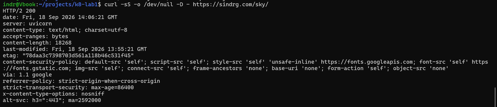

The policy is the application's rather than the platform's: `default-src 'self'` with Google Fonts named explicitly, where the project page serves `default-src 'none'`. Both are declared by the workload rather than by the Gateway, for the reason [Phase 13](phase-13-security-baseline.md#what-the-run-settles) gives.

With both paths covered, the surface check reported the closure instead of a pass, and exited `1` as [the deliberate test](phase-13-security-baseline.md#the-gate-tested-deliberately) forced it to:

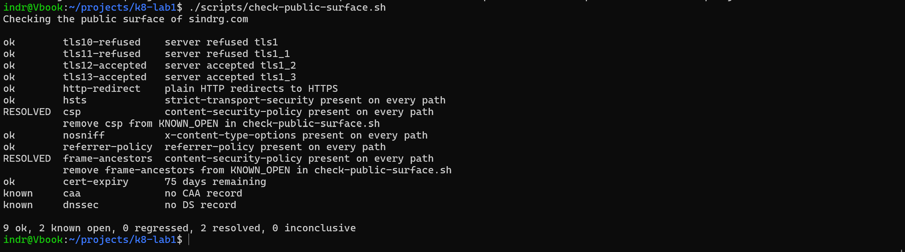

Deleting both lines from `KNOWN_OPEN` leaves `caa` and `dnssec`, which Slices 4 and 7 close:

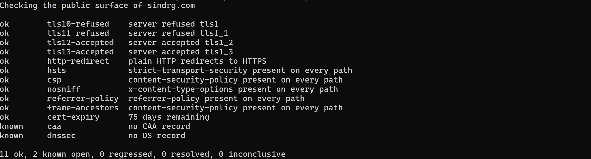

## Slice 4: CAA

Status: Complete. The pair is live and verified, finding 3 is closed, and a new finding was raised on the way.

### What the domain publishes

Both records were created by hand in Cloudflare with flags `0`, as `DNS only`:

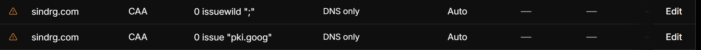

Read back from two public resolvers. The zone's own nameservers do not answer this query form, so they are not the check:

```bash
dig +short CAA sindrg.com @1.1.1.1
dig +short CAA sindrg.com @8.8.8.8
```

```text
0 issue "pki.goog"
0 issuewild ";"
0 issue "pki.goog"
0 issuewild ";"
```

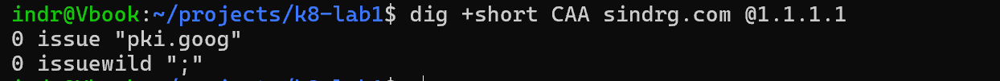

Each resolver returns the derived pair and nothing else. No `letsencrypt.org`, `ssl.com`, `comodoca.com` or `digicert.com`. Google Trust Services is the only CA authorised to issue for `sindrg.com`, no CA may issue a wildcard, and finding 3 is closed.

### Finding: Universal SSL makes the authorised issuer set Cloudflare's to change

Cloudflare adds CAA records for its own partner CAs whenever Universal SSL is on and any CAA record exists in the zone. Adding the pair above turned that on. The same resolver, queried before Universal SSL was disabled:

```bash
dig +short CAA sindrg.com @1.1.1.1
```

```text
0 issue "comodoca.com"
0 issue "digicert.com; cansignhttpexchanges=yes"
0 issue "letsencrypt.org"
0 issue "pki.goog; cansignhttpexchanges=yes"
0 issue "ssl.com"
0 issuewild ";"
0 issuewild "comodoca.com"
0 issuewild "digicert.com; cansignhttpexchanges=yes"
0 issuewild "letsencrypt.org"
0 issuewild "pki.goog; cansignhttpexchanges=yes"
0 issuewild "ssl.com"
```

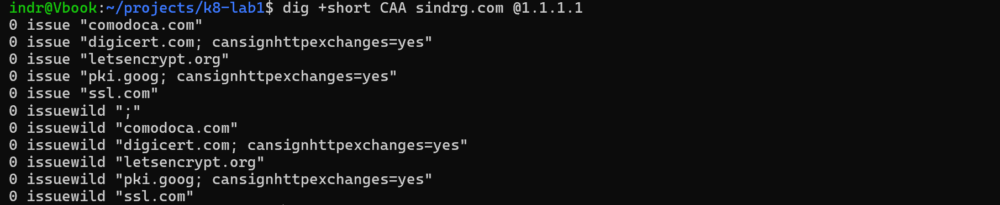

Eleven records where the zone holds two, on both tags. The dashboard screenshot above was taken while this was live and shows two rows, so the injected records are readable only from a resolver. Cloudflare documents the list as [not exhaustive](https://developers.cloudflare.com/ssl/edge-certificates/caa-records/).

This is a weakening rather than a duplication. RFC 8659 takes the union of the records at a name and sets no precedence between a broad record and a narrow one, so `0 issuewild ";"` sits inert beside five named `issuewild` records and a CA reading that set finds itself authorised. Universal SSL was therefore turned off rather than worked around, and the check is a resolver rather than the dashboard.

### How the pair was derived

No CAA record existed, which is the finding the threat model recorded on boundary 6:

```bash
dig +short CAA sindrg.com @1.1.1.1
dig +noall +answer CAA sindrg.com @8.8.8.8
dig +noall +answer CAA www.sindrg.com @8.8.8.8
```

```text
```

The issuer was read off the live certificate rather than taken from configuration:

```bash
echo | openssl s_client -connect sindrg.com:443 -servername sindrg.com 2>/dev/null |
  openssl x509 -noout -issuer -subject -dates -ext subjectAltName -ext authorityInfoAccess
```

```text
issuer=C = US, O = Google Trust Services, CN = WR3
subject=CN = sindrg.com
notBefore=Sep  4 12:17:24 2026 GMT
notAfter=Dec  3 13:13:19 2026 GMT
X509v3 Subject Alternative Name: 
    DNS:sindrg.com
Authority Information Access: 
    CA Issuers - URI:http://i.pki.goog/wr3.crt
```

One SAN, no wildcard, issued by GTS WR3. A CAA record names an Issuer Domain Name, which is the string the CA declares it honours rather than that issuer CN. For Google Trust Services it is `pki.goog`, per section 4.2.4 of its [Certification Practice Statement v5.22](https://pki.goog/repo/cps/5.22/GTS-CPS.html). That section was read through a page fetch that returned a summary rather than its text, so it is paraphrased here and not quoted. The certificate's own AIA URI, `http://i.pki.goog/wr3.crt`, corroborates it.

| Name | Flags | Tag | Value |
| --- | --- | --- | --- |
| `sindrg.com` | 0 | `issue` | `pki.goog` |
| `sindrg.com` | 0 | `issuewild` | `;` |

The second row is required rather than optional. RFC 8659 falls back to `issue` for a wildcard request when no `issuewild` record exists, so `issue "pki.goog"` alone would still authorise a wildcard from GTS. `issuewild ";"` is the empty issuer set, and this platform issues no wildcard. Flags `0` rather than `128`, because the critical flag only governs a property tag the CA does not understand.

One question decided whether the pair was correct or an outage. A proxied record would mean Cloudflare's edge terminates TLS with its own certificate, which a `pki.goog`-only record would forbid at renewal:

```bash
dig +short A sindrg.com
dig +short NS sindrg.com
```

```text
8.232.183.150
kareem.ns.cloudflare.com.
eva.ns.cloudflare.com.
```

The A record is the gateway's own address rather than a Cloudflare anycast address, so Cloudflare hosts the zone without proxying this record and the Gateway terminates TLS.

A wrong record fails silently and late. CAA is evaluated by the CA at issuance, so the current certificate would keep serving until 2026-12-03 and the failure would appear as an expired certificate on a site that worked the day before.

### A cached negative answer outlived the records

`scripts/check-public-surface.sh` queries the system resolver, a WSL2 stub at `10.255.255.254` on this workstation. With the records live and correct, it still reported them missing:

```bash
dig +short CAA sindrg.com
dig CAA sindrg.com | sed -n '/AUTHORITY SECTION/,/^$/p'
```

```text
sindrg.com.		1608	IN	SOA	eva.ns.cloudflare.com. dns.cloudflare.com. 2415229573 10000 2400 604800 1800
```

Empty, with the SOA in the authority section, which is a cached negative answer rather than a resolver that cannot answer the query form. The same resolver returns `0 issue "pki.goog"` for `google.com` and a DS record for `cloudflare.com`. The zone's SOA minimum is `1800`, so a NODATA answer cached before the records existed is served for up to 30 minutes after they exist.

The gate was re-run once that TTL expired rather than modified. The stale answer belongs to this workstation, and CI resolves through its own runner.

```bash
./scripts/check-public-surface.sh
```

```text
ok        cert-expiry      75 days remaining
RESOLVED  caa              certificate issuance is restricted
          remove caa from KNOWN_OPEN in check-public-surface.sh
known     dnssec           no DS record

11 ok, 1 known open, 0 regressed, 1 resolved, 0 inconclusive
EXIT=1
```

Deleting the `caa` line from `KNOWN_OPEN` leaves `dnssec` as the only entry:

```text
ok        cert-expiry      75 days remaining
ok        caa              certificate issuance is restricted
known     dnssec           no DS record

12 ok, 1 known open, 0 regressed, 0 resolved, 0 inconclusive
EXIT=0
```

Twelve checks passing, and `dnssec` the only entry left, which [Slice 7](#slice-7-dnssec) closes.

## Slice 5: The rate limit under flood

Status: Complete. The throttle engaged where the policy says it should, finding 1 is closed, and a second run at 125 rps isolates the throttle and corrects what the first implied.

This is the phase's exit criterion and the threat model's outstanding claim on [boundary 1](../reference/threat-model.md#boundary-1-internet-to-gateway).

### The policy under test

From `terraform/modules/gateway/main.tf`:

```terraform
    rate_limit_options {
      conform_action = "allow"
      exceed_action  = "deny(429)"
      enforce_on_key = "IP"

      rate_limit_threshold {
        count        = 300
        interval_sec = 60
      }
    }
```

300 requests per 60 seconds per address is an effective ceiling of 5 rps from one source. The resting state, read before the run:

```bash
kubectl get resourcequota -n demo -o wide
kubectl get hpa -n demo
```

```text
NAME          REQUEST                                                        LIMIT                                            AGE
demo-budget   pods: 4/16, requests.cpu: 800m/5, requests.memory: 384Mi/2Gi   limits.cpu: 2500m/13, limits.memory: 768Mi/4Gi   20d

NAME   REFERENCE        TARGETS       MINPODS   MAXPODS   REPLICAS   AGE
sky    Deployment/sky   cpu: 1%/70%   2         8         2          2d23h
```

### The flood

1200 requests, ten concurrent, one source address, against `https://sindrg.com/`:

```bash
seq 1200 | xargs -P 10 -I{} sh -c 'printf "%s %s\n" "$(date +%s.%N)" "$(curl -s -o /dev/null -w "%{http_code}" https://sindrg.com/)"' > ~/rl.txt
sort -n ~/rl.txt > ~/rl-sorted.txt
awk 'NR==1{s=$1} END{printf "%d requests in %.1fs, %.1f rps\n", NR, $1-s, NR/($1-s)}' ~/rl-sorted.txt
awk '{print $2}' ~/rl.txt | sort | uniq -c
grep -n ' 429' ~/rl-sorted.txt | head -1
```

```text
1200 requests in 79.8s, 15.0 rps
    607 200
    593 429
293:1789744339.285246716 429
```

15 rps offered against a 5 rps ceiling, and 593 of 1200 requests refused with `429`. The throttle is enforcing on live traffic, which is the claim the threat model had marked unproven.

### Where the refusals begin

```bash
awk 'NR==1{s=$1} $2==429 && !seen {printf "first 429 at t+%.1fs, request %d of the run\n", $1-s, NR; seen=1}' ~/rl-sorted.txt
head -292 ~/rl-sorted.txt | awk '{print $2}' | sort | uniq -c
awk 'NR==1{s=$1} {w=int(($1-s)/60); if($2==200) a[w]++; t[w]++} END{for(i=0;i<=1;i++) printf "window %d (t+%ds to t+%ds): %d allowed, %d offered\n", i, i*60, i*60+60, a[i], t[i]}' ~/rl-sorted.txt
```

```text
first 429 at t+18.0s, request 293 of the run
    292 200
window 0 (t+0s to t+60s): 319 allowed, 910 offered
window 1 (t+60s to t+120s): 288 allowed, 290 offered
```

The first 292 requests returned `200` and the 293rd was the first `429`. That is a spent budget rather than a fixed-interval throttle: the window's 300 requests are consumed at whatever rate they arrive, and at 15 rps they last 20 seconds.

Two numbers qualify it. Window 0 allowed 319 against a documented 300, about 6% over, which is what counting across distributed load balancer instances produces. Window 1 is partial: the run ended at 79.8s, so it spans 19.8 seconds, in which a refilled budget passed 288 of 290.

### The quota never moved

At this offered rate `demo-budget` stayed at its resting `pods: 4/16` and `requests.cpu: 800m/5`. Sampled every 5 seconds for the duration of the run:

```bash
while kill -0 "$FLOOD" 2>/dev/null; do
  date -u +'--- %H:%M:%SZ'
  kubectl get resourcequota -n demo -o wide --no-headers
  kubectl get hpa -n demo --no-headers
  sleep 5
done
```

Thirteen samples, `15:12:01Z` through `15:13:21Z`, all identical. The first and the last:

```text
--- 15:12:01Z
demo-budget   pods: 4/16, requests.cpu: 800m/5, requests.memory: 384Mi/2Gi   limits.cpu: 2500m/13, limits.memory: 768Mi/4Gi   20d
sky   Deployment/sky   cpu: 1%/70%   2     8     2     2d23h
--- 15:13:21Z
demo-budget   pods: 4/16, requests.cpu: 800m/5, requests.memory: 384Mi/2Gi   limits.cpu: 2500m/13, limits.memory: 768Mi/4Gi   20d
sky   Deployment/sky   cpu: 1%/70%   2     8     2     2d23h
```

No Pod was created during the run, the HPA held at 2 replicas, and CPU stayed at 1% against a 70% target.

### The same rate, with the limit live

At 15 rps the HPA would not have scaled unthrottled either, so that run cannot isolate the throttle. This one offers the rate [Phase 12d](phase-12d-autoscaling.md#slice-6-eight-pods-across-zones) used, with the limit live:

```bash
k6 run -e RUN=rl-isolation -e STEPS=125 -e STEP_SECONDS=120 -e SETTLE_SECONDS=75 ramp.js
```

```text
running (1m25.9s), 000/140 VUs, 10485 complete and 17 interrupted iterations
background      ✗ [==================>-----] 00/05 VUs   1m25.8s/2m0s  2.00 iters/s
step01_125rps   ✗ [==================>-----] 002/135 VUs  1m25.8s/2m0s  125.00 iters/s
```

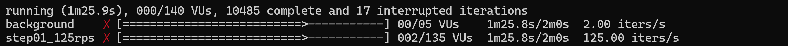

It ends at 86s of 120 because `delayAbortEval` judges the settled window at `SETTLE_SECONDS + 10`, where `http_req_failed` returned 100% against a `rate<0.01` threshold carrying `abortOnFail`. That is the script judging the step failed, by design, not an interrupted run.

`handleSummary`'s JSON was not kept, so the figures below come from the printed summary and `results/rl-isolation-*-k6.json` is a gap.

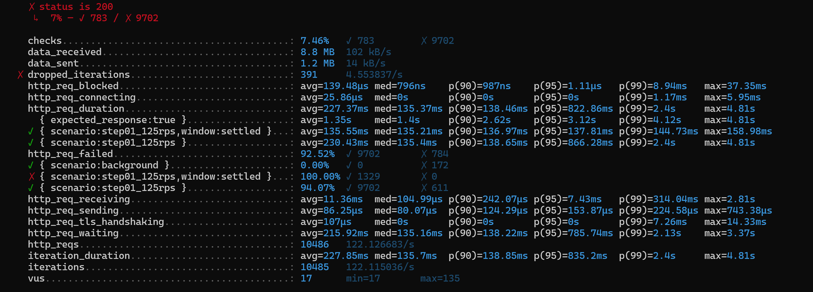

| Metric | Value |
| --- | --- |
| Requests | 10,486, offered at 122.1/s against 125 configured |
| Refused | 9,702, 92.52% |
| Allowed | 784: 611 on sky, 172 on nginx, 1 from `setup()` |
| Settled window | 1,329 requests, 100% failed, p95 137.81ms |
| Dropped iterations | 391, against a `count==0` threshold |

The error rate ended the step, not latency. Dropped iterations are the second failed threshold, and `ramp.js` says one means "the result describes the generator, not sky". All 135 allocated VUs were in use, which is why the rate landed at 122.1.

### sky scaled to three

The workload did not stay at rest.

```text
2026-09-18T17:10:51Z   Normal   SuccessfulRescale   sky   New size: 3; reason: cpu resource utilization (percentage of request) above target
2026-09-18T17:10:51Z   Normal   ScalingReplicaSet   sky   Scaled up replica set sky-7c57fd7d9b from 2 to 3
```

The quota reads `pods: 5/16, requests.cpu: 1150m/5` from `17:10:48Z`, against `4/16` and `800m/5` at rest. The HPA read `cpu: 92%/70%` at `17:10:58Z` and held 3 replicas to the end of recording. No Pod passed 0.078 of its CPU limit or 0.082 of memory, so it is the 350m request the HPA scales on, not the limit.

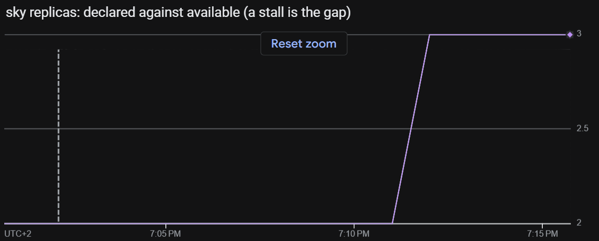

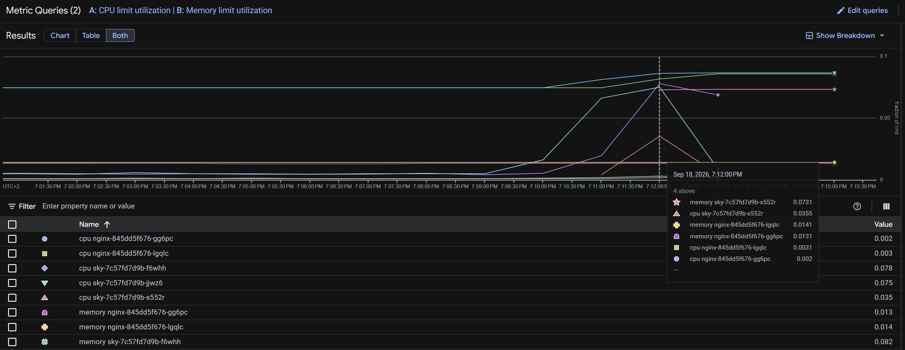

Phase 12d offered the same rate with nothing in the path and reached [8 of 8](phase-12d-autoscaling.md#result). Throttled it reached 3 of 8, inside `demo-budget`.

This corrects what the 15 rps slice implied. Finding 1's mitigation holds, because the blast radius stayed bounded and the quota was never reached. The causal claim does not: the throttle is not what keeps the HPA from scaling, it is what caps how far it scales.

### Each backend counts separately

The background scenario held 2 rps against `/` throughout and lost nothing, 172 of 172 served, while the step was refused 94% of the time. One policy is attached to each Service by its own `GCPBackendPolicy`:

```bash
grep -h 'securityPolicy\|name: ' kubernetes/*/gcpbackendpolicy.yml | grep -v 'app\.'
```

```text
  name: nginx
    securityPolicy: k8-lab-gateway-rate-limit
    name: nginx
  name: sky
    securityPolicy: k8-lab-gateway-rate-limit
    name: sky
```

Two backend services mean two per-IP counters, so spending sky's budget leaves the same address's budget on nginx untouched.

### The allowed count against the budget

The run spanned 85.8s, touching two 60-second windows granted 300 each. sky allowed 611 against that 600, about 2% over, where the flood allowed 319 against 300, about 6% over. At 125 rps a window is spent within seconds of opening, so both fall almost entirely inside the run. The per-window split cannot be recovered, as no per-request log was kept.

### The uptime check held

Every probe passed across the window, so `sindrg.com is not serving` had nothing to fire on. This is inferred from probe success rather than read from an incident record.

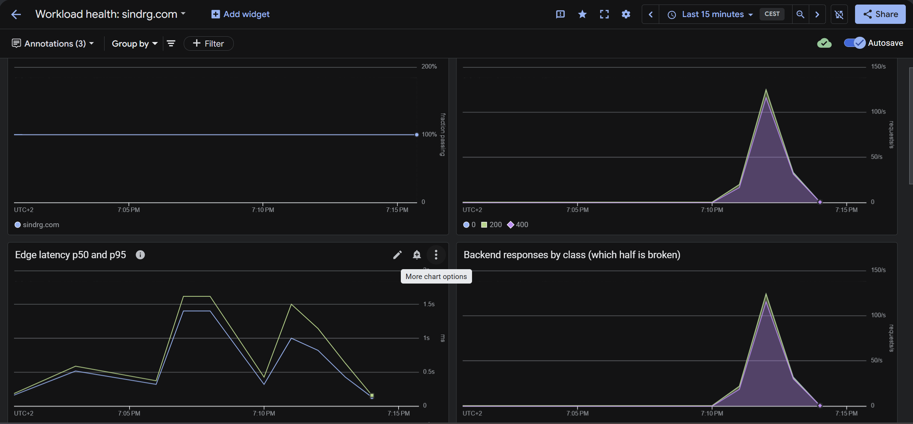

The dashboard reports the refusals as a 400 class and nothing here carries the exact status, so this run claims 4xx where the flood read `429`.

### Open: allowed requests were ten times slower than refused ones

| Sub-metric | avg | med | p95 | max |
| --- | --- | --- | --- | --- |
| Settled step, almost all refused | 135.55ms | 135.21ms | 137.81ms | 158.98ms |
| `{expected_response:true}`, the 784 allowed | 1.35s | 1.4s | 3.12s | 4.81s |

The edge latency chart agrees, p50 and p95 both rising to about 1.5s. Why 611 requests over 85.8s, about 7 rps, cost this much is unanswered, given two replicas held 40 rps in [Phase 12a](phase-12a-load-baseline.md). It stays open.

## Slice 6: Security Command Center

Status: Complete as a first look. The tier is read and the count is one. The first Security Health Analytics scan has not finished, so nothing here is a clean bill of health.

### The tier

Security Command Center Premium was activated at the organization level on 2026-09-18: `sindre-demetrio-org`, id `550178366891`. Project `421458901689` inherits it.

| Fact | Value | Source |
| --- | --- | --- |
| Trial ends | 2026-10-18 | The console page, confirmed by the owner |
| Tier at expiry | Standard | The console page, confirmed by the owner |

Neither is readable from any API, which is why both are attributed rather than pasted. Standard keeps Security Health Analytics' basic detectors and drops the Premium-only ones, so the detector set below is the trial's rather than the steady state. Re-read this slice on 2026-10-18.

### The count is one

Read at project scope and through the V2 API, for the reasons in [the last section](#what-it-took-to-read-any-of-this):

```bash
gcloud scc findings list projects/421458901689 --location=global \
  --format='value(finding.findingClass,finding.severity,finding.category,finding.createTime)' > ~/scc-all.txt
wc -l < ~/scc-all.txt
awk -F'\t' '{print $1, $2}' ~/scc-all.txt | sort | uniq -c
awk -F'\t' '{print $3}' ~/scc-all.txt | sort | uniq -c
```

```text
1
      1 THREAT LOW
      1 Persistence: Service Account Created in sensitive namespace
```

That finding in full:

```bash
gcloud scc findings list projects/421458901689 --location=global \
  --format='yaml(finding.category,finding.findingClass,finding.severity,finding.state,finding.createTime,finding.parentDisplayName,finding.resourceName,finding.access.principalEmail,finding.access.methodName)'
```

```text
finding:
  access:
    methodName: io.k8s.core.v1.serviceaccounts.create
    principalEmail: service-project-421458901689@gcp-sa-ktd-hpsa.iam.gserviceaccount.com
  category: 'Persistence: Service Account Created in sensitive namespace'
  createTime: '2026-09-18T15:01:06.363Z'
  findingClass: THREAT
  parentDisplayName: Event Threat Detection
  resourceName: //container.googleapis.com/projects/project-69726555-c4de-48de-a69/locations/europe-north1-a/clusters/k8-lab
  severity: LOW
  state: ACTIVE
```

The principal is `gcp-sa-ktd-hpsa`, Container Threat Detection's own agent service account, and the timestamp is minutes after activation. Event Threat Detection flagged Container Threat Detection installing itself, so the platform's only finding is Security Command Center's own onboarding.

The organization-wide count is not read directly, because the account cannot list findings at that scope. It is covered rather than guessed, because the organization holds one project:

```bash
gcloud projects list --format='value(projectId,projectNumber)'
```

```text
project-69726555-c4de-48de-a69	421458901689
```

A project-scoped count over the only project is the organization's count. What it misses is a finding attached to the organization or to a folder rather than to a resource inside the project.

Findings are generated from activation forward rather than accumulated before it, so the count starts at zero and says nothing about this project's posture over the twenty days it has been running.

### The scan that would overlap has not run

```bash
gcloud scc manage services list --project=421458901689 \
  --format='value(name.basename(),effectiveEnablementState)'
```

```text
VM_THREAT_DETECTION	DISABLED
WEB_SECURITY_SCANNER	ENABLED
SECURITY_HEALTH_ANALYTICS	ENABLED
AGENT_ENGINE_THREAT_DETECTION	ENABLED
EC2_VULNERABILITY_ASSESSMENT	DISABLED
AGENT_ENGINE_VULN_ASSESSMENT	ENABLED
CLOUD_RUN_THREAT_DETECTION	DISABLED
ARTIFACT_GUARD	DISABLED
EVENT_THREAT_DETECTION	ENABLED
NOTEBOOK_SECURITY_SCANNER	DISABLED
VM_MANAGER	DISABLED
GCE_VULNERABILITY_ASSESSMENT	ENABLED
AZURE_VULNERABILITY_ASSESSMENT	DISABLED
CONTAINER_THREAT_DETECTION	ENABLED
ARTIFACT_ANALYSIS	ENABLED
EXTERNAL_EXPOSURE	ENABLED
VM_THREAT_DETECTION_AWS	DISABLED
```

`SECURITY_HEALTH_ANALYTICS` is `ENABLED` with zero findings an hour after activation, which reads as a first scan not yet complete. It is the configuration scanner, and the one detector whose output overlaps what this repository already runs.

| Tool | Reads | Sees | Overlaps |
| --- | --- | --- | --- |
| checkov | The Terraform and the manifests in git | Configuration before it applies | Security Health Analytics, once it scans |
| kubescape | The live cluster through a kubeconfig | Cluster and workload posture against MITRE and NSA | Security Health Analytics' GKE detectors |
| Security Health Analytics | The project's resources through asset inventory | Google Cloud configuration as applied | Both of the above |
| Event and Container Threat Detection | Audit logs and container runtime | Behaviour rather than configuration | Neither |

The detector list settles the part that does not overlap. checkov reads files and kubescape reads cluster state, both point-in-time reads of configuration, while Event and Container Threat Detection read audit logs and runtime behaviour continuously. This project's single finding is the demonstration: no static analyser reports a service account created in a sensitive namespace, because that is an event rather than a configuration. Nor does the traffic run one way, since checkov gates a pull request before an apply and Security Command Center only reads resources that already exist.

The comparison worth making once the first scan lands is narrow: how many Security Health Analytics findings name something `.checkov.baseline` already records as a priced, accepted decision. High overlap means Security Command Center is re-reporting risks this project has reasoned about, and its value is the remainder plus the threat detection nothing else here provides.

### What it took to read any of this

Three errors, kept because the next reader hits them in the same order. The API was not enabled on the project:

```bash
gcloud scc findings list 550178366891 --limit 20
```

```text
ERROR: (gcloud.scc.findings.list) PERMISSION_DENIED: Security Command Center API has not been
used in project project-69726555-c4de-48de-a69 before or it is disabled.
```

Enabling a service is the owner's decision against live billing, so the owner enabled `securitycenter.googleapis.com`. `securitycentermanagement.googleapis.com` came with it:

```bash
gcloud services list --enabled | grep -i securitycenter
```

```text
securitycenter.googleapis.com            Security Command Center API
securitycentermanagement.googleapis.com  Security Center Management API
```

The organization-scoped query is still refused, for a different reason. The account holds `resourcemanager.organizationAdmin` and no Security Command Center role, and administering the organization does not include reading its findings:

```bash
gcloud scc findings list 550178366891 --limit 20
gcloud organizations get-iam-policy 550178366891 \
  --flatten='bindings[].members' \
  --filter='bindings.members:sindre.demetrio@gmail.com' \
  --format='value(bindings.role)'
```

```text
ERROR: (gcloud.scc.findings.list) PERMISSION_DENIED: Permission 'securitycenter.findings.list'
denied on resource '//securitycenter.googleapis.com/organizations/550178366891/sources/-'
(or it may not exist).
```

```text
roles/billing.admin
roles/billing.creator
roles/iam.workforcePoolAdmin
roles/resourcemanager.organizationAdmin
roles/resourcemanager.projectCreator
roles/resourcemanager.projectMover
roles/serviceusage.serviceUsageAdmin
```

Granting a role is an infrastructure change and was out of scope, so the reads above are at project scope. That needs the V2 API: V1 is retired for project parents, and `gcloud` routes to V1 unless `--location` is given.

```bash
gcloud scc findings list projects/421458901689 --limit 20
```

```text
ERROR: (gcloud.scc.findings.list) INVALID_ARGUMENT: This API is no longer available. Please use
API V2 as an alternative.
```

## Slice 7: DNSSEC

Status: Complete. The zone is signed, the chain validates, and finding 9 is closed.

Finding 9's proposed response was Decide rather than Mitigate, so it closes on a recorded decision either way. The decision was to sign, and the reasoning is in [decisions.md](../decisions.md#zone-signing).

Cloudflare is the registrar, so it signs the zone and publishes the DS in `.com` itself. There is no key to carry and no second panel to edit:

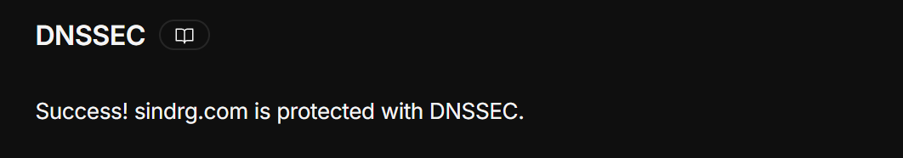

The parent publishes the DS, read back from two public resolvers:

```bash
dig +short DS sindrg.com @1.1.1.1; dig +short DS sindrg.com @8.8.8.8
```

```text
2371 13 2 4FB2EFEC5EEDD841AB7C90E6AD790B7A8CA8BFF1C17AE0509F2BFBFD CC3FE31D
2371 13 2 4FB2EFEC5EEDD841AB7C90E6AD790B7A8CA8BFF1C17AE0509F2BFBFD CC3FE31D
```

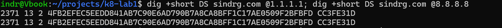

Key tag 2371, algorithm 13 for ECDSA P-256 SHA-256, digest type 2 for SHA-256.

### The answers validate

A DS in the parent proves publication. It does not prove the chain resolves, which is the `ad` flag:

```bash
dig +dnssec sindrg.com @1.1.1.1 | grep -E 'flags:|RRSIG'
```

```text
;; flags: qr rd ra ad; QUERY: 1, ANSWER: 2, AUTHORITY: 0, ADDITIONAL: 1
sindrg.com.  300  IN  RRSIG  A 13 2 300 20260919200317 20260917180317 34505 sindrg.com. ...
```

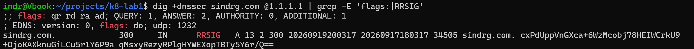

`ad` means the resolver validated the answer rather than merely receiving one, and both paths kept serving `200` throughout.

### The same cache, the same answer

The workstation's resolver reported the zone unsigned for several minutes after the DS was live, which is the behaviour [Slice 4](#a-cached-negative-answer-outlived-the-records) recorded for CAA. The `.com` negative TTL is `900` rather than the zone's `1800`, so it cleared sooner:

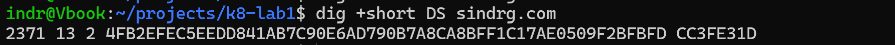

The gate was re-run once it expired rather than pointed at a public resolver.

```bash
./scripts/check-public-surface.sh
```

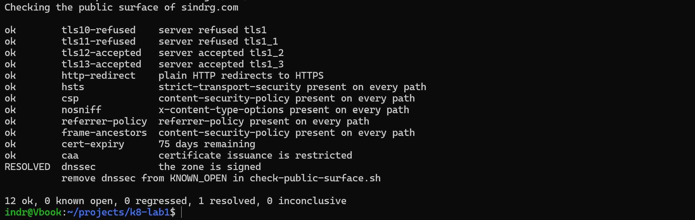

Deleting `dnssec` from `KNOWN_OPEN` empties the list, which is the first run of this script with nothing known open:

```text
ok        caa              certificate issuance is restricted
ok        dnssec           the zone is signed

13 ok, 0 known open, 0 regressed, 0 resolved, 0 inconclusive
EXIT=0
```

The residual is unchanged and belongs to the row above it in the threat model: signing authenticates the zone's answers, and it does nothing about a zone edit by someone who holds the Cloudflare account.

## What this phase leaves open

| # | Item | State |
| --- | --- | --- |
| 1 | Security Command Center overlap with checkov and kubescape | Open. The first Security Health Analytics scan has not completed |
| 2 | Provenance, SBOM, signing, admission, threat model finding 10 | Accepted for now. A phase of its own, revisited with the threat model after Milestone 4 |
| 3 | Universal SSL can be switched back on | Open. It is console state, and nothing in this repository prevents it |
| 4 | Why admitted requests cost ten times what refused ones do | Open, measured. 7 rps of admitted traffic averaged 1.35s where two replicas held 40 rps in [Phase 12a](phase-12a-load-baseline.md) |

Item 2 is recorded as an acceptance on boundary 8 rather than carried as work. Item 3 is what closing finding 3 left behind, though the surface check now compares the CAA answer to the pair the platform declared rather than counting records, so a widening is reported rather than missed. Item 4 came out of the isolation run.

## Where this is recorded elsewhere

The threat model's findings table, `decisions.md` on branch protection and on certificate issuance, and Phase 14 in `plan.md`.
