# Worklog: Phase 15 Security Command Center triage

Date: 2026-09-20, extended 2026-09-21
Status: In progress. The transport, the identity and the worker are applied, and the worker has triaged findings from all three in-scope classes end to end. The crash boundaries and a ledger write failure are drilled against the live worker. The overlap measurement and the injection drill are open, and the model is not called yet.

## Goal

Read the findings Security Command Center has produced since 2026-09-18, correlate them against this repository's own records, and notify through the existing email channel. See [Phase 15](../plan.md#phase-15-security-command-center-triage). The contract the work is held to was settled first, in [#113](https://github.com/sindredg/k8-lab/pull/113).

This worklog covers the infrastructure, the transport and Increment 1 of the worker. The overlap measurement the exit criteria name is open, and Increment 2 has not started.

The transport changed no decision and added evidence to two. [Triage idempotency](../decisions.md#triage-idempotency) now carries what `eventTime` was measured to track, and the warning that a finding cannot be written back at the name it is read at.

## What the findings look like before anything reads them

Read at project scope, filtered on state, because an earlier read that ignored state counted four retired findings as live:

```bash
gcloud scc findings list projects/421458901689 --location=global \
  --format='value(finding.state,finding.category,finding.eventTime)' \
  | grep -viE 'SOFTWARE_|OS_VULN' | sort
```

```text
ACTIVE    BINARY_AUTHORIZATION_DISABLED          2026-09-19T22:05:22Z
ACTIVE    CLUSTER_SECRETS_ENCRYPTION_DISABLED    2026-09-19T22:05:22Z
ACTIVE    EXTERNALLY_EXPOSED_SERVICE_VIA_LOAD_BALANCER  2026-09-19T03:51:40Z
ACTIVE    EXTERNALLY_EXPOSED_SERVICE_VIA_LOAD_BALANCER  2026-09-19T03:51:40Z
ACTIVE    INTRANODE_VISIBILITY_DISABLED          2026-09-19T22:05:22Z
ACTIVE    MASTER_AUTHORIZED_NETWORKS_DISABLED    2026-09-19T22:05:22Z
ACTIVE    NON_ORG_IAM_MEMBER                     2026-09-19T00:13:03Z
ACTIVE    PRIMITIVE_ROLES_USED                   2026-09-19T00:13:03Z
INACTIVE  FIREWALL_RULE_LOGGING_DISABLED         2026-09-18T17:27:04Z
INACTIVE  FLOW_LOGS_DISABLED                     2026-09-18T17:27:22Z
INACTIVE  PRIVATE_GOOGLE_ACCESS_DISABLED         2026-09-18T17:27:22Z
INACTIVE  PUBLIC_IP_ADDRESS                      2026-09-18T17:26:56Z
```

Six active misconfigurations, two external exposures, one threat finding, and 653 vulnerability findings not shown. The four `INACTIVE` ones all name `loadgen` resources in `europe-west4`. Security Command Center raised them at 17:02 on 2026-09-18 and retired them at 17:27, when the load generator and its VPC were deleted, which is the cost posture being honoured and the detector tracking it. They are kept here because they are the proof that one finding produces more than one event, which is why the worker keys on state as well as event time.

## The overlap, read by hand

Not the measurement the exit criteria ask for. That one is produced by the worker with provenance. This is the hand check that says whether the phase is pointed at anything real.

```bash
grep -rn "CKV_GCP_13\"\|CKV_GCP_20\"\|CKV_GCP_61\"\|CKV_GCP_65\"\|CKV_GCP_66\"" \
  ~/.local/share/pipx/venvs/checkov/lib/python3.12/site-packages/checkov/terraform/checks/
```

```text
GKEClientCertificateDisabled.py:8:        id = "CKV_GCP_13"
GKEMasterAuthorizedNetworksEnabled.py:9:  id = "CKV_GCP_20"
GKEEnableVPCFlowLogs.py:10:               id = "CKV_GCP_61"
GKEBinaryAuthorization.py:8:              id = "CKV_GCP_66"
GKEKubernetesRBACGoogleGroups.py:9:       id = "CKV_GCP_65"
```

| Active finding | Priced in `.checkov.baseline` |
| --- | --- |
| `MASTER_AUTHORIZED_NETWORKS_DISABLED` | Yes, `CKV_GCP_20` |
| `BINARY_AUTHORIZATION_DISABLED` | Yes, `CKV_GCP_66`, and threat model finding 10 |
| `CLUSTER_SECRETS_ENCRYPTION_DISABLED` | No |
| `INTRANODE_VISIBILITY_DISABLED` | No |
| `NON_ORG_IAM_MEMBER` | No |
| `PRIMITIVE_ROLES_USED` | No |

Two of six. [Phase 14](phase-14-close-the-baseline.md) expected high overlap and wrote that its value would be "the remainder plus the threat detection nothing else here provides". The remainder is two thirds.

Worth recording how this was nearly got wrong. A first pass paired `CLUSTER_SECRETS_ENCRYPTION_DISABLED` with `CKV_GCP_65` and `INTRANODE_VISIBILITY_DISABLED` with `CKV_GCP_61` on the strength of the names, and reported four of six. `CKV_GCP_65` is RBAC Google Groups and `CKV_GCP_61` is VPC flow logs. Neither pairing exists. That error is why the contract in [#113](https://github.com/sindredg/k8-lab/pull/113) requires every verdict to cite a corpus entry and requires the worker to resolve the citation before accepting the verdict.

## Slice 1: The certificate that was nearly replaced

Status: Closed. The cause is removed and a guard is in place.

`terraform apply` planned `7 to add, 1 to change, 1 to destroy`. The destroy was the certificate serving the public domain. It failed:

```text
Error: Error when reading or editing Certificate: googleapi: Error 400: can't
delete certificate that is referenced by a CertificateMapEntry or other resources
    "subject": "projects/421458901689/locations/global/certificates/k8-lab-gateway-cert",
    "type": "RESOURCE_STILL_IN_USE"
```

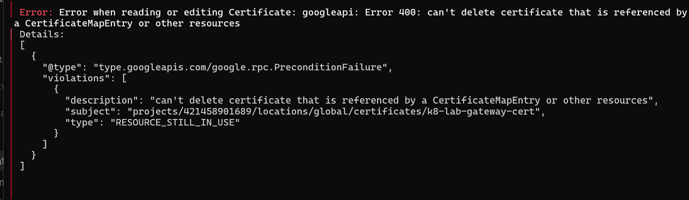

Nothing was destroyed and nothing was created; the apply stopped on its first operation. The site never stopped serving:

```bash
curl -sS -o /dev/null -w "HTTP %{http_code}\n" https://sindrg.com/healthz
```

```text
HTTP 200
```

The cause was four API names. `module.gateway` carries `depends_on = [google_project_service.required]`. This phase added `aiplatform`, `pubsub`, `securitycenter` and `storage` to that set, so the module depended on a resource with pending changes, so Terraform deferred reading `data.google_project.this` until apply, so `.number` was unknown at plan time. It is interpolated into `dns_authorizations`, which is `ForceNew`:

```hcl
dns_authorizations = [
  "projects/${data.google_project.this.number}/locations/global/dnsAuthorizations/...",
]
```

The project number is a constant and was identical before and after. Terraform could not prove that, so it planned a replacement. Any edit to `required_services` by anyone would have done the same.

The fix passes the number in as a variable, so it is known at plan time, and removes the data source in both the gateway module and the new findings module, which had the same pattern waiting on its IAM members. After it:

```text
Plan: 6 to add, 0 to change, 0 to destroy.
```

Only Certificate Manager's own refusal stopped this, which is luck rather than a control, so the certificate now carries `prevent_destroy`. A replacement has to be a deliberate act.

## Slice 2: The alert filter that could not be left open

Status: Closed, and a decision recorded in the plan was wrong.

The alert policy was written with no `resource.type` clause, deliberately. The reasoning was that no worker had written a log entry yet, so naming the type would be a guess, and a wrong guess fails silently. Cloud Monitoring does not allow the choice:

```text
Error: Error creating AlertPolicy: googleapi: Error 400: Field
alert_policy.conditions[0].condition_threshold.filter had an invalid value of
"metric.type = "logging.googleapis.com/user/triage/verdicts"": must specify a
restriction on "resource.type" in the filter
```

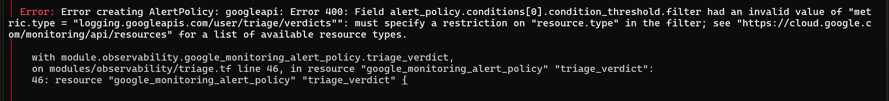

`k8s_container` is therefore a contract rather than an observation, and the worker has to set that monitored resource explicitly rather than relying on client library detection.

That contract is measurable now, before the worker exists:

```bash
gcloud logging write triage-verdict \
  '{"verdict":"new","finding":{"category":"PROBE","severity":"LOW"}}' \
  --payload-type=json --severity=WARNING
```

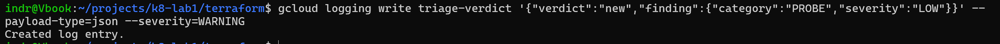

```bash
gcloud logging read 'logName="projects/project-69726555-c4de-48de-a69/logs/triage-verdict"' \
  --limit=1 --format='value(resource.type,jsonPayload.verdict)'
```

```text
global	new
```

A hand written entry lands as `global`. The metric counted it, because the metric filters on `logName` and the verdict only. The alert did not fire, because the alert requires `k8s_container`. So a worker that writes the wrong monitored resource is counted and never paged, which is the silent failure the original reasoning was trying to avoid and the filter now makes explicit.

## Slice 3: The apply that succeeded and reported failure

Status: Closed. The path is applied. Three errors, and two of them were about something other than what they said.

`modules/findings` was written in [#114](https://github.com/sindredg/k8-lab/pull/114) and never called from the root. Terraform does not evaluate a module directory that no configuration calls, so CI's `terraform validate` had been passing for two days without reading a line of it. Wiring it was therefore the first time any of it ran.

Seven of the nine resources created. Then:

```text
Error: Error creating ProjectNotificationConfig: googleapi: Error 403: Your
application is authenticating by using local Application Default Credentials.
The securitycenter.googleapis.com API requires a quota project, which is not
set by default.
    "consumer": "projects/764086051850",
    "reason": "SERVICE_DISABLED"
```

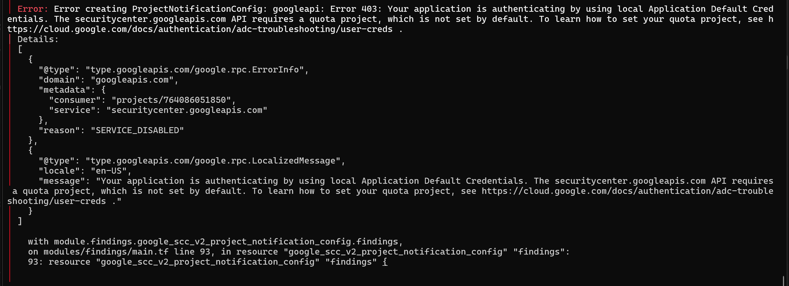

`securitycenter.googleapis.com` is enabled in this project, and `764086051850` is not this project. It is Google's shared gcloud client project. Some APIs bill the caller's quota project rather than the resource's, user Application Default Credentials carry no quota project, so the call was billed to Google's own client project, where the API is disabled. The message names the wrong project and the wrong cause.

`gcloud auth application-default set-quota-project` fixes it for one machine. The provider carries it instead:

```hcl
billing_project       = var.project_id
user_project_override = true
```

The next apply produced a different error:

```text
Error: Error creating ProjectNotificationConfig: googleapi: Error 400:
Precondition check failed.
```

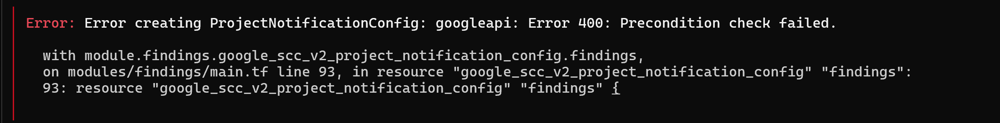

No precondition named, and nothing about what was already true. Read back from the API rather than from state:

```bash
curl -s -H "Authorization: Bearer $(gcloud auth print-access-token)" \
  -H "X-Goog-User-Project: project-69726555-c4de-48de-a69" \
  "https://securitycenter.googleapis.com/v2/projects/project-69726555-c4de-48de-a69/locations/global/notificationConfigs"
```

```text
"name": "projects/421458901689/locations/global/notificationConfigs/k8-lab-triage",
"pubsubTopic": "projects/project-69726555-c4de-48de-a69/topics/scc-findings",
"updateTime": "2026-09-20T13:21:29.056431Z"
```

The config existed, with the filter and topic the module specifies. The ledger bucket from the first apply reports `creation_time 2026-09-20T13:18:10`, three minutes earlier, which places the config in the second apply rather than the first. So the apply that reported a failure had already done the work, and `400 Precondition check failed` is how Security Command Center answers a create for a config that exists. The obvious response is to run it again, and running it again only reproduces it.

Importing it forced a replacement:

```text
~ project = "421458901689" -> "project-69726555-c4de-48de-a69" # forces replacement
```


The API returns `project` as the number, the configuration supplies the id, and `project` is `ForceNew`. This is the same project-number-against-project-id mismatch as Slice 1, arriving by a different route: Slice 1 was a value unknown at plan time, this is two spellings of a known one. The plan showed the replacement before it ran, which is the only reason it was a decision rather than a surprise.

It is an import artifact and not standing drift. After the replacement, the provider keeps the configured value:

```bash
terraform -chdir=terraform plan -detailed-exitcode; echo "EXIT=$?"
```

```text
No changes. Your infrastructure matches the configuration.
EXIT=0
```

What each error said against what it meant:

| Reported | Actual |
| --- | --- |
| `403 SERVICE_DISABLED` on `projects/764086051850` | The API is enabled here. No quota project was set on the credentials |
| `400 Precondition check failed` | The config had just been created by the apply reporting the failure |
| `project` forces replacement | Two spellings of the same project, one from the API and one from the configuration |

One thing the apply did that the configuration does not: Security Command Center granted itself `roles/securitycenter.notificationServiceAgent` on the topic, alongside the `roles/pubsub.publisher` the module grants.

```bash
gcloud pubsub topics get-iam-policy scc-findings --format='value(bindings.role,bindings.members)'
```

```text
roles/pubsub.publisher;roles/securitycenter.notificationServiceAgent	service-org-550178366891@gcp-sa-scc-notification.iam.gserviceaccount.com
```

The module uses `google_pubsub_topic_iam_member`, which is additive, so the two coexist. `google_pubsub_topic_iam_binding` is authoritative and would have stripped the self-granted role on every apply, then Security Command Center would have restored it, forever. The additive resource was already the right choice and now there is a reason on the record for it.

## Slice 4: What a finding looks like when it arrives

Status: Delivery proven. The idempotency key in the contract survives, for a reason the contract did not state.

A topic with a subscription and no traffic proves nothing, so one active finding was muted and unmuted to produce real events from a real detector.

`gcloud` cannot do it. Every documented flag combination reaches the v1 API:

```bash
gcloud scc findings set-mute e5d7b4d99d652ee96c3016210cc73a37 \
  --organization=organizations/550178366891 --source=1405720631579532947 \
  --location=global --mute=MUTED
```

```text
ERROR: (gcloud.scc.findings.set-mute) INVALID_ARGUMENT: Security Command Center
Legacy has been permanently disabled as of June 7, 2021.
```

This is the second unusable `gcloud scc` surface in this phase, after `notifications list`. Treat `gcloud` as unavailable for Security Command Center v2 here and call the REST API.

The REST call works, but only at one of the two scopes:

```bash
curl -s -X POST "https://securitycenter.googleapis.com/v2/${NAME}:setMute" \
  -H "Authorization: Bearer $(gcloud auth print-access-token)" \
  -H "X-Goog-User-Project: project-69726555-c4de-48de-a69" \
  -H "Content-Type: application/json" -d '{"mute":"MUTED"}'
```

| `NAME` | Result |
| --- | --- |
| `projects/project-69726555-c4de-48de-a69/sources/1405720631579532947/locations/global/findings/e5d7…` | 200 |
| `organizations/550178366891/sources/1405720631579532947/locations/global/findings/e5d7…` | 400, the same legacy error |

The organization-scoped name is the one Security Command Center returns as `name`. So a finding cannot be written back at the name it is read at. Reads answer at organization scope, writes are accepted at project scope.

### One finding, three names

```text
name           organizations/550178366891/sources/1405720631579532947/locations/global/findings/e5d7b4…
canonicalName  projects/421458901689/sources/1405720631579532947/locations/global/findings/e5d7b4…
parent         organizations/550178366891/sources/1405720631579532947/locations/global
```

Organization scope, project number scope, and the parent. [Triage idempotency](../decisions.md#triage-idempotency) already keys on the canonical name, which is the project number form, and the project number is immutable. What that decision did not know is that the three forms are not interchangeable: the worker cannot write back at the name it reads. The key and the address for a write are separate values, and the decision now says so.

### Delivery latency

Measured against `publishTime`, which Pub/Sub sets, rather than against the polling interval, which only bounds detection:

```text
mute returned   14:00:19 (approximate, see below)
publishTime     2026-09-20T14:00:21.034Z
```

About two seconds. The recorded start was taken one to two seconds after the successful call, so the true figure is slightly higher than the one second the arithmetic gives. Two seconds is the honest number and the precision beyond that is not worth chasing: it is the floor on how quickly a verdict can follow a finding, and the model call after it will dominate.

Both state changes notify. The mute published at `14:00:21.034Z` and the unmute at `14:02:11.734Z`.

### The envelope

```text
top-level      notificationConfigName, finding, resource
finding keys   canonicalName, category, compliances, createTime, description,
               eventTime, externalUri, findingClass, iamBindings, mute,
               muteInfo, muteInitiator, muteUpdateTime, name, parent,
               parentDisplayName, resourceName, securityMarks,
               sourceProperties, state
```

### The key the contract specifies does not hold

[Phase 15](../plan.md#phase-15-security-command-center-triage) requires redelivery to be safe by keying on the finding, its event time and its state. The message produced by muting carries:

```text
name        organizations/550178366891/sources/…/findings/e5d7b4…
state       ACTIVE
eventTime   2026-09-19T00:13:03.532143Z
mute        MUTED
```

`eventTime` is the previous day. A mute does not advance it, and `state` does not change either. Under `(name, eventTime, state)` this message is indistinguishable from a redelivery of a finding already triaged, so the worker as specified would discard it.

That is not automatically wrong. A mute is a human saying "stop showing me this", not a change in posture, so collapsing it may be the correct behaviour. What is wrong is that it was never a decision. `muteUpdateTime` is in the payload and would separate them if separation is wanted.

### What `eventTime` actually tracks

The question the mute raised is whether `eventTime` is reliable at all, or whether it is a scan timestamp that happens to look stable. Read the same detectors a day after the values at the top of this worklog were recorded:

```bash
gcloud scc findings list projects/421458901689 --location=global \
  --format='value(finding.state,finding.category,finding.eventTime,finding.createTime)' \
  | grep -viE 'SOFTWARE_|OS_VULN' | sort -k2
```

```text
ACTIVE    BINARY_AUTHORIZATION_DISABLED        2026-09-19T22:05:22.735Z  2026-09-19T22:05:23.940Z
ACTIVE    BUCKET_LOGGING_DISABLED              2026-09-20T13:18:15.286Z  2026-09-20T13:18:17.107Z
ACTIVE    CLUSTER_SECRETS_ENCRYPTION_DISABLED  2026-09-19T22:05:22.735Z  2026-09-19T22:05:24.154Z
ACTIVE    INTRANODE_VISIBILITY_DISABLED        2026-09-19T22:05:22.735Z  2026-09-19T22:05:24.399Z
ACTIVE    MASTER_AUTHORIZED_NETWORKS_DISABLED  2026-09-19T22:05:22.735Z  2026-09-19T22:05:24.695Z
ACTIVE    PRIMITIVE_ROLES_USED                 2026-09-19T00:13:03.532Z  2026-09-19T00:13:05.018Z
```

Unchanged findings hold their `eventTime` across re-evaluation. It is not a scan timestamp. It moves when the finding's substance moves, which is what the key needs it to do.

So the key holds after all, for the thing it exists to do. `(name, eventTime, state)` collapses exactly the events that should not cost a model call, and a mute is one of them. It would not collapse a real change. The mute looked like a counterexample and is instead a demonstration.

The digest stays worth adding, demoted from a fix to a cheap safety net: it records that something moved without paying for a verdict, and it is the evidence that would catch a detector that does mutate substance without advancing `eventTime`, which is a thing this worklog has now checked for and not found rather than assumed away.

### The apply produced a finding about itself

`BUCKET_LOGGING_DISABLED` is new, at `2026-09-20T13:18:15.286Z`. The ledger bucket was created at `13:18:10`. Security Command Center detected this phase's own storage bucket five seconds after Terraform made it, and raised a finding about it.

It is already priced. `CKV_GCP_62`, "Bucket should log access", is the check this branch added to `.checkov.baseline` for the same resource, before Security Command Center had seen it.

That is the overlap thesis demonstrated on a resource created during the measurement: two tools, one property, one accepted decision, reached independently. It is also the first honest addition to the overlap count since the hand check above, and it moves the arithmetic rather than confirming it.

### A message nobody acknowledges is parked, not lost

The contract has the worker acknowledge last, so what happens to a message it never acknowledges decides whether one bad finding costs a finding or costs the queue. Both messages were pulled and negatively acknowledged repeatedly:

```text
round 3:   attempt 3 2026-09-20T14:00:21.034Z
round 5:   attempt 4 2026-09-20T14:00:21.034Z
round 7:   attempt 5 2026-09-20T14:00:21.034Z
round 9:   empty
```

```text
=== dead letter subscription ===
messages: 2
   2026-09-20T14:16:10.323Z PRIMITIVE_ROLES_USED mute=UNDEFINED
   2026-09-20T14:15:49.504Z PRIMITIVE_ROLES_USED mute=MUTED
=== scc-triage after ===
messages: 0
```

Five attempts, then both were republished to `scc-findings-dead` with their bodies intact, and `scc-triage` drained. `max_delivery_attempts = 5` is behaviour rather than configuration.

One detail that matters for the worker: the dead letter copies carry new `publishTime` values, `14:15:49` and `14:16:10`, not the originals. Nothing may key on `publishTime`.

`deliveryAttempt` was not reliable to read. An earlier pass observed it at 2, then back at 1 after several more pulls, before incrementing cleanly from 3 to 5 here. Google documents it as approximate. The worker should treat it as a hint and rely on the dead letter topic as the actual boundary.

## Slice 5: An identity with nowhere to stand, and then somewhere

Status: Closed. The worker has an identity, a namespace and proven guardrails. It still does not exist.

`modules/agent-identity` and `kubernetes/agents/` were both written in [#114](https://github.com/sindredg/k8-lab/pull/114) and neither was applied. They are one change rather than two, because the identity cannot be proven without the namespace.

The Workload Identity binding is a string naming a Kubernetes namespace and service account:

```hcl
member = "serviceAccount:${var.project_id}.svc.id.goog[${var.namespace}/${var.kubernetes_service_account}]"
```

Terraform creates that binding whether or not `agents/triage-worker` exists, and reports success either way. So applying the module alone proves that six resources exist, not that any of them work.

```text
Apply complete! Resources: 6 added, 0 changed, 0 destroyed.
```

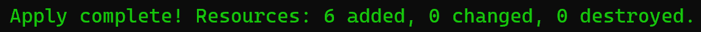

Read back from the API:

```bash
SA=$(terraform -chdir=terraform output -raw triage_service_account_email)
gcloud pubsub subscriptions get-iam-policy scc-triage --format='value(bindings.role,bindings.members)'
gcloud projects get-iam-policy project-69726555-c4de-48de-a69 \
  --flatten='bindings[].members' --filter="bindings.members:${SA}" --format='value(bindings.role)'
gcloud iam service-accounts get-iam-policy "$SA" --format='value(bindings.role,bindings.members)'
gcloud iam service-accounts keys list --iam-account="$SA" --managed-by=user --format='value(name)'
```

```text
roles/pubsub.subscriber   k8-lab-triage@..., service-421458901689@gcp-sa-pubsub...
roles/aiplatform.user
roles/logging.logWriter
roles/iam.workloadIdentityUser   project-69726555-c4de-48de-a69.svc.id.goog[agents/triage-worker]
```

The subscriber role is on the subscription rather than the project, the project holds exactly two roles for this identity, and the key list is empty. An empty key list is the pass, the same claim [Phase 14](phase-14-close-the-baseline.md) made about federation, made again for an agent.

Then the namespace:

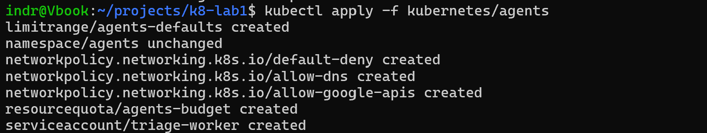

The annotation on the ServiceAccount matches `terraform output -raw triage_service_account_email` exactly. A mismatch here is not an error anywhere; it surfaces much later as a Pod quietly receiving the node identity instead.

### Both guardrails reject, separately

Two probes rather than one, because a Pod violating both would only ever show whichever admission plugin answered first.

Privileged, and otherwise unremarkable:

```text
Error from server (Forbidden): pods "psa-probe" is forbidden: violates PodSecurity
"restricted:v1.35": privileged (container "probe" must not set
securityContext.privileged=true), allowPrivilegeEscalation != false, unrestricted
capabilities, runAsNonRoot != true, seccompProfile
```

Fully `restricted` compliant and asking for twice the namespace budget, so Pod Security has nothing to say:

```text
Error from server (Forbidden): pods "quota-probe" is forbidden: exceeded quota:
agents-budget, requested: requests.cpu=2, used: requests.cpu=0, limited: requests.cpu=1
```

### The identity, and the label that gates it

Two Pods, identical in every respect except one label, both carrying `serviceAccountName: triage-worker`. `allow-google-apis` selects on `app.kubernetes.io/name: triage-worker`.

Which identity does the selected Pod get:

```bash
kubectl exec -n agents wi-probe -- curl -s -H 'Metadata-Flavor: Google' \
  http://169.254.169.254/computeMetadata/v1/instance/service-accounts/default/email
```

```text
k8-lab-triage@project-69726555-c4de-48de-a69.iam.gserviceaccount.com
```

Not `k8-lab-nodes@`. The binding created against a namespace that did not exist now resolves from inside a Pod.

The same request from the Pod the policy does not select:

```text
HTTP 000
curl exit: 28
```

A timeout, not a refusal. And that Pod still resolves DNS, because `allow-dns` selects every Pod:

```text
Name:    pubsub.googleapis.com
Address: 209.85.233.95
```

So the block is `default-deny` refusing the TCP connection, rather than the Pod being broken. One label is the only difference between the two results.

### The grant is scoped to the verb, not the resource

A first pass asked whether the worker could read the subscription, with a `GET`, and got `403`. The test was wrong and the answer was right. `roles/pubsub.subscriber` grants `pubsub.subscriptions.consume`, not `pubsub.subscriptions.get`.

Same Pod, same token, same subscription, three calls:

| Call | Result |
| --- | --- |
| `POST .../subscriptions/scc-triage:pull` | `200`, with a message and an `ackId` |
| `GET .../subscriptions/scc-triage` | `403` |
| `POST .../upload/storage/v1/b/k8-lab-verdicts-.../o` | `200` |

The worker can consume from the subscription and write to the ledger, and cannot read the subscription's own configuration. That is a narrower grant than "access to the subscription", and it is worth having proven rather than assumed, because the difference is invisible until something calls the wrong verb.

### The drill produced the finding it then consumed

The privileged Pod in the first drill was rejected at admission. Event Threat Detection raised a finding about it anyway:

```text
ACTIVE  Privilege escalation: launch of privileged Kubernetes container  2026-09-20T16:41:33.434Z
```

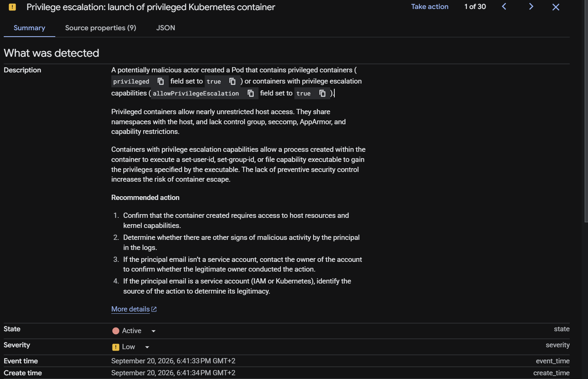

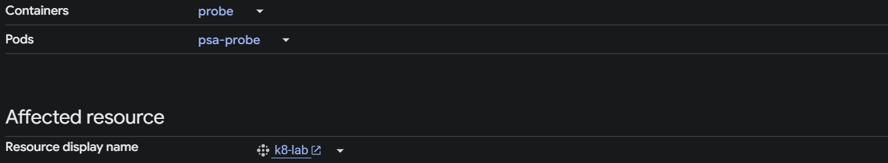

The detector fires on the API request rather than on a running container, so the guardrail working does not prevent the finding. Its description says "A potentially malicious actor created a Pod that contains privileged containers". No Pod was created. Pod Security refused it, and `kubectl get pods -n agents` was empty throughout.

That is the most useful thing in this slice. A finding whose description asserts something that did not happen is exactly what the triage worker exists to resolve, and it cannot resolve it from the finding body alone: nothing in the payload says the request was denied. The corpus has to carry that Pod Security `restricted` is enforced on this namespace, and the verdict has to reason from it.

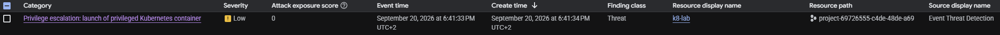

The finding then travelled the path this phase built, and the worker identity pulled it in the `:pull` above. A guardrail refused an action, a detector noticed the refusal, the notification config streamed it, and an identity federated through Workload Identity consumed it. Nothing was arranged for that. It fell out of running the drills in order.

## Slice 6: The worker reads

Status: Applied and proven on one real finding, end to end. Every failure-path drill is still open.

The worker is Go, in [ai-k8s](https://github.com/sindredg/ai-k8s), built here from a pinned commit. Increment 1 calls no model, so the path was proven before a token was spent.

It landed in three pull requests rather than one, and the reason is worth keeping. The first draft of the Deployment raised four `checkov` findings: no readiness probe, no liveness probe, an image that was not a digest, and the pull policy that follows from that. Baselining any of them would have been the wrong answer. The digest needed the image to exist, so the manifest had to follow the first build. The probes needed the worker to grow them, which it had not, because it serves no traffic and nobody had asked what would notice a pull loop that stopped moving.

| Pull request | Delivers |
| --- | --- |
| [ai-k8s#1](https://github.com/sindredg/ai-k8s/pull/1) | The corpus compiler, the verdict contract, the ledger, the worker |
| [ai-k8s#2](https://github.com/sindredg/ai-k8s/pull/2) | `/healthz` and `/readyz`, so a wedged pull loop is visible |
| [#121](https://github.com/sindredg/k8-lab/pull/121) | The pin, the two pin gates, and the build |
| [#122](https://github.com/sindredg/k8-lab/pull/122) | The Deployment, and this worklog |

### The pin was held back by its own gate

The pin was moved by hand, running the two checks `watch-ai-k8s.yml` enforces. The first one refused:

```bash
gh api "repos/sindredg/ai-k8s/commits/${SHA}/check-runs" \
  -q '.check_runs[] | "\(.status):\(.conclusion):\(.name)"'
```

```text
in_progress:null:check
```

Unfinished counts as unknown rather than as a pass, so the pin waited rather than bypassing the control the same branch was adding. After CI completed:

```text
completed:success:check
verified=true reason=valid author=sindredg
```

Both gates pass, and the pin moved to `fcee710`.

### The corpus is compiled into the image

The Dockerfile was built locally before CI ran it, so the first build in the pipeline was not the first time it executed. `corpusc` runs inside the build against both trees:

```text
corpus entries: 131
  checkov   14
  control   12
  decision  93
  threat    12
mapping: 14 categories, 5 pairings
decisions headings carrying no Decision line, skipped: Deferred decision records
```

A malformed entry, an id collision, a citation that does not resolve or a pairing with no justification fails the build rather than the worker. The one skipped heading is `Deferred decision records`, which carries no `Decision:` line because it is a list of gates rather than a decision. It is reported rather than dropped.

The published image:

```text
europe-north1-docker.pkg.dev/project-69726555-c4de-48de-a69/k8-lab/triage-worker
  @sha256:74579fde97cfa8bbc715c19ec94213b48b76d2eb7be680d28b29758ff2ccc87a
  tag fcee710630c1cc818e59fb99364dea2c9e6261ae-35539357637.1
```

### Applied by an operator, not by the pipeline

The pipeline publishes and stops. It holds no RBAC in `agents`, because patching a Deployment in `demo` reaches a web server holding no credential and patching one here reaches `k8-lab-triage` and its four grants. Recorded in [decisions.md](../decisions.md#agent-rollout-authority).

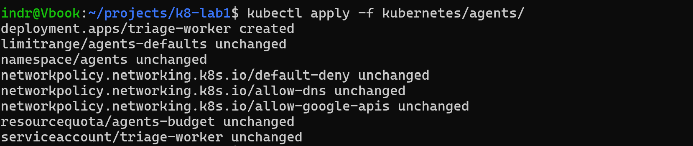

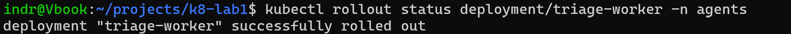

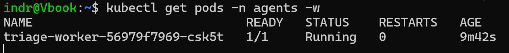

```bash
kubectl get nodes -o custom-columns='NAME:.metadata.name,ZONE:.metadata.labels.topology\.kubernetes\.io/zone' --no-headers
```

```text
gke-k8-lab-general-7d6bb7c7-0rru   europe-north1-a
gke-k8-lab-general-cf1cb723-jplw   europe-north1-b
```

Two nodes. The cost posture asks whether an idle agent forces a third, and it does not. The namespace budget after the rollout:

```text
used   pods 1/4   requests.cpu 50m/1   requests.memory 128Mi/1Gi
```

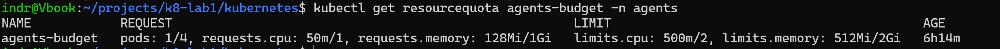

The image carries no shell, which is visible from outside:

```bash
kubectl exec -n agents deployment/triage-worker -- /bin/sh -c 'echo x'
```

```text
OCI runtime exec failed: exec: "/bin/sh": stat /bin/sh: no such file or directory
```

### The first verdict

Nothing was arranged. The worker started, pulled the Event Threat Detection finding that [slice 5](#the-drill-produced-the-finding-it-then-consumed) produced, and ruled on it.

```json
{
  "schema_version": "triage.v1",
  "verdict": "new",
  "finding": {
    "category": "Privilege Escalation: Launch of privileged Kubernetes container",
    "resource_name": "//container.googleapis.com/projects/.../clusters/k8-lab",
    "severity": "LOW",
    "finding_class": "THREAT",
    "digest": "sha256:1fa6af8b9e2d0ed090851f135c21aac6a13146200727a099cad97c5b028ad9a0"
  },
  "corpus_match": "none",
  "citations": [],
  "reasoning": "No corpus entry pairs category Privilege Escalation: Launch of privileged Kubernetes container with this resource, so nothing here prices it.",
  "settled_by": "rules",
  "provenance": {
    "corpus_commit": "7c5629c00dbe2924707b86196cd59ded0e3c98fd",
    "agent_commit": "fcee710630c1cc818e59fb99364dea2c9e6261ae"
  }
}
```

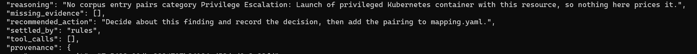

`new` is the designed answer, not a miss. `mapping.yaml` leaves that category unpriced deliberately: the corpus carries `control:pod-security-restricted-agents` as the fact that settles it, and deterministic resolution cannot tell the drill that produced this finding from a real privilege escalation in another namespace. Pairing them would auto-accept both. It waits for Increment 2 to reason from the control rather than match on it.

So the verdict notifies, which is the correct direction. A finding nothing here prices reaches a human.

### The ordering is measured, not asserted

Four objects under one prefix, one generation each:

```bash
gcloud storage ls -a "${PREFIX}/*.json"
```

```text
received.json#1789941103748788
classified.json#1789941103817295
notification_attempted.json#1789941103876246
acknowledged.json#1789941104048402
```

One generation per object means nothing was overwritten, which is the append-only property the worker's missing delete permission depends on. A Cloud Storage generation is a microsecond timestamp, so the same listing also dates each write:

| State | Written | After `received` |
| --- | --- | --- |
| `received` | 21:51:43.748788Z | |
| `classified` | 21:51:43.817295Z | +68.5ms |
| `notification_attempted` | 21:51:43.876246Z | +127.5ms |
| log entry emitted | 21:51:43.884557Z | +135.8ms |
| `acknowledged` | 21:51:44.048402Z | +299.6ms |

The log entry sits between `notification_attempted` and `acknowledged`, 8.3ms after the record that says a notification may be about to go out. That is the ordering [triage idempotency](../decisions.md#triage-idempotency) requires, and two independent clocks agree on it: Cloud Storage assigned the generations and Cloud Logging timestamped the entry. Recording the attempt afterwards would drop a notification silently whenever the worker died in that window.

### The monitored resource, side by side

```bash
gcloud logging read 'logName="projects/.../logs/triage-verdict"' \
  --limit 3 --format='value(timestamp,resource.type,jsonPayload.verdict,jsonPayload.finding.category)'
```

```text
2026-09-20T21:51:43.884557970Z  k8s_container  new  Privilege Escalation: Launch of privileged Kubernetes container
2026-09-20T12:14:29.601508026Z  global         new  PROBE
```

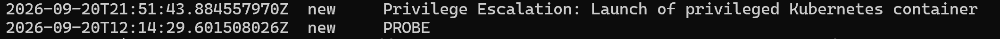

The second line is the hand-written probe from [slice 2](#slice-2-the-alert-filter-that-could-not-be-left-open), and it is kept because it is the failure this contract exists to prevent. Both entries are in the same log and both carry a verdict the metric counts. Only the first matches `resource.type = "k8s_container"`, which the alert policy's condition requires. The `global` one is counted and never alerts.

### The mail arrives

The verdict reached the address the availability alert already uses. No second channel was added.

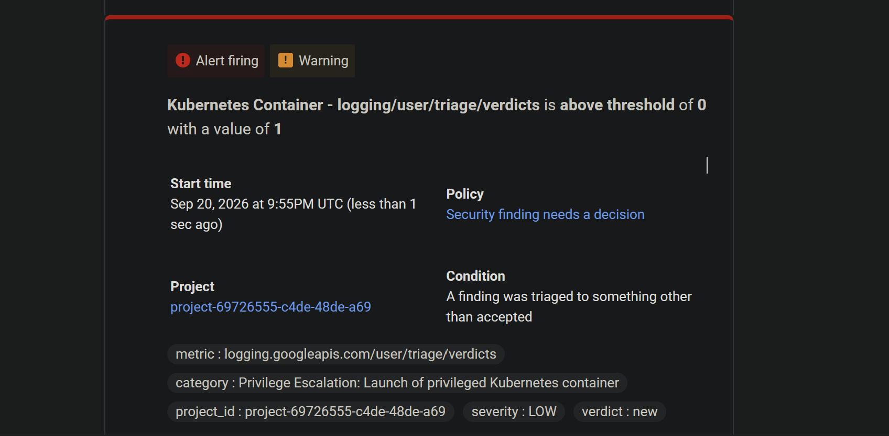

The mail carries what a decision needs and nothing more: the policy, the condition, the finding's category, its severity and `verdict: new`. It fired at 21:55Z against a log entry written at 21:51:43.884557Z. That gap is Cloud Monitoring's alignment, not the worker's, which the ledger above dates to the millisecond.

### Counters

```text
received 1  unreadable 0  vulnerabilities_skipped 0  redelivered 0  drift 0
settled_by_rules 1  settled_by_model 0
accepted 0  contradicts_decision 0  new 1  insufficient_evidence 0
notifications_sent 1  failed 0
```

One finding, settled by the rules, no model. The number this phase publishes is `settled_by_rules` against `settled_by_model`, and at one to zero it says nothing yet. It needs traffic.

### What the image cannot know about itself

`provenance.image_digest` came back empty on the first verdict. An image cannot learn its own digest during its own build, and the worker holds no cluster credential to read its own Pod status with, which is the permission boundary working as intended rather than a gap to close.

The digest is therefore set in the Deployment, next to the image it names, and a rollout changes both. That is duplication, and the alternative is a provenance field that records two of the three things the plan asks for. The first verdict above was produced before this fix and carries the empty field, which is why it is quoted with only two provenance values.

The fix is applied. `IMAGE_DIGEST` sits in the Deployment beside the image, and the apply replaced the running Pod:

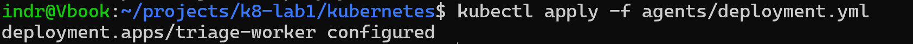

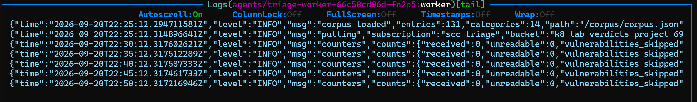

The replacement started at 22:25:12Z and has counted `received 0` since. The claim stays open: the field is set, and no verdict has carried it yet.

### The offline overlap measurement

Not the exit criterion, and closer to it than the hand count. The same classifier and the same compiled corpus were run over an export of every finding in the project, outside the Pub/Sub path:

```text
triaged: accepted 5, new 10
vulnerabilities skipped: 653
records that failed validation: 0
```

Three of the seven active misconfigurations resolve to a `.checkov.baseline` entry, which is the same number [the hand read](#the-overlap-read-by-hand) reached, produced by the matcher rather than by eye. The corpus at the time held 130 entries; the mapping was identical.

It stays open as an exit criterion because the deployed worker has seen one finding, not 668. The number the phase publishes has to come from the worker's own counters.

Reading the export also produced one fact the mapping needed and no document records. The same cluster arrives under two resource names:

```text
//container.googleapis.com/projects/.../zones/europe-north1-a/clusters/k8-lab       Security Health Analytics
//container.googleapis.com/projects/.../locations/europe-north1-a/clusters/k8-lab   Event Threat Detection
```

`zones` and `locations`. Exact matching makes that visible on the first run. Name similarity would have hidden it, and a matcher that shrugged at the difference would have been quietly wrong about which cluster a decision covered.

## Slice 7: The crash boundaries, drilled

Five failure paths, run against the deployed worker on 2026-09-21. Four real findings were muted to publish a message, and every mute was reversed afterwards.

### A crash point, because the windows are too small to aim at

The three boundaries the [idempotency decision](../decisions.md#triage-idempotency) orders are sub-millisecond apart. Deleting a Pod cannot land inside one, so the worker gained `-crash-at`, which names a boundary and exits there with 70. It is empty everywhere but a drill, and it reads only the command line. The reasoning is in [decisions.md](../decisions.md#drill-fault-injection).

The flag announces itself, which is the guard against a worker quietly left holding it:

```text
{"level":"WARN","msg":"the crash drill boundary is set, this worker will stop on purpose","boundary":"received"}
```

### Redelivery is faster than the acknowledgement deadline

The first drill corrected an assumption the procedure was built on. The subscription sets `ackDeadlineSeconds: 120`, so the plan was to remove the flag inside a two minute window. The message came back in about 25 seconds instead:

| Event | Time |
| --- | --- |
| Muted, message published | 00:29:56Z |
| Worker crashed, first delivery | 00:29:58Z |
| Worker crashed, second delivery | 00:30:25Z |

Killing the process closes the StreamingPull stream, and Pub/Sub returns an outstanding message when its stream closes rather than waiting out the deadline. That matters because `maxDeliveryAttempts` is 5. A crash loop spends the budget in about two minutes, not ten, and a finding that exhausts it goes to the dead letter topic instead of being triaged. Drill 1 spent three of five. The later drills removed the flag as soon as the crash was observed, and none spent more than three.

### Kill after inference, before persistence

```text
[00:30:13Z] restarts=1 exitCode=70
ledger objects for 932b4341: 0
{"time":"2026-09-21T00:30:25.265Z","level":"ERROR","msg":"crashing on purpose, the drill boundary was reached","boundary":"received"}
```

Nothing was on record. The finding had been parsed, settled and validated, and the crash landed before the first write, which is the window the decision says costs a re-inference and nothing else.

The flag was removed at 00:30:44Z. The redelivery was triaged in full:

```text
received.json#1789950686421179                00:31:26.421179Z
classified.json#1789950686483729              00:31:26.483729Z
notification_attempted.json#1789950686537268  00:31:26.537268Z
acknowledged.json#1789950686706032            00:31:26.706032Z
```

Four states, one generation each, written inside 285ms. The finding was re-inferred and triaged once, and the verdict carries the image that produced it:

```text
verdict     : new
settled_by  : rules
image       : sha256:b3770360802ba4567b171016dc11f10bb04167a30a2d67fc687503e2adf3803d
agentCommit : f3f931d7665f1fdc5d3c229d5c2022e0c5787c80
```

This is the first verdict to carry `image_digest`. The field was applied on 2026-09-20 and [no verdict had been produced since](#what-the-image-cannot-know-about-itself).

The verdict reached the owner at 00:35Z:

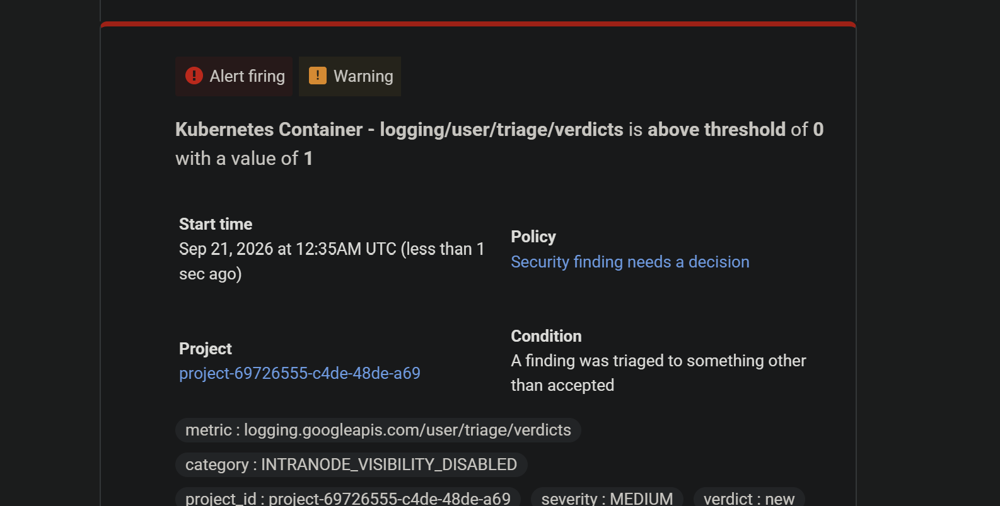

### A redelivery produces one verdict, and the drift net catches the difference

Unmuting the same finding republishes it. A mute does not advance `eventTime`, so the message arrives under the key already in the ledger:

```text
unmuted 00:33:32Z
{"time":"2026-09-21T00:33:36.461Z","level":"WARN","msg":"the finding body moved without advancing its event time",
 "recorded_digest":"sha256:ba33f1ab...","delivered_digest":"sha256:7ebbc531..."}
ledger objects for 932b4341: 4
```

The ledger did not move. The furthest state was `acknowledged`, so the worker dropped the message without inference, which is the redelivery row of the state machine on a real delivery rather than in a unit test.

The digest comparison fired at the same time. It was written as a safety net for a detector that mutates a body without advancing `eventTime`, and a mute is exactly that shape: the `mute` field changed, the body digest changed, and `eventTime` did not. The net has now been exercised by something real.

### Kill after persistence, before notification

At the crash, with the verdict durable and nobody told:

```text
[00:35:21Z] restarts=1
classified.json
received.json
```

`notification_attempted` is absent, which is the whole claim. The flag was removed at 00:36:11Z, and the finding was notified after the restart:

| | Time | Source |
| --- | --- | --- |
| `notification_attempted` written | 00:36:34.779549Z | Cloud Storage generation `1789950994779549` |
| The log entry the alert reads | 00:36:34.786733Z | Cloud Logging |

7.18ms apart, and the record is first. Two independent clocks, neither of them the worker's own, dating the ordering across a crash rather than inside one process.

The notification the crash delayed arrived at 00:40Z:

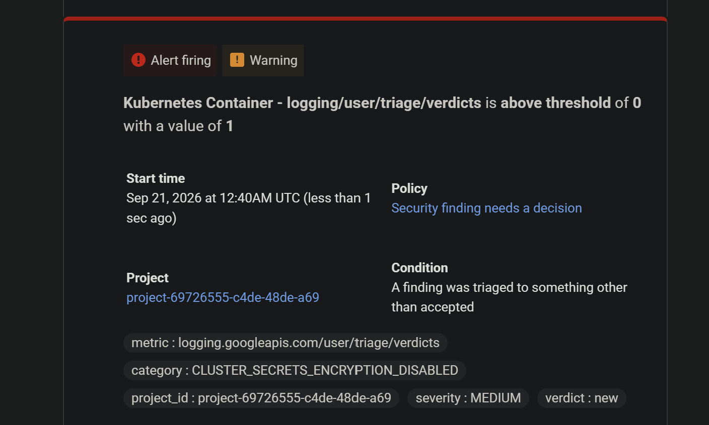

### Kill after notification, before acknowledgement

The window the state machine exists to close. At the crash:

```text
[00:38:15Z] restarts=1
classified.json
notification_attempted.json
received.json
```

`acknowledged` is absent, so the message was still outstanding after the owner had been told. The flag was removed at 00:38:32Z, and the finding was notified again on every delivery until one of them acknowledged:

```text
2026-09-21T00:38:09.620937650Z  new
2026-09-21T00:38:31.819331453Z  new
2026-09-21T00:38:58.929951324Z  new
```

Three notifications, one ledger record:

```text
1 acknowledged.json#1789951139130628
1 classified.json#1789951089551176
1 notification_attempted.json#1789951089611034
1 received.json#1789951089491298
```

That is the trade the decision names, observed rather than argued. The ledger holds one `notification_attempted` and not two verdicts, and the owner was told three times. Duplicate email is accepted and a missed notification is not.

The same two-clock measurement holds here: the record was written at 00:38:09.611034Z and the first log entry landed at 00:38:09.620937Z, 9.90ms later.

The duplication is bounded by the alert policy rather than by the worker. All three entries carry the same verdict, category and severity, so they group into one incident while it is open rather than opening three.

An alert on this finding reached the owner at 00:41Z:

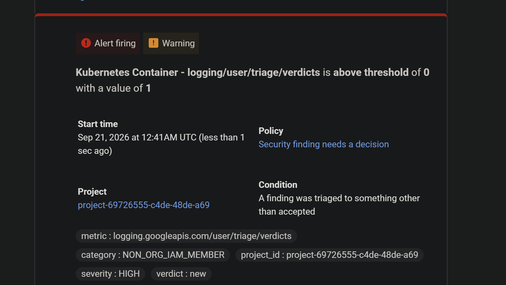

It carries `severity: HIGH`, extracted from the finding rather than from the verdict. How many mails the three entries produced was not counted, so the grouping claim above stays as [the decision](../decisions.md#triage-idempotency) states it: bounded in the common case, guaranteed in none.

### A finding that arrives while the worker is stopped

```text
scaled to 0          00:39:59Z
No resources found in agents namespace.
muted, published     00:40:10Z
ledger objects for e5d7b4d9 while stopped: 0
scaled to 1          00:41:01Z
ledger objects for e5d7b4d9: 4, acknowledged present
```

The message waited with no subscriber, and the worker triaged it after it came back. Nothing was lost and nothing was dropped.

The verdict reached the owner at 00:45Z, about three minutes after the triage:

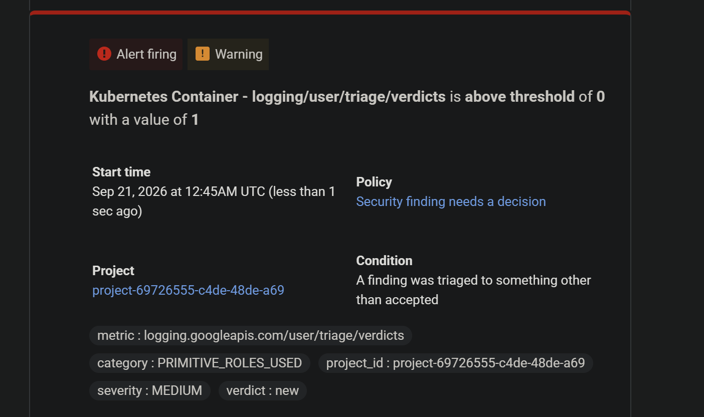

### The ledger after the drills

```text
distinct findings : 5
live objects      : 20
versions          : 21
```

Five findings, four states each, one generation per state. The twenty-first version is `probe/identity-drill.json`, a noncurrent object from [the identity drill](#the-grant-is-scoped-to-the-verb-not-the-resource) and outside every finding prefix. It is also a small piece of evidence for an open item: that object could be deleted at all because `roles/storage.objectUser` is wider than the worker needs.

Every verdict in the ledger was settled without a model:

```text
new rules PRIMITIVE_ROLES_USED                sha256:b3770360802ba
new rules NON_ORG_IAM_MEMBER                  sha256:b3770360802ba
new rules INTRANODE_VISIBILITY_DISABLED       sha256:b3770360802ba
new rules CLUSTER_SECRETS_ENCRYPTION_DISABLED sha256:b3770360802ba
new rules Privilege Escalation: Launch of privileged container   none
```

`settled_by_model` is 0. Four of the five carry the image digest, and the fifth predates the field.

Two classes have now been through the deployed worker, misconfiguration and threat. External exposure has not, so that item stays open.

All four muted findings were unmuted afterwards, and the project reports none muted.

External exposure went through the worker in [slice 8](#a-verdict-through-the-narrowed-role).

## Slice 8: The ledger grant, narrowed and then broken on purpose

Run on 2026-09-21. The worker's ledger grant was cut to the three calls it makes, and a verdict was written through it. Then create was taken away, and a finding was published into the gap.

### Three calls, three permissions

The worker touches the bucket in three places, all in `internal/gcp/storage.go` at `f3f931d`:

| Call | Permission |
| --- | --- |
| `Create`, with `DoesNotExist`, which is `ifGenerationMatch=0` | `storage.objects.create` |
| `Read` | `storage.objects.get` |
| `List` under a key's prefix | `storage.objects.list` |

The predefined pair that comes closest carries more than that:

```bash
gcloud iam roles describe roles/storage.objectViewer --format='value(includedPermissions)'
gcloud iam roles describe roles/storage.objectCreator --format='value(includedPermissions)'
```

```text
resourcemanager.projects.get;resourcemanager.projects.list;storage.folders.get;storage.folders.list;storage.managedFolders.get;storage.managedFolders.list;storage.objects.get;storage.objects.list
orgpolicy.policy.get;resourcemanager.projects.get;resourcemanager.projects.list;storage.folders.create;storage.managedFolders.create;storage.multipartUploads.abort;storage.multipartUploads.create;storage.multipartUploads.listParts;storage.objects.create;storage.objects.createContext
```

So the role is written out: `k8_lab_ledger_appender`, holding the three permissions in the table and nothing else. Leaving out `storage.objects.delete` removes overwrite as well, because replacing an existing object needs delete alongside create.

### The apply that removed the grant and could not add one back

```text
module.agent_identity.google_storage_bucket_iam_member.ledger_writer: Destruction complete after 4s
module.agent_identity.google_project_iam_custom_role.ledger_appender: Creation complete after 3s
module.agent_identity.google_storage_bucket_iam_member.ledger_writer: Creating...
Error: Error applying IAM policy for storage bucket "b/k8-lab-verdicts-project-69726555-c4de-48de-a69":
googleapi: Error 400: Role (projects/project-69726555-c4de-48de-a69/roles/k8_lab_ledger_appender)
does not exist in the resource's hierarchy., invalid
```

The role did exist:

```text
projects/project-69726555-c4de-48de-a69/roles/k8_lab_ledger_appender  GA  storage.objects.create;storage.objects.get;storage.objects.list
```

The binding was attempted the moment the role returned, and a new custom role is not yet visible to a bucket's IAM check at that point. A second `terraform apply` created the binding.

Between the two applies the worker held no ledger grant at all. The binding is identified by its role, so changing the role is a destroy and a create, and the destroy goes first. Nothing arrived in the window. The counters did not move and `failed` stayed at 0:

```text
received 598  vulnerabilities_skipped 598  failed 0
```

Had a finding arrived, it would have taken the path the drill below proves. The near miss is recorded in [troubleshooting.md](../troubleshooting.md#a-custom-role-cannot-be-bound-in-the-apply-that-creates-it).

### The grant, read back and probed

```text
projects/project-69726555-c4de-48de-a69/roles/k8_lab_ledger_appender serviceAccount:k8-lab-triage@project-69726555-c4de-48de-a69.iam.gserviceaccount.com
```

A probe Pod carrying the worker's ServiceAccount and the label `allow-google-apis` selects on, against one object of its own under `drill/`:

```text
identity: k8-lab-triage@project-69726555-c4de-48de-a69.iam.gserviceaccount.com
object:   drill/ledger-grant/20260921T121631Z.json
create, ifGenerationMatch=0          200
read                                 200
list under the prefix                200
create again, ifGenerationMatch=0    412
overwrite, no precondition           403
delete                               403
body afterwards                      {"probe":1}
```

Two refusals on the same object, from two layers. The `412` is the precondition, and the `403` is the role. Either would keep the record on its own.

### A verdict through the narrowed role

An `EXTERNAL_EXPOSURE` finding the ledger had not seen was muted at 14:32:35.790Z:

```text
received.json      generation 1790001160816557
classified.json    generation 1790001160878996
acknowledged.json  generation 1790001160948391
```

```text
verdict     accepted
category    EXTERNALLY_EXPOSED_SERVICE_VIA_LOAD_BALANCER
resource    //compute.googleapis.com/projects/project-69726555-c4de-48de-a69/global/forwardingRules/gkegw1-zs1b-demo-external-ilvdl48uws6q
citation    decision:ingress-mechanism
settled_by  rules
```

Three states, written 132ms apart end to end. There is no `notification_attempted` because an `accepted` verdict does not notify. This is also the first external exposure finding through the deployed worker, so all three in-scope classes have now been seen by it.

The unmute at 14:45:33Z arrived under the acknowledged key. The worker logged drift and wrote nothing.

### A ledger write failure, made to happen

`storage.objects.create` was removed from the role, leaving `get` and `list`:

```bash
gcloud iam roles update k8_lab_ledger_appender --project=project-69726555-c4de-48de-a69 \
  --remove-permissions=storage.objects.create
```

The drill waited until the probe saw the refusal:

```text
14:47:08Z create 200  list 200
14:47:23Z create 200  list 200
14:47:39Z create 200  list 200
14:47:54Z create 200  list 200
14:48:10Z create 403  list 200
```

`MASTER_AUTHORIZED_NETWORKS_DISABLED`, not yet in the ledger, was muted at 14:49:00.885Z:

```text
14:49:02.452Z ERROR triage failed, leaving the message unacknowledged
  error: record receipt: close .../cb34741b4887.../ACTIVE/received.json: googleapi: Error 403:
  k8-lab-triage@... does not have storage.objects.create access to the Google Cloud Storage object.
14:49:13.849Z ERROR triage failed, leaving the message unacknowledged
14:49:29.896Z ERROR triage failed, leaving the message unacknowledged
14:49:49.903Z ERROR triage failed, leaving the message unacknowledged
14:50:10.965Z ERROR triage failed, leaving the message unacknowledged
```

```text
worker restarts               0
ledger objects for cb34741b   none
verdict log entries           none
```

The list in `resume` succeeded and the create failed, so this is a write failure and not an unreachable bucket. The worker stopped before it classified, before it notified, and before it acknowledged. It kept serving throughout.

The failure landed on the first write, `received`. The write the notification ordering rests on is `notification_attempted`, and that one was not aimed at. Doing so needs a drill flag in the worker, in the shape of `-crash-at`.

### Five attempts is about a minute

The five deliveries span 68 seconds. The retry policy allows up to 600 seconds between attempts, and five attempts never get near it. The message then moved to the dead letter topic:

```text
2026-09-21T14:50:41.897Z  cb34741b4887  MASTER_AUTHORIZED_NETWORKS_DISABLED  mute=MUTED  source attempts=5
```

So a ledger outage longer than about a minute parks every finding that arrives during it. Parked, not lost: the body is intact on `scc-findings-dead-sub`. Nothing re-drives that subscription, and nothing alerts on it, so recovery is a person noticing.

### Recovery

`storage.objects.create` was added back with `gcloud iam roles update --add-permissions`, and the probe saw it return:

```text
14:53:54Z create 200  list 200
```

The dead-lettered message stays where it is. The finding was re-driven by a real state change, the unmute at 14:54:27.039Z:

```text
received.json      generation 1790002469841607
classified.json    generation 1790002469897291
acknowledged.json  generation 1790002469968523
```

```text
verdict     accepted
category    MASTER_AUTHORIZED_NETWORKS_DISABLED
citation    checkov:CKV_GCP_20:module.gke.google_container_cluster.main
settled_by  rules
```

Triaged two seconds after the unmute, once. The restore went through `gcloud`, so Terraform was asked whether it agrees:

```bash
terraform -chdir=terraform plan -detailed-exitcode; echo "EXIT=$?"
```

```text
EXIT=0
No changes. Your infrastructure matches the configuration.
```

The counters account for every delivery in the slice. 598 vulnerabilities, two deliveries of the exposure finding, five failed attempts and one re-drive make 606:

```text
received 606  vulnerabilities_skipped 598  redelivered 1  drift 1
settled_by_rules 2  settled_by_model 0  accepted 2  failed 5  notifications_sent 0
```

Both muted findings were unmuted afterwards.

Six probe objects remain under `drill/ledger-grant/`, and the worker identity cannot remove them, which is the point of the slice. They sit outside every finding prefix, and the bucket's 365-day lifecycle rule removes them.

## Slice 9: Where 598 vulnerabilities came from

The worker's counters jumped from 0 to 598 on 2026-09-21, all vulnerabilities, with no drill running:

```bash
gcloud logging read 'resource.labels.namespace_name="agents" AND jsonPayload.msg="counters"'   --freshness=2d --order=asc --format='value(timestamp,jsonPayload.counts.received,jsonPayload.counts.vulnerabilities_skipped)'
```

```text
2026-09-21T01:29:40Z  received 0    vulnerabilities_skipped 0
2026-09-21T10:39:40Z  received 486  vulnerabilities_skipped 486
2026-09-21T10:44:40Z  received 598  vulnerabilities_skipped 598
```

Security Command Center did not republish anything. The 598 are one state change, read back from the v2 API:

```text
category    SOFTWARE_VULNERABILITY, all 598
state       INACTIVE, all 598
eventTime   2026-09-21T10:36:28.701Z -> 10:37:32.669Z
createTime  2026-09-18T20:47 -> 20:51
resources   gke-k8-lab-general-cf1cb723-jplw  299
            gke-k8-lab-general-7d6bb7c7-0rru  299
```

Both resources are node VMs that no longer exist. GKE upgraded the cluster on the `REGULAR` channel overnight, and the upgrade replaced them:

```text
UPGRADE_MASTER  DONE  2026-09-21T01:08:33Z  2026-09-21T01:17:37Z
UPGRADE_NODES   DONE  2026-09-21T01:18:42Z  2026-09-21T01:32:04Z
01:22:46Z  instances/gke-k8-lab-general-7d6bb7c7-0rru deleted  container-engine-robot
01:27:58Z  instances/gke-k8-lab-general-cf1cb723-jplw deleted  container-engine-robot
```

The findings closed at 10:36Z, about nine hours after the VMs were deleted. The worker Pod was rescheduled by the same upgrade at 01:24:08Z and resumed with nothing lost. Nothing in this repository recorded the upgrade until the counters were read.

The vulnerability volume now reconciles with the offline count:

| Vulnerability findings | Count | Reached the worker |
| --- | --- | --- |
| Node VMs, INACTIVE at 10:36Z on 2026-09-21 | 598 | Yes, as `vulnerabilities_skipped 598` |
| Cluster, INACTIVE at 02Z on 2026-09-20 | 17 | No. Before the worker existed |
| Cluster, ACTIVE and unchanged | 38 | No. Nothing has published them |
| Total | 653 | |

The worker only sees changes. A stock count and a delivery count are different numbers, and the difference is findings that have not moved since the worker started. That is also why the overlap measurement needs a backfill: Security Command Center does not republish on its own.

The two replacement nodes carried no vulnerability findings when this was read, about thirteen hours after they were created.

## What is applied

```bash
terraform -chdir=terraform plan -detailed-exitcode; echo "EXIT=$?"
```

```text
No changes. Your infrastructure matches the configuration.
EXIT=0
```

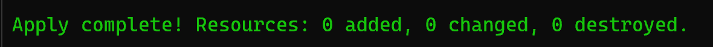

Read back from the API rather than from state:

```bash
gcloud alpha monitoring policies list \
  --filter='displayName:(Security finding needs a decision)' \
  --format='value(displayName,enabled,notificationChannels)'
gcloud alpha monitoring channels list --format='value(displayName,type)'
gcloud logging metrics describe triage/verdicts --format='value(name,filter)'
```

```text
Security finding needs a decision	True	projects/project-69726555-c4de-48de-a69/notificationChannels/5886169687490354841
Platform owner	email
triage/verdicts	logName = "projects/project-69726555-c4de-48de-a69/logs/triage-verdict" AND jsonPayload.verdict != "accepted"
```

One notification channel, which is the requirement: verdicts reach the address the availability alert already uses, rather than a second one.

## What is proven and what is not

| Claim | State |
| --- | --- |
| Four APIs enabled, metric and alert policy applied | Proven, read back from the API |
| Verdicts reach the existing email channel and no second channel exists | Proven end to end, twice. A real verdict landed with `resource.type = k8s_container`, the alert fired on it at 21:55Z on 2026-09-20, and the mail arrived at the Platform owner channel. The stop-while-waiting drill fired the same policy again at 00:45Z on 2026-09-21 |
| `k8s_container` is required, and the wrong resource type fails silently | Proven, by writing an entry that landed as `global` |
| A replacement of the public certificate cannot happen as a side effect | Proven for the cause found, and guarded by `prevent_destroy` |
| Findings reach the topic, subscription and dead letter | Proven. A real finding from a real detector arrived about two seconds after the change, on both a mute and an unmute |
| Findings reach the cluster | Proven. The worker pulls continuously, and triaged a real Event Threat Detection finding it was not given |
| The agents namespace rejects what it should | Proven. Pod Security and the quota each refused a probe built to trip only that one |
| The worker identity is scoped to the verb | Proven. `:pull` returns 200, `GET` on the same subscription returns 403, the ledger write returns 200 |
| No agent identity holds a service account key | Proven. The user-managed key list is empty |
| A message nobody acknowledges is parked rather than lost | Proven. Five attempts, then republished to `scc-findings-dead` with the body intact |
| The idempotency key in the contract distinguishes a change from a redelivery | Yes, for substance. `eventTime` holds across re-evaluation and moves on a real change. Attribute-only changes such as a mute collapse into a redelivery, deliberately |
| Security Command Center and `.checkov.baseline` overlap | Three of seven active misconfigurations, after this phase's own bucket raised `BUCKET_LOGGING_DISABLED` against the `CKV_GCP_62` already in the baseline. Still by hand, not the provenanced measurement |
| The overlap is measured with provenance | Open. Three of seven, produced offline by the deployed classifier and corpus rather than by the deployed worker, which has seen one finding |
| A finding arriving while the worker is stopped is triaged afterwards | Proven. Scaled to 0, muted a finding, scaled to 1. The message waited and was triaged after the restart |
| A finding carrying an instruction is triaged to the same verdict | Open. Covered by a unit test, not by a real finding |
| A redelivered message produces one verdict, not two | Proven by replaying a real delivery. The unmute arrived under the key already acknowledged, and the ledger did not move |
| The drift net catches a body that moves without its event time | Proven on a real delivery. The mute changed the body digest and not `eventTime`, and the worker logged it without inference |
| Record before notifying, across a crash | Proven twice, by two clocks that are not the worker's. 7.18ms at the notification boundary and 9.90ms at the acknowledgement boundary, storage generation before log timestamp |
| The worker settles a finding without a model | Proven. Five findings in the ledger, every one `settled_by rules`, `settled_by_model 0` |
| Record before notifying, notify before acknowledging | Proven, and dated by two independent clocks. `notification_attempted` was written 8.3ms before the log entry |
| The ledger is append-only | Proven across five findings. Twenty objects, one generation per state, nothing overwritten. Three notifications produced one `notification_attempted` record |
| The corpus is compiled at build time and cannot change under the worker | Proven. 131 entries baked into the image, and the build fails on a citation that does not resolve |
| The idle agent fits inside the two-node floor | Proven. `kubectl get nodes` returns two, and the namespace budget reads `pods 1/4` |
| Every verdict records the image it came from | Proven. Four verdicts carry `sha256:b3770360`. The fifth predates the field |
| The three crash-boundary drills | Proven, each against the deployed worker. Nothing recorded at the inference boundary, `notification_attempted` absent at the notification boundary, `acknowledged` absent at the acknowledgement boundary |
| A ledger write failure stops the worker before it notifies | Proven against the live worker, at the `received` write. Create was removed from the role, five deliveries each failed with a 403, and nothing was classified, notified or acknowledged. The `notification_attempted` write was not aimed at |
| The worker cannot delete or overwrite a ledger record | Proven. `DELETE` and an unconditional overwrite both return 403 under `k8_lab_ledger_appender`, and a create-only retry returns 412 |
| A ledger outage longer than about a minute parks findings | Measured. Five attempts took 68 seconds, then the message was dead-lettered with its body intact. Nothing re-drives or alerts on the dead letter subscription |
| An input over the token budget is refused rather than truncated | Open, and belongs to Increment 2 |

The percentages Security Command Center reports against compliance standards were read on this date and are deliberately not recorded here. They are computed from the same detectors as the findings above, over a project with one cluster, two stateless workloads and no data, so a high score measures how little applies rather than how much is controlled. Recording it without that framing would be the kind of claim this repository exists to avoid.
