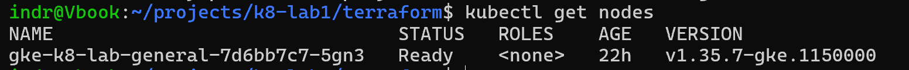
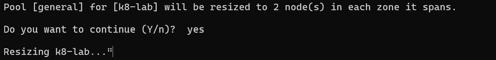
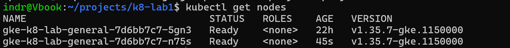
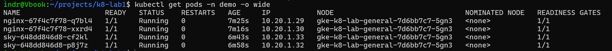
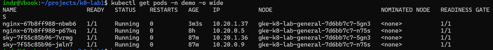
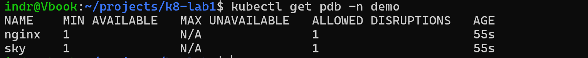

# Worklog: Surviving a node

Date: 2026-09-08  
Status: Complete.

Unnumbered on purpose. This was unplanned hardening that followed Phase 8, and `plan.md` already spends Phase 9 on deterministic manifest review.

## Goal

Make the second replica mean something. Two replicas already survived a rollout; they did not survive a node going away, which is the disruption this cluster actually meets.

## The idea the phase turns on

Redundancy is three claims, and each one can be false while the two either side of it are true.

| Claim | Made true by | Fails silently as |
| --- | --- | --- |
| There is a second copy | `replicas: 2` | two Pods on one node |
| There is somewhere else to put it | a node floor of two | a raised floor nothing acts on |
| Something puts it there | the scheduler | every Pod on the newest node |

`maxUnavailable: 0` covers a **rollout**, which this repository asks for. It says nothing about an **eviction**, which is what `auto_upgrade` and `auto_repair` do to a Pod without asking. Only a disruption budget covers that, and a budget is worse than nothing where the Pod it protects has nowhere to land: on a single node it stalls the drain rather than pacing it.

So the floor and the budgets are one change. Each phase below is a claim that looked true and was not.

## Slice 1: A floor of two nodes

Status: Complete

### Implemented

- `min_node_count` 1 to 2 in the root module.
- `initial_node_count` decoupled from it in `modules/gke/node_pool.tf`.
- A `maintenance_policy` with a daily window at 01:00 UTC, so node replacement lands at night in Helsinki rather than whenever the release channel reaches the cluster.

### The one-line change that would have replaced the node pool

`initial_node_count` was wired to `var.min_node_count`. It is only the size the pool is born at, and it is `ForceNew`: changing it destroys and recreates the pool. Raising the floor by one character would have taken the cluster down, and the diff reads like a resize.

Pinned to `1`, the floor moves on its own. The plan is the evidence:

```
# module.gke.google_container_cluster.main     will be updated in-place
# module.gke.google_container_node_pool.general will be updated in-place
      ~ total_min_node_count = 1 -> 2

Plan: 0 to add, 4 to change, 0 to destroy.
```

The other two changed resources are pre-existing drift in the observability module, present on a clean checkout of `main`.

### The floor was raised and nothing happened

`totalMinNodeCount` read `2` in GCP. The managed instance group target stayed at `1`, and fifteen minutes later there was still one node.



Quota was not the constraint: the regional E2 limit is 24 vCPUs, against a single two-vCPU node. The autoscaler simply had not reconciled a minimum it had no workload pressure to satisfy. It took a direct resize.





Worth keeping as an expectation: a raised minimum is a bound the autoscaler respects, not an instruction it acts on promptly. Check the instance group rather than the Terraform output.

## Slice 2: Getting the Pods to use it

Status: Complete

### The second node changed nothing on its own

Two nodes, and all four Pods on the first one.



A rolling restart made it worse rather than better: all four moved to the *new* node together. The mechanism is that `topologySpreadConstraints` count every Pod matching the selector, including the **old** replicas still running. Each new Pod saw two on the old node and none on the new one and chose the new one, twice. Then the old Pods terminated. `ScheduleAnyway` is a preference, so nothing overrode it.

Restarting again only mirrors the problem.

### What actually rebalanced it

Deleting one Pod per Deployment. A single replacement carries no old-revision skew, so the emptier node wins.



`ScheduleAnyway` stays. With `maxSkew: 1` across exactly two nodes, `DoNotSchedule` would refuse to reschedule during a drain, because the surviving node would sit at skew 2. That is the same deadlock the budgets exist to avoid, moved somewhere harder to see. Phase 2 justified the soft constraint by the single-node floor; it survives the floor moving, for a different reason.

The durable fix is `matchLabelKeys: ["pod-template-hash"]`, which confines the spread calculation to one ReplicaSet. Not applied yet, so every rollout still needs this rebalance.

## Slice 3: The budgets

Status: Complete

### Implemented

- `PodDisruptionBudget` with `minAvailable: 1` for both workloads.
- Applied by an operator: the delivery Role holds `patch` and not `create`, and covers Deployments rather than policy objects.



`ALLOWED DISRUPTIONS` is the field that matters. At `1` the budget paces a drain. At `0` it blocks one, which on a single-node pool is what it would have done from the moment it was applied.

## What this cost

One `e2-standard-2` running continuously instead of on demand, so the node line roughly doubles. The window and the budgets are free.

Spot nodes would more than cover it, and preemptions would exercise the self-healing Phase 2 documents. Deferred because `spot` is `ForceNew` on the node pool: flipping it destroys and recreates the pool, which is only survivable now that the floor is two and the budgets can pace the eviction. Worth doing as a second pool drained onto rather than a swap.

## Open

- `matchLabelKeys` on both spread constraints, so a rollout stops concentrating.
- Spot migration.
- Two observability resources drift on every plan, so `terraform plan` is never clean. A plan nobody expects to be empty is a plan that stops being read.
