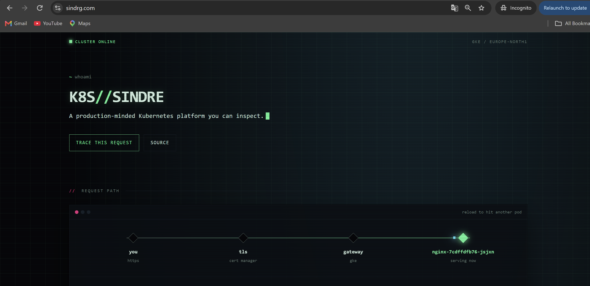
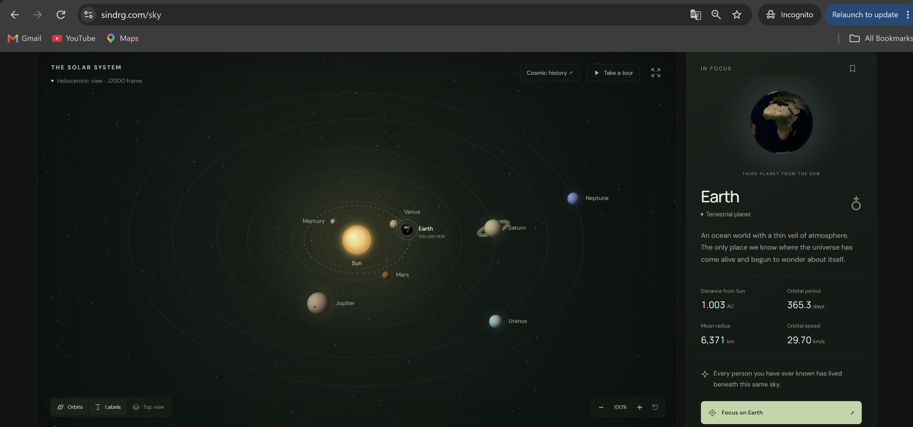

# Worklog: Shutdown

Date: 2026-09-25
Status: Done. The platform is destroyed, the Terraform state is empty, and the DNS records for `sindrg.com` are deleted.

## Result

```text
Apply complete! Resources: 0 added, 0 changed, 65 destroyed.
```

| Step | Took |
| --- | --- |
| Gateway controller removes its load balancer, backends and firewall rule | About 5 minutes |
| Node pool destroyed | 4m16s |
| Cluster destroyed | 4m56s |

The Terraform in this repository is left as it was at the close on 2026-09-22, deletion protection included. The guards were lifted only in the working copy that ran the destroy.

## The site before it went





## What was recorded first

Captured while the platform was still running, in `worklog/shutdown/`:

| File | Holds |
| --- | --- |
| [cluster-final-state.txt](shutdown/cluster-final-state.txt) | Every workload, Service, route, HPA, budget and NetworkPolicy |
| [nodes.txt](shutdown/nodes.txt) | The four nodes across three zones |
| [image-digests.txt](shutdown/image-digests.txt) | The digest each Deployment ran |
| [registry-images.txt](shutdown/registry-images.txt) | Every image in Artifact Registry, with tags |
| [gke-cluster.yaml](shutdown/gke-cluster.yaml) | The cluster as GKE described it |
| [alert-policies.yaml](shutdown/alert-policies.yaml) and [uptime-checks.yaml](shutdown/uptime-checks.yaml) | The three alerts and the uptime check |
| [gcp-compute-instances.txt](shutdown/gcp-compute-instances.txt), [gcp-firewall-rules.txt](shutdown/gcp-firewall-rules.txt), [gcp-forwarding-rules.txt](shutdown/gcp-forwarding-rules.txt) | The Compute Engine view, including what the Gateway controller owned |
| [terraform-state-list.txt](shutdown/terraform-state-list.txt) | The 65 resources in state |
| [terraform-plan-destroy.txt](shutdown/terraform-plan-destroy.txt) | The plan that was read before it was applied |
| [terraform-destroy.txt](shutdown/terraform-destroy.txt) | The apply |

The triage ledger, 178 objects, and the active Security Command Center findings were copied out as well. They are raw data and are kept outside the repository.

## What stood in the way

A plain `terraform destroy` would have failed three times.

| Blocker | Where | Lifted by |
| --- | --- | --- |
| Cluster deletion protection | `terraform/main.tf` | `deletion_protection = false`, applied to the cluster alone |
| `prevent_destroy` on the public certificate | `terraform/modules/gateway/main.tf` | Set to `false` in the working copy |
| `force_destroy = false` on the ledger bucket | `terraform/modules/findings/main.tf` | Set to `true`, applied to the bucket alone |

A fourth would have hung the destroy. The Gateway controller creates its own forwarding rules, backend services, network endpoint groups and firewall rule, all prefixed `gkegw1-`. Terraform does not own them, and they hold the static address and the VPC. Deleting the Gateway first let the controller clean up after itself:

```bash
kubectl delete httproute -A --all
kubectl delete gateway -A --all
```

The first `apply` was targeted at the cluster and the bucket, not run whole. An untargeted plan also proposed moving the node pool from `e2-medium` to `e2-standard-2`: the pool had been resized outside Terraform, and applying it would have rolled every node while the final screenshots were being taken.

## After

A sweep of the project found nothing that bills beyond pennies:

| Left | Why |
| --- | --- |
| Four `container-analysis-*` Pub/Sub topics | Created by Google when vulnerability scanning was enabled |
| The default compute service account | Created with the project |
| A Vertex AI staging bucket, 1.7 KB | Created by Vertex AI on first use |

The deploy, watch and security scan workflows are disabled in GitHub, since each targets the cluster or the domain. CI stays on, and needs no cloud credential.

## DNS records

The Cloudflare records for `sindrg.com` pointed at `8.232.183.150` after the destroy. Google can reassign that address, so the records were deleted.

```bash
dig sindrg.com A @1.1.1.1 +noall +comments
```

| Name | A | AAAA | CAA |
| --- | --- | --- | --- |
| `sindrg.com` | `NOERROR`, 0 answers | `NOERROR`, 0 answers | `NOERROR`, 0 answers |
| `www.sindrg.com` | `NOERROR`, 0 answers | `NOERROR`, 0 answers | `NOERROR`, 0 answers |

Checked on 2026-09-25 against `1.1.1.1`. `dig +short sindrg.com A @8.8.8.8` also returned nothing.

The zone stays on Cloudflare, with the `eva` and `kareem` name servers and the DS record still published in `.com`. The CAA records from [Phase 14](phase-14-close-the-baseline.md) are gone with the rest, so certificate issuance for the domain is no longer restricted.
